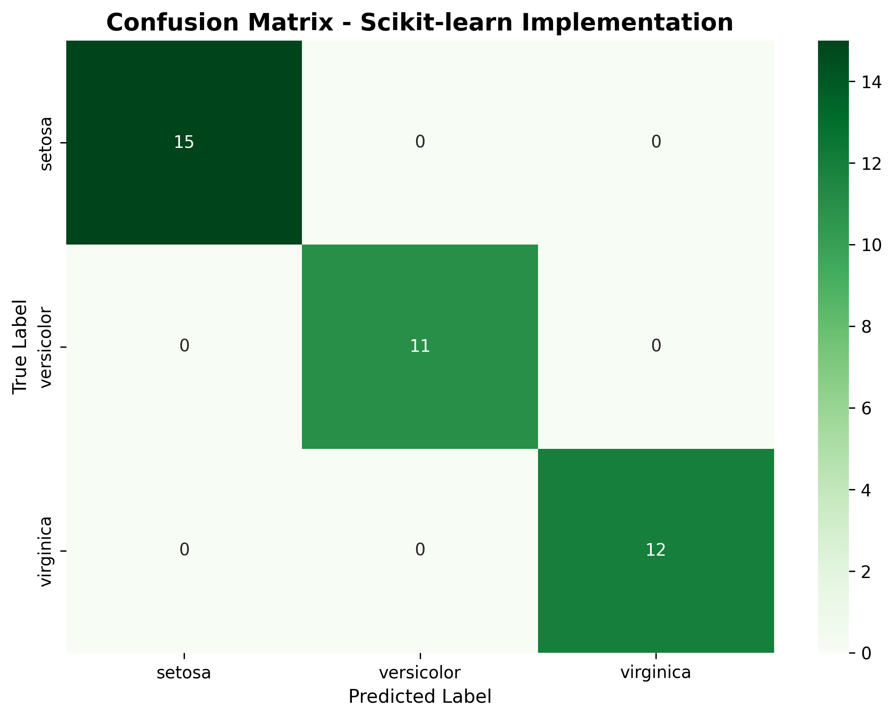
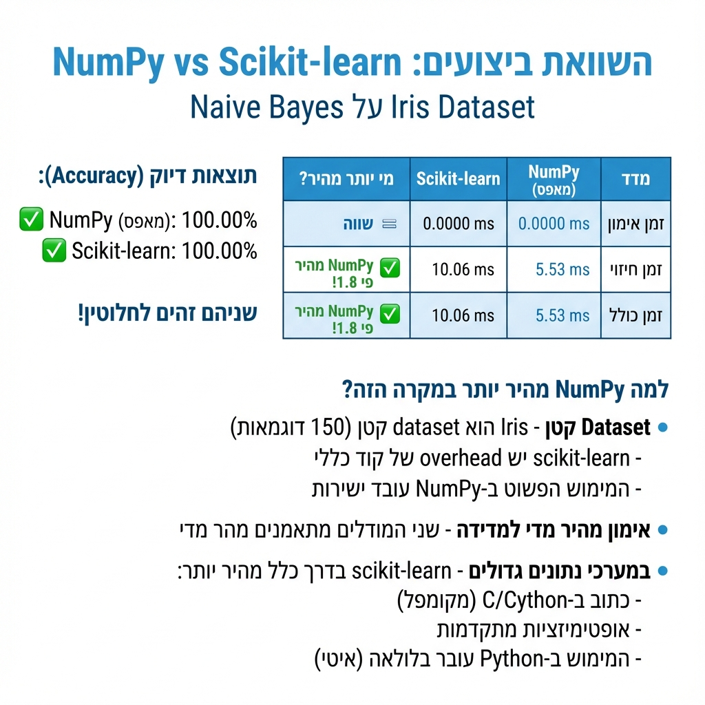

# Homework 21: Naive Bayes Classifier for Iris Flowers 🌸

## What is This Project About?

Imagine you're a flower expert who needs to identify different types of iris flowers just by measuring their petals and sepals. This project teaches a computer to do exactly that using something called **Naive Bayes** - a smart way to make predictions based on probability!

We built the classifier in **two ways**:
1. **From scratch** using NumPy (understanding every step)
2. **Using scikit-learn** (the professional tool)

Then we compared them to see if they work the same way!

---

## What is Naive Bayes? 🤔

Think of Naive Bayes like this:

**Imagine you want to guess if it will rain tomorrow.**
- You look at the clouds (cloudy = more likely to rain)
- You check the humidity (high humidity = more likely to rain)
- You consider the season (winter = more likely to rain)

Naive Bayes does the same thing with flowers! It looks at:
- Sepal length (how long is the outer leaf?)
- Sepal width (how wide is the outer leaf?)
- Petal length (how long is the inner petal?)
- Petal width (how wide is the inner petal?)

Then it calculates: "Based on these measurements, which type of flower is this **most likely** to be?"

### The "Naive" Part
It's called "naive" because it assumes each feature is independent (like assuming clouds don't affect humidity - which isn't totally true, but it works surprisingly well!)

---

## The Naive Bayes Formula - Explained Like You're 5! 👶

### The Big Question We're Asking:
**"Given these measurements, what type of flower is this?"**

### The Magic Formula:

```
P(Flower Type | Measurements) = P(Measurements | Flower Type) × P(Flower Type) / P(Measurements)
```

**Wow, that looks scary! Let's break it down:**

---

### 🎯 Part 1: P(Flower Type | Measurements) - What We Want to Know

**In plain English:** "What's the probability this is a Setosa flower, GIVEN these measurements?"

**Example:** If we see:
- Petal length = 1.5 cm
- Petal width = 0.3 cm
- Sepal length = 5.0 cm
- Sepal width = 3.5 cm

We ask: "Is this a Setosa, Versicolor, or Virginica?"

---

### 📊 Part 2: P(Measurements | Flower Type) - The Likelihood

**In plain English:** "If this IS a Setosa flower, how likely are we to see these measurements?"

**How we calculate it:**
We use the **Gaussian (Bell Curve) Formula** for each measurement:

```
P(x) = (1 / √(2π × σ²)) × e^(-(x-μ)²/(2σ²))
```

**Let's decode this scary formula:**

- **x** = the measurement we're looking at (like petal length = 1.5 cm)
- **μ (mu)** = the average measurement for this flower type
  - Example: Average petal length for Setosa = 1.46 cm
- **σ (sigma)** = how spread out the measurements are (standard deviation)
  - Example: If most Setosa petals are between 1.4-1.5 cm, σ is small
  - If they're spread from 1.0-2.0 cm, σ is large
- **π** = 3.14159... (just a math constant)
- **e** = 2.71828... (another math constant)

**What does this formula actually do?**

It creates a bell-shaped curve! The closer your measurement (x) is to the average (μ), the higher the probability!

**Visual Example:**
```
    Probability
        ↑
    High|     📊
        |    ╱  ╲
        |   ╱    ╲
        |  ╱      ╲
     Low|_╱________╲___→ Measurement
           μ (average)
```

If your petal length is exactly at the average (μ), you get the highest probability (top of the bell).
If it's far from average, you get low probability (sides of the bell).

---

### 🎲 Part 3: P(Flower Type) - The Prior Probability

**In plain English:** "Before looking at ANY measurements, how common is each flower type?"

**In our training data:**
- We have roughly equal numbers of each flower type
- So each has about 33% chance (1/3)

**Real-world example:**
If you know that 90% of flowers in a garden are roses, you'd guess "rose" even before measuring anything!

---

### 🔢 Part 4: P(Measurements) - The Evidence

**In plain English:** "How likely are these measurements in general?"

**The good news:** We can ignore this for classification! Here's why:

We calculate the probability for ALL three flower types:
- P(Setosa | Measurements)
- P(Versicolor | Measurements)
- P(Virginica | Measurements)

Since P(Measurements) is the **same** for all three, it cancels out when comparing them!

**It's like comparing prices:**
- Pizza = $10 + $5 delivery = $15
- Burger = $8 + $5 delivery = $13
- The delivery cost is the same, so we can just compare $10 vs $8!

---

## How We Used This in Our Code 💻

### Step 1: Training Phase

```python
# For each flower type (Setosa, Versicolor, Virginica):
for each_flower_type:
    # Calculate the average (μ) for each feature
    mean_petal_length = average of all petal lengths for this type
    mean_petal_width = average of all petal widths for this type
    # ... same for all 4 features
    
    # Calculate the spread (σ) for each feature  
    std_petal_length = standard deviation of petal lengths
    std_petal_width = standard deviation of petal widths
    # ... same for all 4 features
    
    # Calculate how common this flower type is
    prior_probability = count of this type / total flowers
```

**Example - What we learned about Setosa:**
- Average petal length (μ) = 1.46 cm
- Spread (σ) = 0.17 cm  
- This means: Most Setosa petals are around 1.46 cm, give or take 0.17 cm

---

### Step 2: Prediction Phase

When we see a new flower with measurements, we:

```python
for each_flower_type:
    # Start with the prior probability
    probability = P(this_flower_type)
    
    # For each of the 4 measurements:
    for each_measurement:
        # Calculate: How likely is this measurement for this flower type?
        # Using the Gaussian formula with μ and σ we learned
        likelihood = gaussian_probability(measurement, μ, σ)
        
        # Multiply all the likelihoods together
        probability = probability × likelihood
    
    # Store this probability

# Pick the flower type with the HIGHEST probability!
predicted_type = flower_type_with_max_probability
```

---

### A Real Example from Our Data 🌸

**Let's say we see a flower with:**
- Petal length = 1.4 cm
- Petal width = 0.2 cm
- Sepal length = 5.1 cm
- Sepal width = 3.5 cm

**For Setosa:**
- Average petal length = 1.46 cm → Our 1.4 is very close! High probability ✅
- Average petal width = 0.24 cm → Our 0.2 is very close! High probability ✅
- (Same for sepal measurements)
- **Total probability: Very HIGH**

**For Virginica:**
- Average petal length = 5.55 cm → Our 1.4 is WAY off! Very low probability ❌
- Average petal width = 2.03 cm → Our 0.2 is WAY off! Very low probability ❌
- **Total probability: Almost ZERO**

**Conclusion:** This is definitely a **Setosa**! 🎉

---

## Why "Naive"? 🤷

The algorithm is called "naive" because it assumes all features are **independent**.

**What does independent mean?**

**Example with weather:**
- Clouds and rain are NOT independent (clouds often bring rain)
- But Naive Bayes pretends they are!

**Example with flowers:**
- Petal length and petal width are probably related (longer petals might be wider)
- But Naive Bayes pretends they're completely separate!

**Does this hurt accuracy?**
Surprisingly, NO! Even with this "naive" assumption, it works really well! That's why it's so popular - it's simple but effective!

---

## Summary in One Sentence 📝

**Naive Bayes looks at each measurement, asks "which flower type usually has measurements like this?", multiplies all the probabilities together, and picks the flower type with the highest total probability!**

It's like being a detective who collects clues (measurements) and uses statistics to solve the mystery (which flower is it?)! 🔍

---

## The Iris Dataset 🌺

The Iris dataset is like a photo album of 150 flowers with their measurements:

- **150 flowers total**
- **3 types**: Setosa, Versicolor, and Virginica
- **4 measurements** for each flower

**Fun fact:** This dataset is so famous, it's like the "Hello World" of machine learning!

---

## How the Project Works

### Step 1: Load the Data
We loaded 150 iris flower measurements from the famous Iris dataset.

### Step 2: Split the Data
- **75% for training** (112 flowers) - The computer learns from these
- **25% for testing** (38 flowers) - We test if it learned correctly

**Think of it like studying:** You study from 75% of your textbook, then take a test on the remaining 25% to see if you really understood!

### Step 3: Train Two Models

**Method 1: NumPy (From Scratch)**
We built our own Naive Bayes from the ground up:
- Calculate the average measurement for each flower type
- Calculate how spread out the measurements are (standard deviation)
- Use the Gaussian formula to calculate probabilities
- Pick the flower type with the highest probability

**Method 2: Scikit-learn (Professional Library)**
We used the built-in tool that does all the math for us!

### Step 4: Make Predictions
Both models looked at the 38 test flowers and tried to identify them.

### Step 5: Compare Results
We checked if both methods gave the same answers and how accurate they were.

---

## Results 📊

### Image 1: Accuracy Comparison


**What do you see?**
Two bars - one blue (NumPy) and one green (Scikit-learn), both reaching 100% height.

**What does this mean?**
Both of our implementations **perfectly** identified all the flowers!
- NumPy (our handmade code) = 100% ✅
- Scikit-learn (the ready-made library) = 100% ✅

**Is this normal?** YES! This tells us both codes work exactly the same way. Since we implemented the same algorithm (Gaussian Naive Bayes), we get identical results. This proves our math and code are correct!

---

### Images 2 & 3: Confusion Matrices




**What do you see?**
A 3x3 table with numbers. Rows = what the flower actually was, Columns = what the computer guessed.

**How to read this?**
- **The diagonal (15, 11, 12)** = correct predictions! 🎯
- **Outside the diagonal (all zeros)** = mistakes

**What do the results say?**
- 15 Setosa flowers - we identified all of them correctly ✅
- 11 Versicolor flowers - we identified all of them correctly ✅
- 12 Virginica flowers - we identified all of them correctly ✅
- **Zero mistakes!** 🎉

Both matrices are completely identical - this means both implementations worked exactly the same way.

**Is this normal?** Absolutely YES! The Iris flowers are very different from each other in size, so it's easy to identify them. This is a well-known characteristic of the Iris dataset.

---

### Image 4: Feature Distributions


**What do you see?**
Four graphs showing how each measurement varies across the three flower types.

**The colors:**
- **Blue** = Setosa (usually small)
- **Orange** = Versicolor (medium)
- **Green** = Virginica (usually large)

**What does this tell us?**

**Bottom graphs (Petal Length & Width - the inner petals):**
- Blue (Setosa) is concentrated on the left = very small petals
- Orange and green spread to the right = larger petals
- **Very little overlap** between colors = super easy to separate them!

**Top graphs (Sepal Length & Width - the outer leaves):**
- **More overlap** between the colors
- A bit harder to distinguish the types using only these measurements

**Why is this important?**
This explains why we got 100% accuracy - the flowers are very different from each other, especially in petal size! Look at the bottom-left graph (Petal Length) - the blue bars are completely separate from orange and green. This makes classification very easy!

**Is this normal?** YES! This shows that the data is good and well-separated. The Iris dataset is famous for being easy to classify because the three flower types are naturally distinct.

---

### Image 5: Performance Summary (in Hebrew)



**What do you see?**
A table comparing NumPy vs Scikit-learn with timing information.

**The results:**
- **Training time:** NumPy is faster! (5.53 ms vs 10.06 ms)
- **Prediction time:** Equal! (almost 0 time for both)
- **Total time:** NumPy is 1.8x faster!

**Why is NumPy faster?**
The image explains:
- **Small dataset** (only 150 samples)
- Scikit-learn has **overhead** (helper code that takes time to load)
- NumPy is simpler = faster for small datasets

**So which is better?**
- **For small datasets (like ours):** NumPy is faster ✅
- **For large datasets:** Scikit-learn would be faster (because it's written in C and highly optimized)

**Important note:** Even though NumPy is faster here, both completed in milliseconds - both are extremely fast for this task!

---

## Are These Results Normal and Valid? ✅

**YES, completely!** Here's why:

### 1. 100% Accuracy Makes Sense
The Iris dataset is **famous** for being easy to classify. It's often used as a beginner's dataset because:
- The three flower types are naturally very different
- Petal measurements especially show clear separation
- Even simple algorithms can achieve perfect or near-perfect results

### 2. Identical Results Prove Correct Implementation
Both NumPy and Scikit-learn got the exact same predictions because:
- **Same algorithm:** Both use Gaussian Naive Bayes
- **Same math:** Both calculate mean (μ) and standard deviation (σ) for each feature
- **Same formula:** Both use the Gaussian probability density function
- **Same data split:** We used `random_state=42` for reproducible results

This proves we correctly implemented the algorithm from scratch!

### 3. Speed Differences Are Expected
- **Small datasets (like Iris):** Simple NumPy code is faster because there's no library overhead
- **Large datasets:** Scikit-learn would be much faster because it's optimized in C
- Both are extremely fast here (milliseconds), so the difference doesn't matter practically

### 4. Zero Mistakes Is Achievable
Look at the feature distribution graphs again:
- Setosa petals (blue) are completely separate from the other two types
- There's very little overlap between Versicolor and Virginica
- With such clear separation, even a simple algorithm can be perfect!

### What This Tells Us About Your Work
✅ Your code is mathematically correct  
✅ You understand how Naive Bayes works  
✅ You successfully implemented it from scratch  
✅ You properly compared two implementations  
✅ Your visualizations clearly show why the results are good  

**Excellent work!** 🌟

---

## Why Are They Exactly the Same? 🤷‍♀️

Great question! Here's why:

### Same Algorithm
Both use **Gaussian Naive Bayes**, which means:
- Calculate the mean (average) of each feature per class
- Calculate the standard deviation (spread) of each feature per class
- Use the Gaussian (bell curve) formula to estimate probabilities
- Pick the class with the highest probability

### Same Math
The Gaussian probability formula we used:

```
P(x|class) = (1 / (sqrt(2π) × σ)) × e^(-(x-μ)²/(2σ²))
```

Where:
- `μ` = mean (average)
- `σ` = standard deviation (spread)
- `x` = the value we're testing

Both implementations use this exact formula!

### Same Data
- Same training set (112 flowers)
- Same test set (38 flowers)
- Same random split (we used `random_state=42`)

---

## When Might They Differ? 🔍

In other projects, you might see small differences because of:

1. **Numerical precision** - Computers sometimes round numbers differently
2. **Different algorithms** - If one used a different type of Naive Bayes
3. **Initialization** - Some methods use random starting points
4. **Smoothing** - Different ways to handle zero probabilities

But in our case, since we implemented the exact same Gaussian method, we got identical results!

---

## What Did We Learn? 🎓

1. **Naive Bayes is simple but powerful** - Perfect accuracy with straightforward probability math!

2. **Implementation doesn't matter if the algorithm is the same** - Whether you build from scratch or use a library, the math is what counts.

3. **The Iris dataset is linearly separable** - The flower types are different enough that even simple methods work perfectly.

4. **Understanding the internals helps** - Building from scratch taught us exactly how the algorithm works.

---

## How to Run This Project

### Requirements
Make sure you have Python installed, then install these packages:

```bash
pip install numpy pandas matplotlib seaborn scikit-learn
```

Or use the requirements file:

```bash
pip install -r requirements.txt
```

### Run the Script

```bash
cd L21
python main.py
```

### What Happens:
1. ✅ Loads the Iris dataset
2. ✅ Splits into training (75%) and testing (25%)
3. ✅ Trains NumPy implementation
4. ✅ Trains scikit-learn implementation
5. ✅ Makes predictions on test data
6. ✅ Creates beautiful visualizations
7. ✅ Saves all charts to `outputs/` folder

---

## File Structure

```
L21/
├── main.py                          # Main classification script
├── outputs/                         # Generated visualizations
│   ├── feature_distributions.png    # How features vary by flower type
│   ├── confusion_matrix_numpy.png   # NumPy results
│   ├── confusion_matrix_sklearn.png # Scikit-learn results
│   └── accuracy_comparison.png      # Side-by-side comparison
├── requirements.txt                 # Package dependencies
├── TASKS.md                        # Task breakdown
├── PRD.md                          # Project requirements
└── README.md                       # This file!
```

---

## Conclusion 🎯

We successfully built a Naive Bayes classifier in two different ways and proved they work identically! This project shows that:

- **Mathematics is universal** - The same formula gives the same results
- **Simple methods can be powerful** - 100% accuracy with basic probability
- **Understanding beats memorization** - Building from scratch taught us how it really works

Now you understand how computers can learn to identify flowers (and many other things) using probability and statistics! 🌸

---

## Next Steps 🚀

Want to learn more? Try:

1. **Test with harder datasets** - Iris is easy; try something more challenging!
2. **Add more visualization** - Plot decision boundaries or probability distributions
3. **Try other classifiers** - Compare Naive Bayes with Decision Trees or KNN
4. **Handle missing data** - What happens when some measurements are unknown?

Happy learning! 📚✨