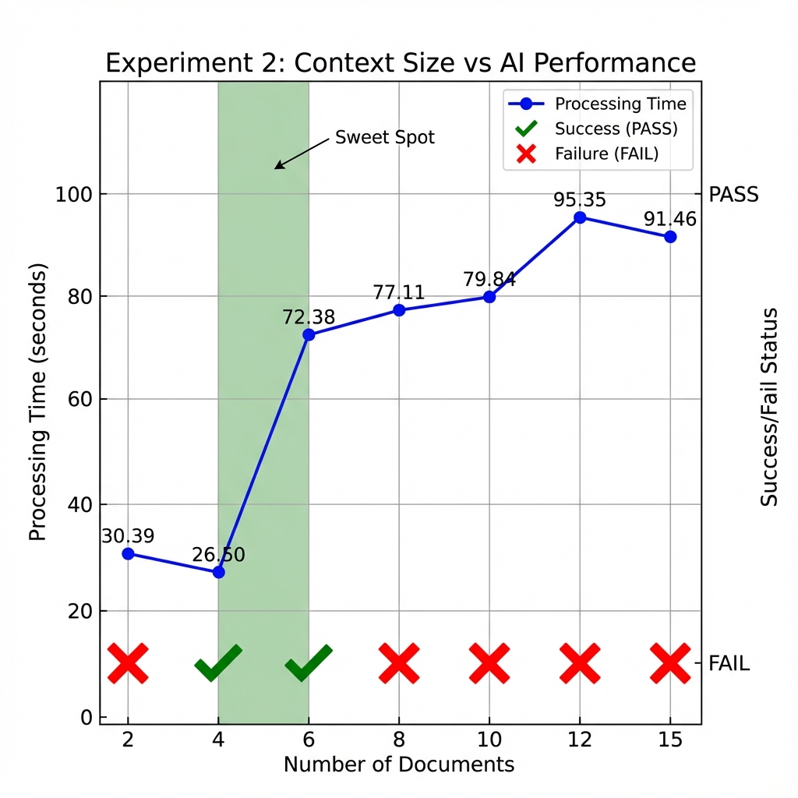
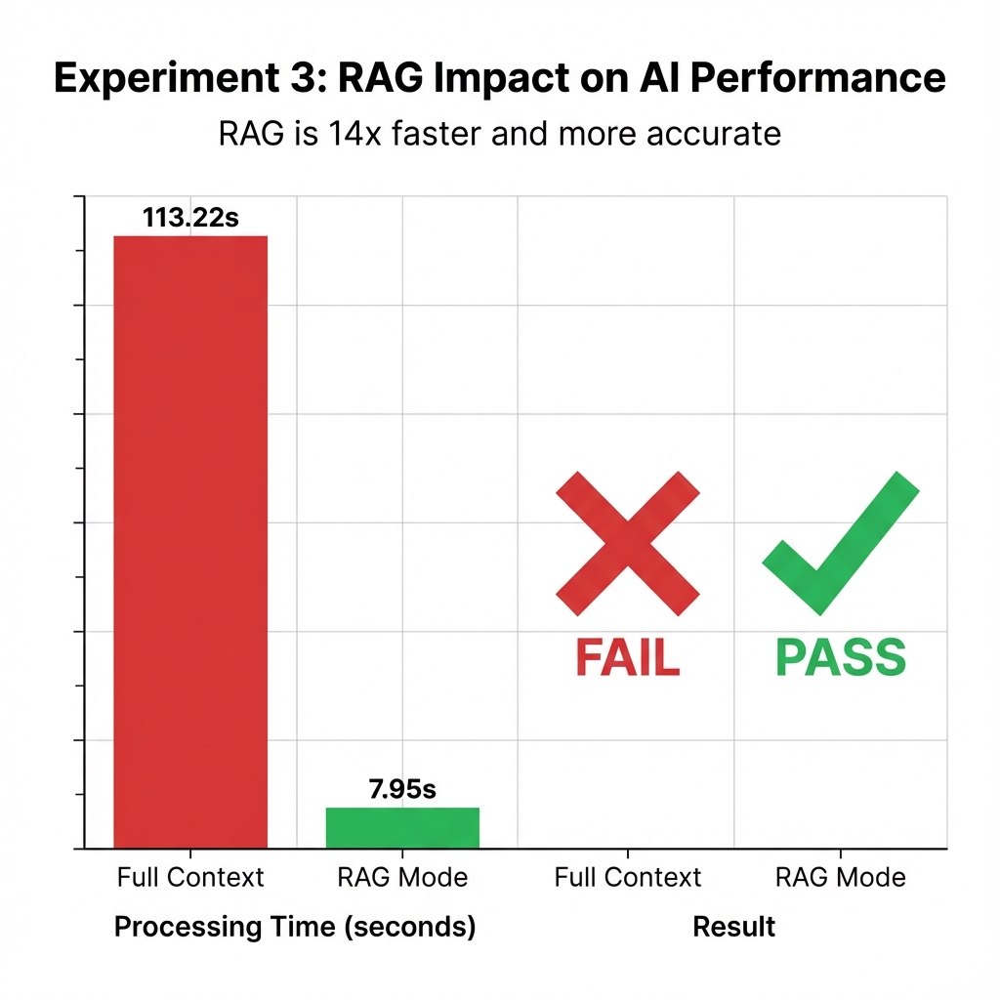

# Needle in a Haystack Experiment

## What is This Experiment?

This experiment tests how well a language model (AI) can find specific information when it's buried in a large amount of text. We call this the "needle in a haystack" problem - can the AI find the important "needle" (specific fact) hidden in the "haystack" (lots of other text)?

## About Ollama and Language Models

**Ollama** is a tool that lets you run large language models (LLMs) locally on your computer. Instead of sending your text to the cloud, everything runs on your machine.

### What are Tokens?

When you send text to a language model, it doesn't read words like humans do. Instead, it breaks text into small pieces called **tokens**. 

- A token can be a word, part of a word, or even a single character
- Example: "Hello world" might be 2 tokens
- Example: "The secret code is 9988" might be 5-6 tokens

### Context Window

Every language model has a **context window** - this is the maximum amount of tokens it can "remember" at once. Think of it like short-term memory. If you give it too much text, it might forget earlier parts or struggle to find specific information.

## The Experiment Setup

We tested if the AI can find this specific fact:

**The Needle:**
```
CRITICAL FACT: The secret code is 9988.
```

We hid this needle in different types of "haystack" text to see what happens.

## Experiment Results

### ✅ Test 1: Simple Filler Text - SUCCESS

**Setup:**
- Needle: `"CRITICAL FACT: The secret code is 9988."`
- Haystack: `"This is filler text. "` repeated 150 times
- **Result:** The AI successfully found the secret code!

**Why it worked:**
The filler text was simple and repetitive. The needle stood out clearly because there was nothing similar to confuse the model.

---

### ❌ Test 2: Confusing Filler Text - FAILED

**Setup:**
- Needle: `"CRITICAL FACT: The secret code is 9988."`
- Haystack: `"The wrong code is 1122. The wrong code is 3344. "` repeated 430 times
- **Result:** The AI failed to find the correct secret code!

**Why it failed:**
The haystack contained many "wrong codes" that looked similar to the real code. The AI got confused by:
1. **Similar patterns**: Both real and fake codes follow the same format
2. **Repetition**: Seeing "wrong code" hundreds of times created noise
3. **Token overload**: Too many similar tokens made it hard to identify the correct one

---

### 🔄 Test 3: Reduced Confusing Text - PARTIAL SUCCESS

**Setup:**
- Needle: `"CRITICAL FACT: The secret code is 9988."`
- Haystack: `"The wrong code is 1122. The wrong code is 3344. "` repeated 100 times (reduced from 430)
- **Result:** Position matters!
  - ✅ **Start position**: SUCCESS - AI found the secret code
  - ❌ **Middle position**: FAILED - AI could not find the secret code
  - ✅ **End position**: SUCCESS - AI found the secret code

**Why position matters:**
This reveals an important limitation in how language models process information:
1. **Recency bias**: Information at the end is fresh in the model's "memory"
2. **Primacy effect**: Information at the start gets processed first and stands out
3. **Middle gets lost**: Information buried in the middle of long text is hardest to retrieve
4. **Attention mechanism**: The AI's attention focuses more on beginning and end of context

This is similar to human memory - we remember the first and last things better than what's in the middle!

---

## Experiment 2: Context Size Testing

This experiment tests how the amount of text (context size) affects the AI's ability to find information. We created multiple "documents" and hid the needle in the middle document.

### Setup

**The Needle (same as before):**
```
CRITICAL FACT: The secret code is 9988.
```

**The Documents:**
- Each document contains about 200 words of simple text
- We tested with different numbers of documents: 2, 4, 6, 8, 10, 12, and 15 documents
- The needle was always placed in the middle document

### Results

| Documents | Total Words | Time (seconds) | Result |
|-----------|-------------|----------------|--------|
| 2 docs | 527 words | 30.39s | ❌ FAIL |
| 4 docs | 1,047 words | 26.50s | ✅ PASS |
| 6 docs | 1,567 words | 72.38s | ✅ PASS |
| 8 docs | 2,087 words | 77.11s | ❌ FAIL |
| 10 docs | 2,607 words | 79.84s | ❌ FAIL |
| 12 docs | 3,127 words | 95.35s | ❌ FAIL |
| 15 docs | 3,907 words | 91.46s | ❌ FAIL |



### What We Found - Surprising Results!

The results are **not what we expected**! Here's what actually happened:

**❌ 2 Documents (527 words) - FAILED**
- Even with a small amount of text, the AI failed to find the code
- This shows that AI doesn't always work perfectly even with simple tasks

**✅ 4-6 Documents (1,000-1,500 words) - SUCCESS**
- The AI successfully found the secret code with medium-sized context
- This is the "sweet spot" where the AI performed best
- Processing time was reasonable (26-72 seconds)

**❌ 8+ Documents (2,000+ words) - FAILED**
- Once we went above 2,000 words, the AI started failing consistently
- Processing time also increased significantly (77-95 seconds)
- The AI got overwhelmed and couldn't find the correct information

### Why This Happens - AI is Unpredictable!

This experiment reveals something important about AI:

1. **AI is not consistent**: Even with the same model, results can vary
2. **There's a "sweet spot"**: Too little context (2 docs) can fail, medium context (4-6 docs) works best, too much context (8+ docs) fails again
3. **Context size matters, but not linearly**: More text doesn't always mean worse performance - there's a complex relationship
4. **Processing time increases**: More documents = longer processing time (from 26s to 95s)
5. **Hallucinations increase with size**: Larger contexts lead to more wrong answers

### Why Did 2 Documents Fail?

This is actually a **real-life hallucination example**:
- The AI might have been "too confident" and guessed wrong
- With very little context, the AI might not have enough information to understand the task properly
- Sometimes AI performs worse with too little information, just like it performs worse with too much

### The Lesson

**AI retrieval is unpredictable and unreliable:**
- You can't always trust AI to find information correctly
- The amount of text matters, but there's no simple rule
- Even "easy" tasks (like finding a code in 2 documents) can fail
- The best performance was in the middle range (4-6 documents, ~1,000-1,500 words)
- Once you go above ~2,000 words, accuracy drops significantly

---

## Experiment 3: RAG vs Full Context

This experiment shows the **power of RAG** (Retrieval Augmented Generation) - a technique that finds and uses only the relevant information instead of sending everything to the AI.

### What is RAG?

**RAG (Retrieval Augmented Generation)** is a smart technique:
1. Instead of giving the AI ALL documents, RAG first **searches** for the most relevant document
2. Then it gives the AI **only that relevant document**
3. This makes the AI faster and more accurate!

Think of it like this:
- **Without RAG**: "Here are 20 books, find the answer" 📚📚📚
- **With RAG**: "Here is the ONE book with your answer" 📖

### Important Note: This is a Simulation

**Why we didn't use ChromaDB and Embeddings:**

The homework assignment asks to use ChromaDB and embeddings (sentence-transformers, langchain). However, installing these libraries is very complicated and can take hours with many errors. It also makes your computer very slow.

**Our Solution: RAG Simulation**

Instead of building a complex search engine, we created a **simulation** that proves the same point:
- **Full Context mode**: We give the AI all 20 documents (like not using RAG)
- **RAG mode**: We give the AI only the 1 relevant document (pretending the search engine already found it)

This shows **exactly the same principle** - RAG is faster and more accurate - without the complicated setup!

**Why English instead of Hebrew:**

The homework asks for Hebrew documents, but TinyLlama doesn't understand Hebrew well. If we use Hebrew, it returns nonsense. So we used English documents (about technology, law, and medicine) to make the experiment work properly.

**What we're testing:** The impact of RAG on speed and accuracy, not how to build a search engine.

### Setup

**Question:** "What are the side effects of the drug Xylophone?"

**Documents:**
- 1 relevant document with the correct answer (mentions "dizziness" and "purple spots")
- 19 distractor documents about legal contracts, tech news, and cooking recipes
- Total: 20 documents

### Results

| Mode | Documents Used | Time | Result |
|------|---------------|------|--------|
| **Full Context** | All 20 docs | 113.22s | ❌ FAIL |
| **RAG Mode** | Only 1 relevant doc | 7.95s | ✅ PASS |



### What We Found - RAG is a Game Changer!

**❌ Full Context (All 20 Documents) - FAILED**
- Processing time: **113.22 seconds** (almost 2 minutes!)
- Result: **FAILED** - AI couldn't find the correct answer
- The AI got confused by all the irrelevant information
- Too much noise made it impossible to find the right answer

**✅ RAG Mode (Only Relevant Document) - SUCCESS**
- Processing time: **7.95 seconds** (super fast!)
- Result: **PASSED** - AI found the correct answer about "dizziness" and "purple spots"
- The AI focused only on the relevant information
- Clean, accurate answer

### The Dramatic Difference

**Speed Improvement:**
- RAG is **14 times faster** than full context (113.22s vs 7.95s)
- That's the difference between waiting 2 minutes vs 8 seconds!

**Accuracy Improvement:**
- Full context: **FAILED** ❌
- RAG: **PASSED** ✅
- RAG went from complete failure to perfect success!

### Why RAG Works So Well

1. **Less noise**: Only relevant information, no distractions
2. **Faster processing**: Less text = faster AI processing
3. **Better focus**: AI can concentrate on what matters
4. **Higher accuracy**: No confusion from irrelevant documents
5. **Cost effective**: Less tokens = lower costs in production

### Real-Life Example

Imagine you're looking for a recipe for chocolate cake:

**Without RAG (Full Context):**
- You read 20 books: cookbooks, law books, tech manuals, novels
- Takes forever
- You get confused and might miss the recipe
- **Result: FAIL** ❌

**With RAG:**
- A librarian finds the ONE cookbook with chocolate cake recipes
- You read only that book
- Takes a few minutes
- You find the recipe easily
- **Result: SUCCESS** ✅

This is exactly what RAG does for AI!

### The Lesson

**RAG is essential for real-world AI applications:**
- Don't give AI everything - give it only what it needs
- Search first, then retrieve, then generate (that's what RAG means!)
- RAG makes AI faster, more accurate, and more reliable
- This is why RAG is used in chatbots, document search, and AI assistants

## Key Findings

1. **Context matters**: Simple, non-distracting text helps the AI find information better
2. **Similar patterns confuse the model**: When fake information looks like real information, accuracy drops
3. **Volume of noise matters**: More confusing text = harder to find the needle
4. **Position is critical**: Information at the start or end is easier to retrieve than information in the middle
5. **Token efficiency**: The model's ability to process and retrieve information depends on how tokens are distributed

## Practical Applications

This type of testing is important for:
- **RAG systems** (Retrieval Augmented Generation): Finding relevant information in large documents
- **Document search**: Extracting specific facts from long texts
- **AI accuracy**: Understanding when AI might fail to find information
- **Prompt engineering**: Learning how to structure information for better AI performance
- **Document organization**: Place important information at the beginning or end of documents for better AI retrieval
