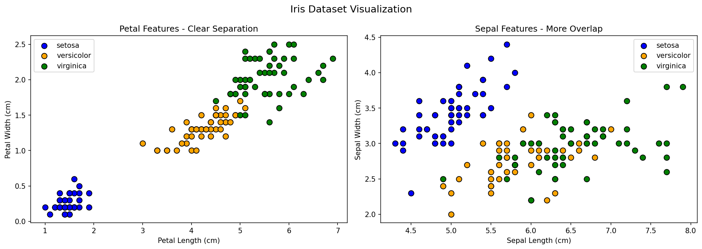
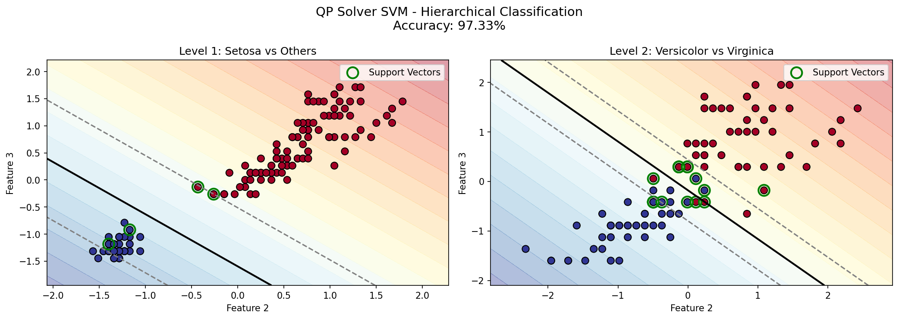
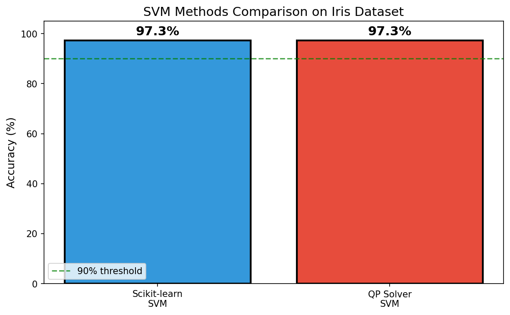

# 🌸 SVM Flower Classification - Simple Guide

## What is This Project?

Imagine you have a basket of flowers and you want to teach a computer to sort them into 3 types:
1. **Setosa** - one type of iris flower
2. **Versicolor** - another type 
3. **Virginica** - a third type

This project teaches a computer to look at a flower and say "This is a Setosa!" or "This is a Versicolor!"

---

## 🤔 What is SVM?

**SVM = Support Vector Machine**

Think of it like this:

Imagine you have red candies and blue candies on a table. You want to put a string to separate them.

```
    🔴 🔴           🔵 🔵
  🔴   🔴    |    🔵    🔵
    🔴       |       🔵
             |
        (the string)
```

**SVM finds the BEST place for the string** - the one that has the most space between the candies and the string!

---

## ⭐ What are Support Vectors? (Very Important!)

The candies closest to the string are called **"Support Vectors"**.

Think of it like this: You want to put a fence between cats and dogs in a yard.

```
    🐱 🐱 🐱              🐕 🐕 🐕
  🐱   🐱   🐱    |    🐕   🐕   🐕
    🐱 ⭕🐱     |      ⭕🐕 🐕
         ↑       |       ↑
    This cat   FENCE   This dog
    touches            touches
    the fence          the fence
```

**The animals touching the fence are Support Vectors!**

**Why are they special?**
- Only THESE animals decide where the fence goes
- If you move a cat far from the fence → nothing changes
- If you move a cat TOUCHING the fence → the whole fence moves!

**In our graphs:**
- Support Vectors are shown with **green circles** ⭕
- They're the flowers closest to the decision line
- More Support Vectors = harder problem (flowers are more mixed)

---

## 🔢 How Does the Computer Find Support Vectors?

### The Separating Line

The line (or "fence") is defined by this formula:

```
w · x + b = 0
```

**What does this mean?**
- `w` = direction of the line (which way it tilts)
- `x` = a point (a flower)
- `b` = how much to shift the line

### The Rule for Support Vectors

For each point, we calculate how far it is from the line:

```
distance = y × (w · x + b)
```

Where `y` is the label (+1 for blue, -1 for red).

**The rule:**
- If distance = 1 → This point is a Support Vector! ⭕
- If distance > 1 → This point is far from the line, not important

### The Magic Number: Alpha (α)

When the computer solves SVM, it gives each point a number called **alpha (α)**:

```
If α > 0  →  Support Vector! ⭕
If α = 0  →  Not a Support Vector
```

**Simple example:**
| Flower | Alpha (α) | Support Vector? |
|--------|-----------|-----------------|
| Flower 1 | 0.0 | No ❌ |
| Flower 2 | 0.5 | Yes ⭕ |
| Flower 3 | 0.0 | No ❌ |
| Flower 4 | 1.2 | Yes ⭕ |

---

## 🔧 Two Ways to Build SVM

### Method 1: Scikit-learn (The Easy Way) 📦

**What it is:** A ready-made library someone already built

**Like:** Buying a cake from a bakery 🎂

```python
from sklearn.svm import SVC

# Create the model
svm = SVC(kernel='linear')

# Train - computer learns the line
svm.fit(X, y)

# Predict - ask which group a new flower belongs to
answer = svm.predict(new_flower)
```

**Pros:** Easy, fast, only 3 lines of code!
**Cons:** We don't see what happens inside (black box)

---

### Method 2: QP Solver (The Math Way) 🧮

**What it is:** We solve the math problem ourselves

**Like:** Baking a cake from scratch with a recipe 👨‍🍳

**The Math Problem:**

SVM tries to find the line with the **BIGGEST margin** (most space).

This is called an **optimization problem**:

```
MAXIMIZE:    Σαᵢ  -  ½ΣΣ αᵢαⱼyᵢyⱼ(xᵢ · xⱼ)
             ───     ─────────────────────
             │              │
             │              └─ How similar are points?
             │
             └─ Sum of all alphas

SUBJECT TO:  0 ≤ αᵢ ≤ C      (alphas must be between 0 and C)
             Σαᵢyᵢ = 0       (must be balanced)
```

**In simple words:**
- `αᵢ` = How important is flower i? (if > 0, it's a Support Vector!)
- `yᵢ` = The label (+1 or -1)
- `xᵢ · xⱼ` = How similar are flower i and flower j?
- `C` = How many mistakes we allow (higher = stricter)

**How we solve it:**

This is a **Quadratic Programming** problem. There are algorithms that solve it!

```python
from cvxopt import solvers

# Build the matrices (the recipe)
P = similarity_matrix   # How similar are all flowers?
q = minus_ones          # Vector of -1s
G = inequality_bounds   # The rules
h = limits              # The limits

# Solve! (the computer does the hard work)
solution = solvers.qp(P, q, G, h, A, b)
alphas = solution['x']  # The α for each flower
```

**After we have the alphas:**

```
w = Σ αᵢ × yᵢ × xᵢ     (the direction of the line)
b = average over Support Vectors (how much to shift)
```

**Pros:** We understand exactly what happens!
**Cons:** More complicated, more code

---

## 📊 Comparison: Which Method is Better?

```
┌────────────────────────────────────────────────────┐
│                                                    │
│   SKLEARN (Library)         QP SOLVER (From Scratch)│
│                                                    │
│   ┌──────────────┐         ┌──────────────┐       │
│   │  BLACK BOX   │         │  GLASS BOX   │       │
│   │              │         │              │       │
│   │   Data In    │         │   Data In    │       │
│   │      ↓       │         │      ↓       │       │
│   │    Magic     │         │  See all the │       │
│   │      ↓       │         │    steps!    │       │
│   │  Answer Out  │         │      ↓       │       │
│   │              │         │  Answer Out  │       │
│   └──────────────┘         └──────────────┘       │
│                                                    │
│   Result: 97.3%            Result: 97.3%          │
│                                                    │
│   ✓ Fast                   ✓ Educational          │
│   ✓ Easy                   ✓ Understand SVM       │
│   ✗ Can't see inside       ✗ More work            │
│                                                    │
└────────────────────────────────────────────────────┘
```

**Both methods give the SAME answer** because they solve the same math problem!

---

## 🎯 The Problem: 3 Groups, But SVM Only Does 2!

SVM can only separate 2 groups at a time. But we have 3 flower types!

**Solution: Split the problem into 2 steps!**

### Step 1: Is it Setosa or Not?
```
┌─────────────────────────────────────────┐
│                                         │
│   FLOWER                                │
│      │                                  │
│      ▼                                  │
│  ┌───────────┐                          │
│  │ Is it     │──YES──▶ It's SETOSA! 🌸  │
│  │ Setosa?   │                          │
│  └───────────┘                          │
│      │                                  │
│      NO                                 │
│      │                                  │
│      ▼                                  │
│   Go to Step 2                          │
└─────────────────────────────────────────┘
```

### Step 2: Is it Versicolor or Virginica?
```
┌─────────────────────────────────────────────┐
│                                             │
│   NOT SETOSA                                │
│      │                                      │
│      ▼                                      │
│  ┌──────────────┐                           │
│  │ Versicolor   │──YES──▶ It's VERSICOLOR!  │
│  │ or Virginica?│                           │
│  └──────────────┘                           │
│      │                                      │
│      NO                                     │
│      │                                      │
│      ▼                                      │
│  It's VIRGINICA! 🌺                         │
└─────────────────────────────────────────────┘
```

---

## 🔧 Two Ways to Build SVM

### Method 1: Scikit-learn (The Easy Way)
Like using a pre-built LEGO set with instructions. Someone already made the SVM tool - we just use it!

```python
from sklearn.svm import SVC
svm = SVC()      # Get the tool
svm.fit(X, y)    # Teach it
svm.predict(X)   # Ask it to guess
```

### Method 2: QP Solver (Building From Scratch)
Like building your own LEGO creation without instructions. We solve the math ourselves!

**The math looks scary but it's just asking:**
> "Find the best line that separates the groups with the most space"

We use something called "Quadratic Programming" to solve this math puzzle.

---

## 📊 The Iris Dataset

We measure 4 things about each flower:
1. **Sepal Length** - length of the outer green part
2. **Sepal Width** - width of the outer green part  
3. **Petal Length** - length of the colorful inner part
4. **Petal Width** - width of the colorful inner part

```
        SEPAL (green outer part)
        ╭─────────╮
       ╱           ╲
      │   PETAL    │
      │  (colorful) │
       ╲           ╱
        ╰─────────╯
```

---

## 📈 Results & Graphs

### 1. The Iris Data - Meet Our Flowers! 🌸



**What you see:**
- Each dot is ONE flower (150 flowers total)
- **Blue dots** = Setosa flowers
- **Orange dots** = Versicolor flowers
- **Green dots** = Virginica flowers

**Left graph (Petal Features):** Shows petal length and width
- Look! Setosa (blue) is sitting all alone in the corner!
- It's like the blue team is playing on one side of the playground, and orange+green are on the other side
- This is GREAT for our computer - easy to separate!

**Right graph (Sepal Features):** Shows sepal length and width
- Uh oh! All the colors are mixed together like a messy room
- This would be HARD for our computer to separate
- That's why we use petal features instead!

**Why this matters:** We pick the features where flowers are most separated - like choosing the easiest puzzle to solve!

---

### 2. Scikit-learn SVM Results - The Library Way


#### 📖 How to Read These Graphs:

| What you see | What it means |
|--------------|---------------|
| 🔵 Blue dots | Flowers in Group 1 |
| 🔴 Red dots | Flowers in Group 2 |
| ⬛ Thick black line | The "fence" (Decision Boundary) |
| ➖ Gray dashed lines | The "safety zone" (Margin) |
| ⭕ Green circles | Support Vectors (most important flowers!) |
| Blue/Red background | Where computer thinks each group belongs |

**What you see:**

**Left graph - Level 1 (Is it Setosa?):**
- **Blue dots** = Setosa (the ones we want to find)
- **Red dots** = Everyone else (Versicolor + Virginica together)
- **Thick black line** = The "fence" our computer built to separate them
- **Gray dashed lines** = The "safety zone" (called margin) - like a buffer zone between countries
- **Green circles** = Support Vectors - these are the MOST IMPORTANT flowers! They're right next to the fence and help decide where to put it

**Right graph - Level 2 (Versicolor or Virginica?):**
- Now we're looking at the non-Setosa flowers
- **Blue dots** = Versicolor
- **Red dots** = Virginica
- Notice MORE green circles here - because these flowers are harder to separate, we need more "helpers"!

**The colors in the background:** Blue area = computer says "this is group 1", Red area = computer says "this is group 2"

---

### 3. QP Solver SVM Results - We Built It Ourselves! 🔧



**What you see:**
- This looks almost EXACTLY like the sklearn version!
- Same fence line, same support vectors, same everything!

**Why is this cool?**
- We didn't use any ready-made SVM tool
- We solved the math puzzle ourselves using something called "Quadratic Programming"
- It's like baking a cake from scratch vs. buying one from a store - same cake, but you learned how to make it!

**Spot the difference:** Look closely - the graphs are nearly identical! This proves our homemade SVM works correctly!

---

### 4. Comparison - Who Won? 🏆



**What you see:**
- **Blue bar** = Scikit-learn method: 97.3% correct
- **Red bar** = QP Solver method: 97.3% correct  
- **Green dashed line** = Our goal was 90%, and we beat it!

**It's a TIE!** Both methods got exactly the same score!

**What does 97.3% mean?**
- Out of 150 flowers, we correctly identified 146
- Only 4 flowers were guessed wrong
- That's like getting 97 out of 100 on a test!

**Why are they the same?**
- Both methods solve the same math problem
- It's like taking two different roads to the same destination
- The sklearn library just does it faster (like a car), while QP solver shows us how it works (like walking and seeing everything)

---

## 🏃 How to Run

```bash
# Make sure you have the libraries
pip install numpy matplotlib scikit-learn cvxopt

# Run the project
python main.py
```

---

## 📁 Project Files

| File | What it does |
|------|-------------|
| `main.py` | Runs everything and makes comparison |
| `svm_sklearn.py` | SVM using the easy library method |
| `svm_qp.py` | SVM using math (from scratch) |
| `utils.py` | Helper functions for loading data |
| `PRD.md` | Project requirements document |
| `TASKS.md` | List of tasks for the project |

---

## 🎓 What Did We Learn?

1. **SVM finds the best line** to separate groups
2. **For 3+ groups**, we can split into multiple binary problems
3. **Two ways to implement**: use a library OR solve the math yourself
4. **Both give same results** - because they solve the same problem!

---

## 🌟 Fun Fact

The name "Support Vector" comes from the data points (vectors) that "support" the decision boundary - they're the ones touching the margin lines!

```
Support Vectors → 🔴      |      🔵 ← Support Vectors
                   ↘     |     ↙
                    margin|margin
                          |
                    (boundary)
```

---
