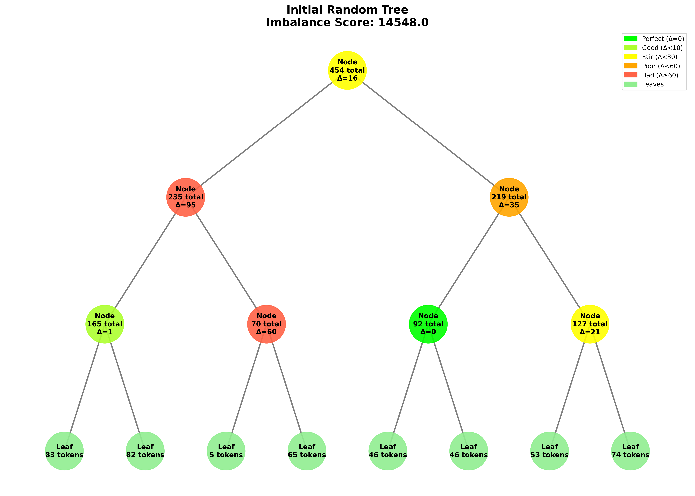
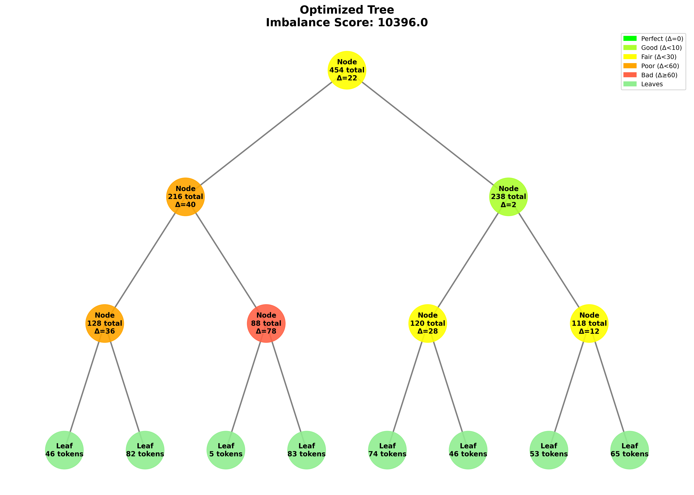
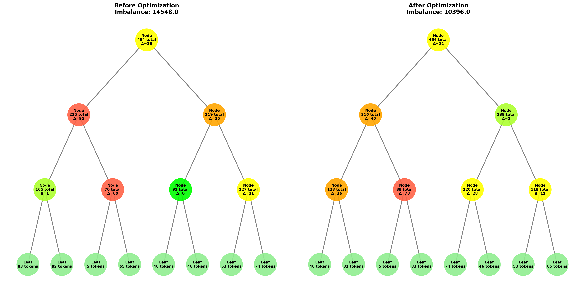
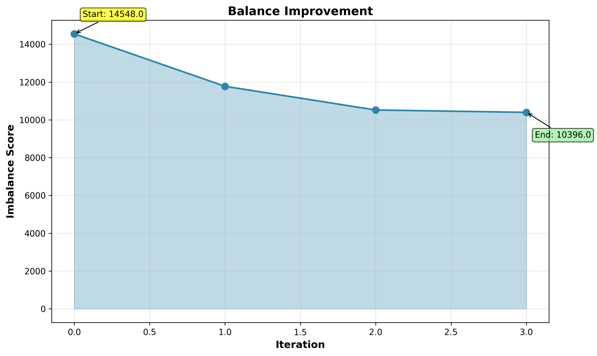
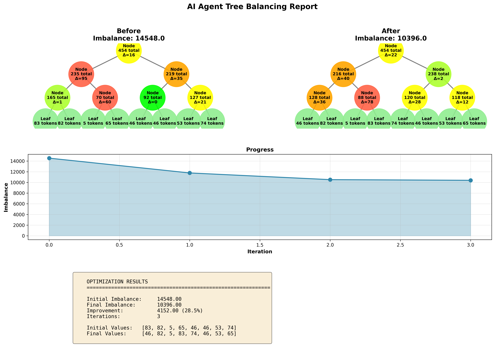

# 🌳 AI Agent Tree Balancing Game

An educational simulation that demonstrates how to optimize token distribution in hierarchical AI agent systems.

## 📖 Table of Contents

- [What is This?](#what-is-this)
- [The Problem](#the-problem)
- [The Solution](#the-solution)
- [How It Works](#how-it-works)
- [Quick Start](#quick-start)
- [Understanding Balance](#understanding-balance)
- [The Algorithm](#the-algorithm)
- [Visual Examples](#visual-examples)
- [Technical Details](#technical-details)

---

## What is This?

In modern AI systems, multiple AI agents often work together in a **tree structure**. Each agent at the bottom (called **leaf nodes**) consumes tokens (API calls), and these costs add up as you go up the tree.

**The challenge:** How do we distribute the workload so no single branch gets overloaded?

This project simulates such systems and shows you how to automatically balance them!

---

## The Problem

### Simple Example

Imagine you have 4 AI agents with these token consumptions:
```
Agent A: 1 token
Agent B: 2 tokens
Agent C: 10 tokens
Agent D: 80 tokens
```

If we organize them in a tree like this:

```
         Root (93 total)
        /               \
   Left (90)          Right (3)
   /      \           /       \
  10      80         1         2
  (C)     (D)        (A)       (B)
```

**Notice the problem:**
- The left branch uses 90 tokens
- The right branch uses only 3 tokens
- This is **very unbalanced!**

The left side is doing 30 times more work than the right side!

---

## The Solution

**What if we swap agents D and B?**

```
         Root (93 total)
        /               \
   Left (12)          Right (81)
   /      \           /       \
  10       2         1        80
  (C)     (B)        (A)      (D)
```

**Much better!**
- Left branch: 12 tokens
- Right branch: 81 tokens
- More balanced distribution!

---

## How It Works

### The Balance Formula

We measure "imbalance" using a mathematical formula. For each parent node:

```
Imbalance = (Left Child - Right Child)²
```

We square the difference because:
- **Small differences** (like 45 vs 55) = small penalty
- **Large differences** (like 10 vs 90) = HUGE penalty

**Total tree imbalance** = sum of all parent nodes' imbalances

### Example Calculation

**Before swap:** `[10, 80] vs [1, 2]`
```
Root level:     (90 - 3)²   = 7,569
Left subtree:   (10 - 80)²  = 4,900
Right subtree:  (1 - 2)²    = 1
TOTAL IMBALANCE = 12,470
```

**After swap:** `[10, 2] vs [1, 80]`
```
Root level:     (12 - 81)²  = 4,761
Left subtree:   (10 - 2)²   = 64
Right subtree:  (1 - 80)²   = 6,241
TOTAL IMBALANCE = 11,066
```

**Result:** 11.3% improvement! ✅

---

## Quick Start

### Installation

```bash
# Clone or download the project
cd ai-agent-tree-balancing

# Install dependencies
pip install -r requirements.txt

# Run the simulation
python src/main.py
```

### What You'll See

1. **Simple Example** - The classic 4-agent example explained above
2. **Educational Explanation** - How the balance metric works
3. **Full Simulation** - Random tree with automatic optimization
4. **Visual Reports** - Beautiful charts and diagrams

---

## Understanding Balance

### Why Balance Matters

In AI agent systems:
- ⚡ **Unbalanced trees** create bottlenecks
- 💸 **One branch** might use 90% of your API budget
- 🐌 **Performance** suffers when work isn't distributed
- ✅ **Balanced trees** use resources more efficiently

### Real-World Analogy

Think of a restaurant kitchen:
- **Unbalanced:** One chef cooks 20 dishes while another cooks 2
- **Balanced:** Each chef cooks 11 dishes

The balanced kitchen serves customers faster and more efficiently!

### The Balance Metric Explained

**Why do we square the difference?**

Let's compare two approaches:

**Linear difference (simple subtraction):**
- 90 - 10 = 80
- 55 - 45 = 10
- Both are "just numbers"

**Squared difference:**
- (90 - 10)² = 6,400 😱
- (55 - 45)² = 100 😊
- **Big imbalances get heavily penalized!**

This encourages the algorithm to fix large imbalances first.

---

## The Algorithm

### Greedy Swap Optimization

Our algorithm uses a simple but effective approach:

```
1. Calculate current imbalance score
2. For each possible pair of leaf agents:
   a. Simulate swapping them
   b. Calculate new imbalance
   c. Remember if this is the best swap
3. Apply the best swap we found
4. Repeat until no more improvements
```

### Why "Greedy"?

We always pick the **best improvement right now**, even if it's not perfect. This finds a good solution quickly!

### Example Run

```
Initial tree: [73, 90, 88, 96, 51, 98, 40, 16]
Imbalance: 32,392

Iteration 1: Swap 88 ↔ 16  →  Imbalance: 14,248  ✓
Iteration 2: Swap 51 ↔ 40  →  Imbalance: 14,028  ✓
Iteration 3: Swap 96 ↔ 98  →  Imbalance: 13,932  ✓
Iteration 4: Swap 90 ↔ 16  →  Imbalance: 13,844  ✓

Final imbalance: 13,844
Total improvement: 57.3% ✨
```

---

## Visual Examples

### Initial Random Tree



**Color coding:**
- 🟢 **Green** = Well balanced
- 🟡 **Yellow** = Somewhat balanced
- 🟠 **Orange** = Poor balance
- 🔴 **Red** = Very unbalanced

The Δ (delta) value shows the difference between left and right children.

### Optimized Tree



Notice how the algorithm:
- Reduced red nodes (high imbalance)
- Created more green nodes (good balance)
- Distributed tokens more evenly

### Before vs After Comparison



Side-by-side view clearly shows the improvement!

### Improvement Progress



The chart shows how imbalance decreases with each iteration. Each drop represents a successful swap!

### Complete Report



Full summary with:
- Before/after trees
- Progress chart
- Detailed statistics
- Leaf value transformations

---

## Technical Details

### Project Structure

```
ai-agent-tree-balancing/
├── src/
│   ├── tree.py          # Binary tree implementation
│   ├── balancer.py      # Optimization algorithms
│   ├── visualizer.py    # Chart and diagram generation
│   └── main.py          # Main application
├── images/              # Generated visualizations
├── README.md            # This file
├── PRD.md              # Product Requirements Document
└── requirements.txt     # Python dependencies
```

### Key Components

**Tree (tree.py)**
- Binary tree data structure
- Token aggregation from leaves to root
- Imbalance calculation
- Leaf swapping operations

**Balancer (balancer.py)**
- Greedy swap optimization
- Configuration evaluation
- Optimization history tracking

**Visualizer (visualizer.py)**
- Tree diagram generation
- Comparison charts
- Progress visualization
- Summary reports

### Running Different Scenarios

**Change tree depth:**
```python
tree = AgentTree(depth=4)  # Creates 16 leaf nodes
```

**Adjust token range:**
```python
tree = AgentTree(depth=3, min_tokens=1, max_tokens=50)
```

**Limit optimization iterations:**
```python
balancer = TreeBalancer(tree)
results = balancer.optimize_greedy(max_iterations=50)
```

### Dependencies

- **matplotlib** - Creating charts and diagrams
- **networkx** - Graph visualization
- **numpy** - Numerical calculations

---

## Key Takeaways

1. **Token distribution matters** in multi-agent AI systems
2. **Simple metrics** like squared difference can measure balance effectively
3. **Greedy algorithms** can find good solutions quickly
4. **Visual tools** help understand complex tree structures
5. **Small changes** (swapping leaves) can make big improvements

---

## Educational Value

This project teaches:
- ✅ Binary tree data structures
- ✅ Optimization algorithms
- ✅ Metric design (why squaring matters)
- ✅ Greedy vs optimal solutions
- ✅ Data visualization
- ✅ Real-world AI system challenges

Perfect for:
- 🎓 Computer Science students
- 🤖 AI Engineering courses
- 💻 Software developers learning optimization
- 📊 Anyone interested in system design

---

## Future Enhancements

Possible improvements:
- 🌲 Support for non-binary trees (3+ children)
- 🎯 Multiple optimization strategies comparison
- 🎮 Interactive web interface
- 📈 Real-time optimization animation
- 🔗 Integration with actual AI agent frameworks

---

## License

Educational project - free to use and modify for learning purposes.

---

## Questions?

**Common Questions:**

**Q: Why can't we just perfectly balance everything?**  
A: We can only swap leaf values, not change them. With random values, perfect balance is usually impossible!

**Q: Is this the optimal solution?**  
A: Our greedy algorithm finds a *good* solution quickly, but not always the *best possible* solution.

**Q: Can this work with real AI systems?**  
A: Yes! The principles apply to any hierarchical system with resource constraints.

**Q: What if my tree has 1000 agents?**  
A: The algorithm still works, but might take longer. For very large trees, consider more advanced optimization techniques.

---

**Made with ❤️ for AI Engineering education**

*Last updated: January 2026*