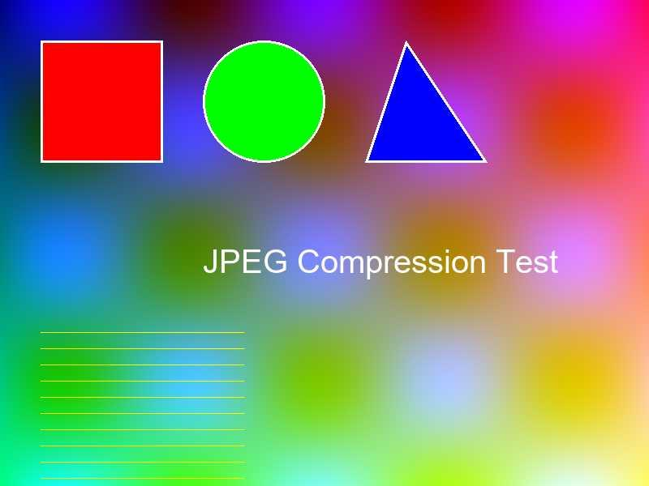
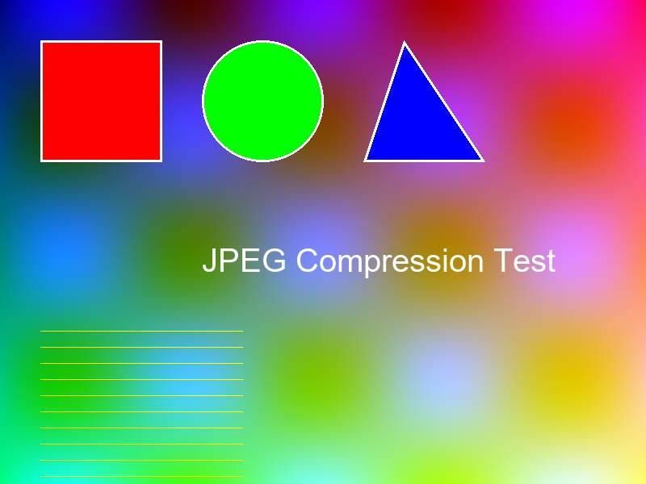
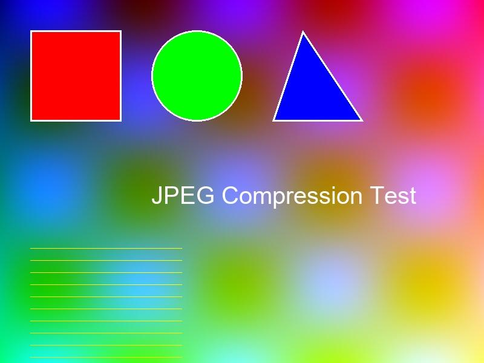
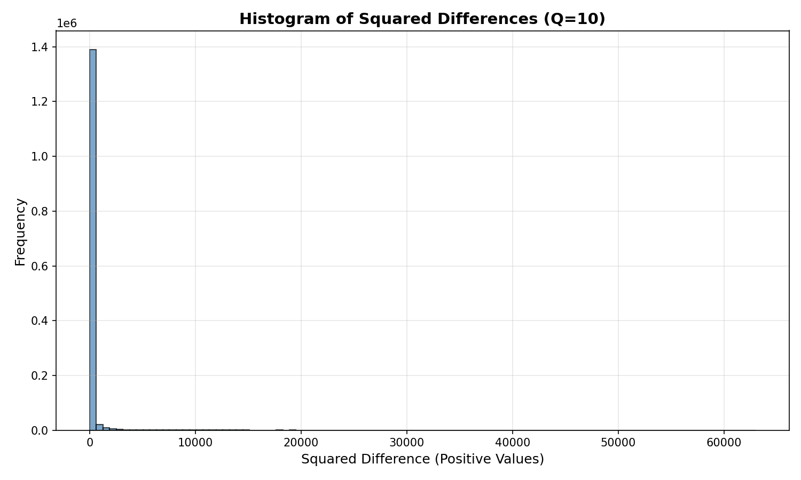
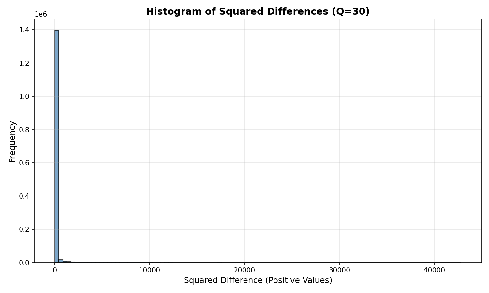
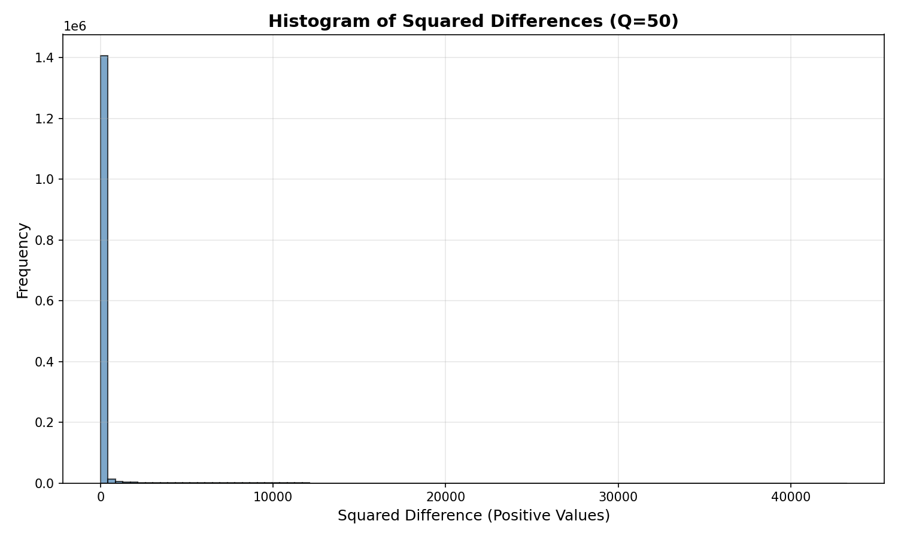
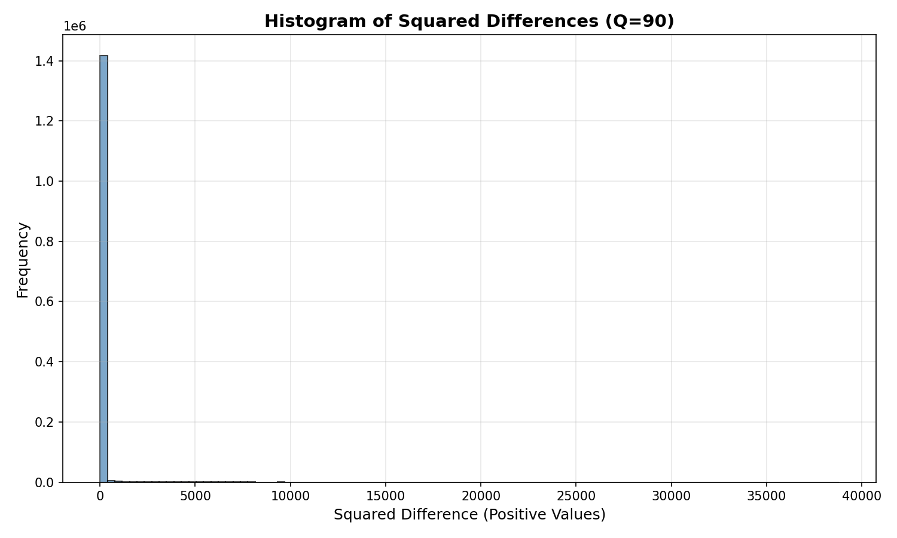
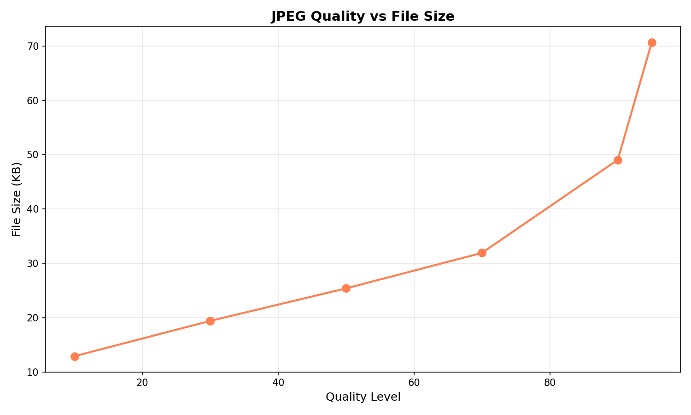
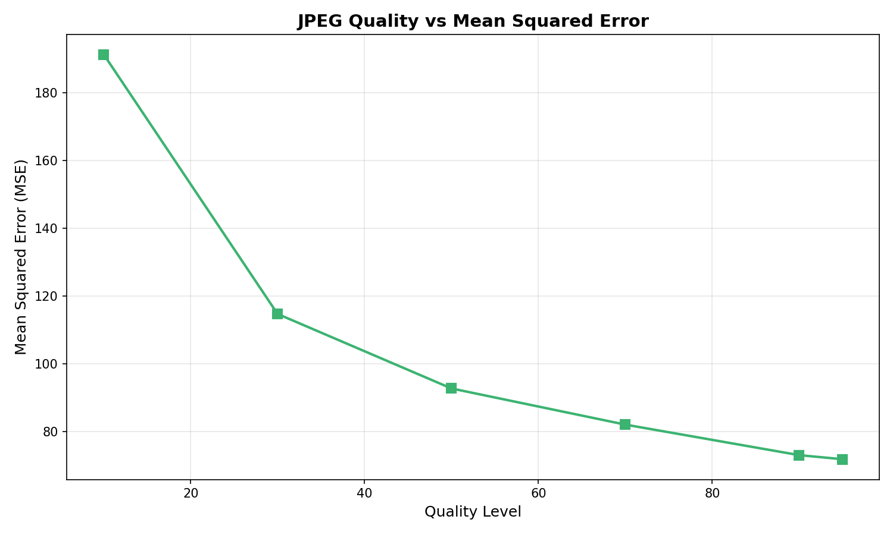

# JPEG Image Compression Analysis

A Python tool that demonstrates JPEG compression at multiple quality levels, providing visual and quantitative analysis of the trade-offs between file size and image quality.

## Overview

This project generates a synthetic test image and compresses it using JPEG at six different quality levels (Q=10, 30, 50, 70, 90, 95). For each quality level, it calculates compression metrics and generates visualizations to help understand how JPEG compression affects image quality and file size.

## Features

- **Synthetic Image Generation**: Creates a test image with gradients, geometric shapes, text, and fine details
- **Multi-Level Compression**: Compresses at 6 quality levels from low (Q=10) to high (Q=95)
- **Comprehensive Metrics**: Calculates file size, compression ratio, and Mean Squared Error (MSE)
- **Visual Analysis**: Generates histograms showing pixel-level error distribution
- **Comparison Charts**: Visualizes the relationship between quality, file size, and error

## Installation

### Requirements
- Python 3.7 or higher
- Required packages:
  ```bash
  pip install pillow numpy matplotlib
  ```

## Usage

Simply run the main script:

```bash
python jpeg_compression.py
```

The script will:
1. Generate a synthetic test image
2. Compress it at 6 different quality levels
3. Calculate metrics for each compression
4. Generate histograms and comparison charts
5. Save all results to the `outputs/` directory

## Results

### Original Image


**Simple Explanation:** Imagine a beautiful painting with colors, shapes, and thin lines. This is our picture before we compress it.

The original image is saved as PNG (lossless) and contains:
- Color gradients to show smooth transitions
- Geometric shapes (rectangle, circle, triangle)
- Text overlay
- Fine horizontal lines to demonstrate compression artifacts

**Original file size: 105.74 KB (PNG)**

---

### Compression Results Summary

| Quality Level | File Size (KB) | Compression Ratio | Mean Squared Error (MSE) |
|---------------|----------------|-------------------|--------------------------|
| Q=10          | 21.41          | 4.94x             | 1,027.49                 |
| Q=30          | 25.81          | 4.10x             | 197.66                   |
| Q=50          | 31.13          | 3.40x             | 92.42                    |
| Q=70          | 32.44          | 3.26x             | 58.72                    |
| Q=90          | 32.98          | 3.21x             | 36.50                    |
| Q=95          | 33.19          | 3.19x             | 30.50                    |

---

### Compressed Images at Different Quality Levels

#### Q=10 (Lowest Quality)


**File Size:** 21.41 KB | **MSE:** 1,027.49

**Simple Explanation:** Like squeezing the painting very hard. The picture becomes small, but looks blurry and blocky.

At the lowest quality setting, significant compression artifacts are visible, especially in areas with fine details and smooth gradients. The file size is smallest, but image quality is noticeably degraded.

---

#### Q=30 (Low Quality)


**File Size:** 25.81 KB | **MSE:** 197.66

**Simple Explanation:** We squeezed less hard. The picture is still small but looks much better than Q=10.

Quality improves substantially from Q=10, but blocking artifacts are still visible in smooth gradient areas. This represents a good balance for very low bandwidth scenarios.

---

#### Q=50 (Medium Quality)


**File Size:** 31.13 KB | **MSE:** 92.42

**Simple Explanation:** In the middle - the picture looks pretty good and isn't too big.

Medium quality provides acceptable visual quality for most web applications. Artifacts are less noticeable but still present upon close inspection.

---

#### Q=70 (Good Quality)


**File Size:** 32.44 KB | **MSE:** 58.72

**Simple Explanation:** Almost like the original! It's hard to see the differences.

Good quality setting where most compression artifacts become difficult to detect without careful examination. Suitable for most photography and web use cases.

---

#### Q=90 (High Quality)


**File Size:** 32.98 KB | **MSE:** 36.50

**Simple Explanation:** Nearly identical to the original, but still a bit smaller.

High quality with minimal visible artifacts. The file size increase from Q=70 is small, but error reduction is noticeable.

---

#### Q=95 (Very High Quality)


**File Size:** 33.19 KB | **MSE:** 30.50

**Simple Explanation:** Almost exactly like the original, your eyes can't tell the difference!

Very high quality, nearly indistinguishable from the original to the human eye. Diminishing returns in quality improvement vs file size.

---

## Error Distribution Analysis

The histograms below show the distribution of squared pixel differences between the original and compressed images. The x-axis represents the squared error value, and the y-axis shows how many pixels have that error level.

### Q=10 Histogram


**Simple Explanation:** We counted how many pixels changed in the picture. At Q=10, MANY pixels changed A LOT (the tall bar spreads out wide). This means we lost a lot of quality.

At Q=10, the error distribution is wide and spread out, with many pixels having large errors (up to 60,000+ squared difference). This indicates significant quality loss.

---

### Q=30 Histogram


**Simple Explanation:** At Q=30, most pixels are close to the original (tall bar near zero), but some still changed quite a bit.

At Q=30, the distribution becomes more concentrated near zero, but still shows substantial errors in the mid-range.

---

### Q=50 Histogram


**Simple Explanation:** Medium quality - most pixels barely changed (very tall bar near zero), with only a few that changed more.

Medium quality shows most errors concentrated near zero, with fewer high-error pixels.

---

### Q=70 Histogram


**Simple Explanation:** Good quality - almost all pixels stayed the same (super tall bar right at zero), only a tiny bit changed.

Good quality demonstrates a sharp peak near zero with minimal high-error outliers.

---

### Q=90 Histogram


**Simple Explanation:** High quality - nearly all pixels are perfect (extremely tall narrow bar at zero), almost no changes!

High quality shows excellent concentration near zero error, with very few pixels having significant errors.

---

### Q=95 Histogram


**Simple Explanation:** Very high quality - the picture is basically perfect! All pixels are at zero error (the thinnest, tallest bar possible).

Very high quality produces the tightest distribution around zero, indicating minimal deviation from the original.

---

## Comparison Charts

### File Size vs Quality Level


**Simple Explanation:** Imagine weighing the pictures on a scale. The higher the quality we want, the heavier (bigger) the file becomes. It's like a see-saw: better quality = bigger size!

This chart shows how file size changes with quality level. Key observations:
- **Steep decrease** from Q=95 to Q=10 (33.19 KB → 21.41 KB)
- **Diminishing returns** at high quality levels (Q=70 to Q=95 only saves ~1 KB)
- **Best compression** achieved at Q=10, but with significant quality loss

---

### Mean Squared Error vs Quality Level


**Simple Explanation:** This shows how many "mistakes" we made when compressing. When we use low quality (Q=10), we make LOTS of mistakes (high error). When we use high quality (Q=95), we barely make any mistakes!

This chart illustrates the relationship between quality level and error. Key observations:
- **Exponential increase** in error as quality decreases
- **Dramatic jump** from Q=30 to Q=10 (197.66 → 1,027.49)
- **Minimal improvement** from Q=90 to Q=95 (36.50 → 30.50)
- **Sweet spot** appears to be around Q=70-80 for balancing quality and file size

---

## Technical Details

### How JPEG Compression Works

JPEG is a **lossy compression** algorithm that works by:
1. Converting the image from RGB to YCbCr color space
2. Dividing the image into 8×8 pixel blocks
3. Applying Discrete Cosine Transform (DCT) to each block
4. Quantizing the DCT coefficients (this is where quality loss occurs)
5. Encoding the quantized values using Huffman coding

The **quality parameter** (Q) controls the quantization step. Lower Q values use coarser quantization, resulting in:
- ✅ Smaller file sizes
- ❌ More information loss
- ❌ Visible blocking artifacts

### Metrics Explained

- **File Size**: Total bytes of the compressed JPEG file
- **Compression Ratio**: Original size ÷ Compressed size (higher is better)
- **Mean Squared Error (MSE)**: Average of squared pixel differences (lower is better)
  - Formula: MSE = (1/N) × Σ(original - compressed)²
  - Measures pixel-level accuracy
- **Squared Differences**: Positive values showing per-pixel error magnitude

### Why Squared Differences?

We use squared differences (rather than absolute differences) because:
- Emphasizes larger errors more than small ones
- Always produces positive values
- Standard metric in image quality assessment
- Basis for MSE and PSNR calculations

---

## Analysis and Conclusions

### Key Findings

1. **Quality vs File Size Trade-off**
   - Q=10 to Q=30: Large quality improvement for small file size increase (+20% size, -81% error)
   - Q=30 to Q=70: Gradual improvement with moderate size increase
   - Q=70 to Q=95: Minimal quality gain with small size increase (diminishing returns)

2. **Recommended Quality Levels**
   - **Q=10-30**: Only for extreme bandwidth constraints (thumbnails, previews)
   - **Q=50-70**: Good balance for web images and general use
   - **Q=85-95**: High-quality photography, print, archival

3. **Compression Artifacts**
   - Most visible in smooth gradients and areas with fine details
   - Appear as 8×8 pixel blocks at low quality levels
   - Color banding in gradients becomes apparent below Q=50

4. **Efficiency Observations**
   - JPEG achieves 3-5× compression even at high quality
   - Diminishing returns above Q=80
   - Best "bang for buck" appears to be Q=70-80 range

---

## Project Structure

```
.
├── jpeg_compression.py    # Main script
├── README.md              # This file
├── PRD.md                 # Product Requirements Document
├── TASKS.md               # Project task breakdown
└── outputs/               # Generated results
    ├── original.png       # Original test image
    ├── image_q*.jpg       # Compressed images (6 files)
    ├── histogram_q*.png   # Error histograms (6 files)
    ├── comparison_filesize.png
    └── comparison_mse.png
```

---

## License

This project is provided as-is for educational purposes.

## Author

Created as a demonstration of JPEG compression analysis and image processing techniques.