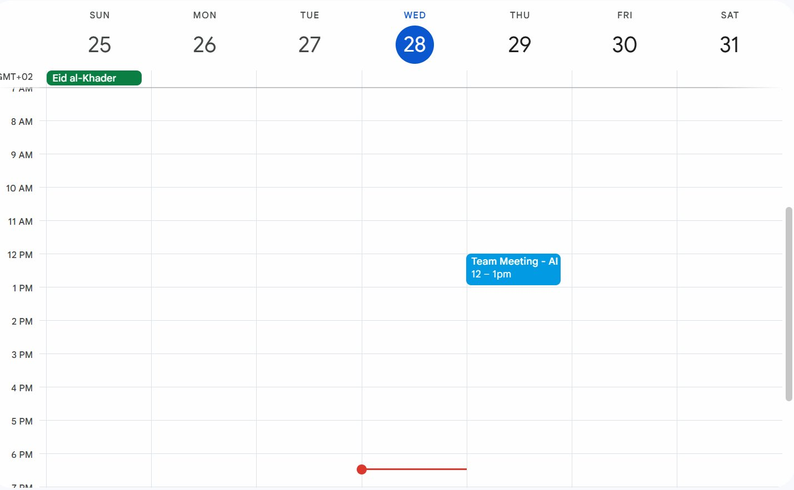

# Usage Examples

Real-world examples of how to use Gmail to Calendar Automation


*Example: "Team Meeting - AI" email automatically converted to calendar event*

---

## Example 1: Simple Meeting Invitations

**Scenario:** You receive meeting invitations with "meeting" in the subject.

**Test Email to Send:**
```
From: your.personal@email.com
To: your.calendar.account@gmail.com
Subject: Team Meeting - AI
Body:
Hi,

Let's discuss the AI development course project progress.

Looking forward to our discussion!
Best
```

### Configuration (.env)
```env
RUN_MODE=once
SEARCH_MODE=config
SEARCH_QUERY=is:unread subject:meeting
CALENDAR_ID=primary
```

### Expected Behavior
1. Scans for unread emails with "meeting" in subject
2. Creates calendar event: "Team Meeting - AI"
3. Sets default time: tomorrow at 10 AM (since no specific time in email)
4. Links back to original email
5. Marks email as read

### Sample Output
```
=== Configuration ===
Run Mode: once
Search Mode: config
Search Query: is:unread subject:meeting
Calendar: primary
=========================

Authenticating with Google APIs...
✓ Authentication successful

--- Starting email scan ---
Found 3 email(s)

Processing email: 18a1b2c3d4e5f6g7
  Subject: Team Meeting - Q1 Planning
  From: manager@company.com
✓ Event created: Team Meeting - Q1 Planning
  Link: https://calendar.google.com/calendar/event?eid=...
✓ Marked email as read: 18a1b2c3d4e5f6g7

--- Scan complete: 3/3 emails processed ---
```

---

## Example 2: Continuous Monitoring from Boss

**Scenario:** Monitor emails from your manager every 30 seconds.

### Configuration (.env)
```env
RUN_MODE=continuous
SCAN_INTERVAL=30
SEARCH_MODE=config
SEARCH_QUERY=is:unread from:boss@company.com
CALENDAR_ID=primary
```

### Expected Behavior
- Runs continuously
- Checks every 30 seconds
- Only processes emails from boss@company.com
- Creates events immediately when new email arrives
- Press Ctrl+C to stop

### Sample Output
```
=== RUNNING IN CONTINUOUS MODE ===
Scanning every 30 seconds
Press Ctrl+C to stop

[Iteration 1]
--- Starting email scan ---
Found 1 email(s)
Processing email: xyz123...
✓ Event created: Urgent: Budget Review
✓ Marked email as read
--- Scan complete: 1/1 emails processed ---

Waiting 30 seconds until next scan...

[Iteration 2]
--- Starting email scan ---
No emails found matching query
--- Scan complete: 0/0 emails processed ---

Waiting 30 seconds until next scan...
^C
Stopping continuous mode...
Goodbye!
```

---

## Example 3: AI-Powered Natural Language Search

**Scenario:** Find appointments and meetings using natural language, extract event details.

### Configuration (.env)
```env
RUN_MODE=once
SEARCH_MODE=llm
LLM_SEARCH_PROMPT=Find unread emails about appointments or meetings scheduled for this week
OPENAI_API_KEY=sk-proj-xxxxxxxxxxxxx
CALENDAR_ID=primary
```

### Expected Behavior
1. LLM converts prompt to Gmail query
2. Extracts event details from email body
3. Creates events with proper date/time/location
4. More accurate than config mode

### Sample Output
```
=== Configuration ===
Run Mode: once
Search Mode: llm
LLM Prompt: Find unread emails about appointments or meetings scheduled for this week
OpenAI API Key: **********xyz
=========================

Using LLM to generate query from: 'Find unread emails about...'
LLM generated query: is:unread (subject:appointment OR subject:meeting) newer_than:7d

--- Starting email scan ---
Found 2 email(s)

Processing email: abc456...
  Subject: Dentist Appointment Confirmation
  From: dental@clinic.com
  Extracting event details with LLM...
✓ Event created: Dental Checkup
  Link: https://calendar.google.com/calendar/event?eid=...
  Time: 2026-01-30T14:00:00 (extracted from email)
  Location: Downtown Dental Clinic (extracted from email)
✓ Marked email as read

--- Scan complete: 2/2 emails processed ---
```

---

## Example 4: Important Labeled Emails

**Scenario:** Process emails you've labeled as "Important" in Gmail.

### Configuration (.env)
```env
RUN_MODE=once
SEARCH_MODE=config
SEARCH_QUERY=is:unread label:important
CALENDAR_ID=primary
```

### Gmail Setup
1. Create label "Important" in Gmail
2. Manually label emails or create filter
3. Application processes labeled emails

### Expected Behavior
- Only processes emails with "Important" label
- Works with any custom Gmail label
- Useful for filtering specific types of emails

---

## Example 5: Multiple Criteria Search

**Scenario:** Find unread emails from specific senders with attachments.

### Configuration (.env)
```env
RUN_MODE=once
SEARCH_MODE=config
SEARCH_QUERY=is:unread from:(boss@company.com OR manager@company.com) has:attachment
CALENDAR_ID=primary
```

### Expected Behavior
- Matches emails from boss OR manager
- Must be unread
- Must have attachment
- Combines multiple Gmail search operators

---

## Example 6: Date-Based Search

**Scenario:** Process recent emails from the last 2 days.

### Configuration (.env)
```env
RUN_MODE=once
SEARCH_MODE=config
SEARCH_QUERY=is:unread subject:(meeting OR appointment) newer_than:2d
CALENDAR_ID=primary
```

### Expected Behavior
- Only emails from last 2 days
- Must have "meeting" or "appointment" in subject
- Prevents processing old emails

---

## Example 7: Specific Calendar

**Scenario:** Add events to work calendar instead of primary.

### Setup
1. Go to Google Calendar
2. Find calendar ID:
   - Click calendar name → Settings
   - Scroll to "Integrate calendar"
   - Copy "Calendar ID" (looks like: xyz123@group.calendar.google.com)

### Configuration (.env)
```env
RUN_MODE=once
SEARCH_MODE=config
SEARCH_QUERY=is:unread from:work@company.com
CALENDAR_ID=xyz123@group.calendar.google.com
```

### Expected Behavior
- Events added to specific calendar
- Useful for separating work/personal
- Can use any calendar you have access to

---

## Example 8: AI Smart Extraction

**Scenario:** Let AI understand complex email content and extract all details.

### Sample Email Content
```
Hi,

I'd like to schedule a meeting to discuss the Q2 roadmap.

Date: Next Wednesday, February 5th
Time: 2:30 PM - 4:00 PM
Location: Conference Room B (or Zoom if you prefer)

Please confirm your availability.

Thanks,
Sarah
```

### Configuration (.env)
```env
RUN_MODE=once
SEARCH_MODE=llm
LLM_SEARCH_PROMPT=Find meeting scheduling emails
OPENAI_API_KEY=sk-proj-xxxxxxxxxxxxx
```

### Expected Result
```
Event Created:
- Title: Q2 Roadmap Discussion
- Date: 2026-02-05
- Time: 14:30 - 16:00
- Location: Conference Room B
- Description: Meeting with Sarah about Q2 roadmap
```

LLM extracts:
- Actual date from "Next Wednesday, February 5th"
- Exact time "2:30 PM - 4:00 PM"
- Location "Conference Room B"
- Context about meeting purpose

---

## Example 9: Read Status Check

**Scenario:** Run once, then run again to verify no duplicates.

### First Run
```bash
python main.py
```

Output: Processes 5 emails, marks as read

### Second Run (immediately after)
```bash
python main.py
```

Output: "No emails found matching query"

### Why?
- Emails marked as read after processing
- Query searches for `is:unread`
- No duplicates created

---

## Example 10: Testing Configuration

**Scenario:** Test setup without creating events.

### Step 1: Check Authentication
```bash
python -c "from auth import test_connection; test_connection()"
```

Expected:
```
✓ Gmail connected: your.email@gmail.com
✓ Calendar connected: 3 calendars found
```

### Step 2: Test Search Query
Modify `gmail_scanner.py` temporarily:
```python
# Add after line "messages = results.get('messages', [])"
print(f"Found {len(messages)} messages")
for msg in messages[:3]:  # Show first 3
    email = get_email_content(gmail_service, msg['id'])
    print(f"  - {email['subject']}")
exit()  # Stop before creating events
```

---

## Common Configuration Patterns

### Pattern 1: Specific Sender
```env
SEARCH_QUERY=is:unread from:specific@email.com
```

### Pattern 2: Multiple Keywords
```env
SEARCH_QUERY=is:unread subject:(meeting OR appointment OR schedule OR deadline)
```

### Pattern 3: Exclude Certain Senders
```env
SEARCH_QUERY=is:unread -from:spam@email.com
```

### Pattern 4: Recent + Specific
```env
SEARCH_QUERY=is:unread newer_than:1d from:boss@company.com
```

### Pattern 5: Important + Recent
```env
SEARCH_QUERY=is:unread is:important newer_than:3d
```

---

## Troubleshooting Examples

### No Emails Found

**Check 1: Test query in Gmail**
1. Go to Gmail web interface
2. Type exact search query in search box
3. See what emails it finds
4. Adjust query based on results

**Check 2: Verify unread status**
- Emails might already be marked as read
- Remove `is:unread` temporarily to test

### Wrong Events Created

**Solution: Use LLM mode**
- Config mode uses basic extraction
- LLM mode understands email content better
- Add OPENAI_API_KEY to .env

### Too Many API Calls

**Solution: Adjust scan interval**
```env
SCAN_INTERVAL=60  # Increase from 10 to 60 seconds
```

---

## Best Practices

### 1. Start Simple
```env
# First test
SEARCH_QUERY=is:unread
RUN_MODE=once
```

### 2. Add Filters Gradually
```env
# Add sender filter
SEARCH_QUERY=is:unread from:specific@email.com

# Add subject filter
SEARCH_QUERY=is:unread from:specific@email.com subject:meeting

# Add date filter
SEARCH_QUERY=is:unread from:specific@email.com subject:meeting newer_than:7d
```

### 3. Test Before Continuous
- Always test with RUN_MODE=once first
- Verify events created correctly
- Then switch to continuous mode

### 4. Monitor Costs (LLM mode)
- Each email costs $0.03-0.06
- 100 emails = $3-6
- Use config mode for simple cases
- Use LLM for complex extraction needs

---

## Quick Reference: Search Operators

| Operator | Example | Meaning |
|----------|---------|---------|
| `from:` | `from:boss@company.com` | From specific sender |
| `to:` | `to:me@email.com` | Sent to you |
| `subject:` | `subject:meeting` | Word in subject |
| `is:unread` | `is:unread` | Unread emails |
| `is:read` | `is:read` | Read emails |
| `is:starred` | `is:starred` | Starred emails |
| `is:important` | `is:important` | Important marker |
| `label:` | `label:work` | Has label |
| `has:attachment` | `has:attachment` | Has file attached |
| `newer_than:` | `newer_than:2d` | Last 2 days |
| `older_than:` | `older_than:1m` | Older than 1 month |
| `OR` | `(word1 OR word2)` | Either word |
| `-` | `-from:spam@email.com` | Exclude |

---

**Pro Tip:** Test all queries in Gmail web interface first before using in the application!
