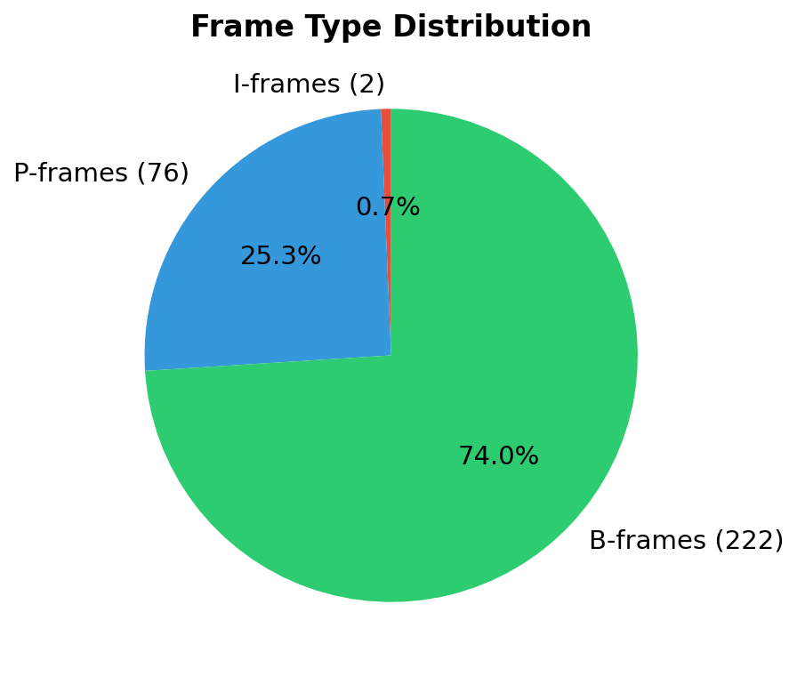
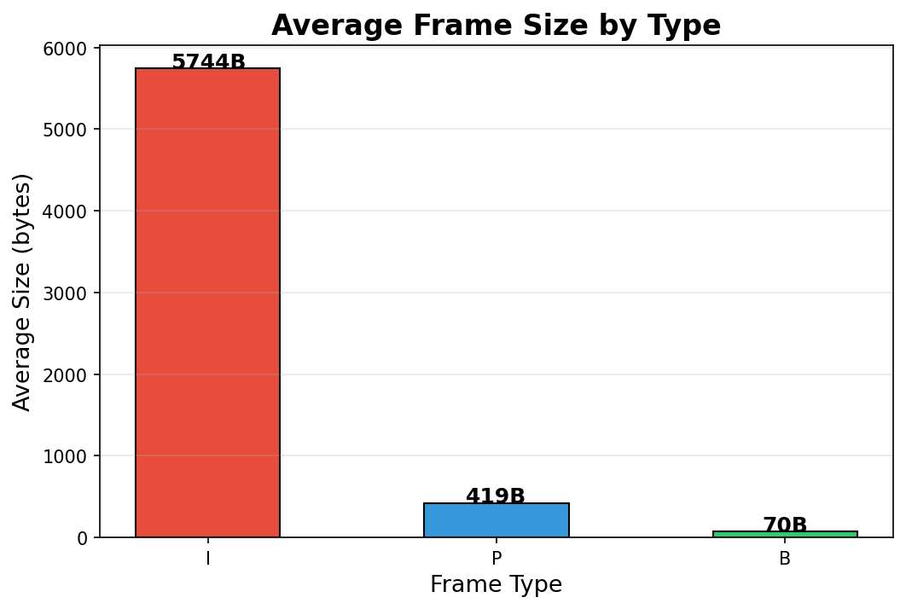
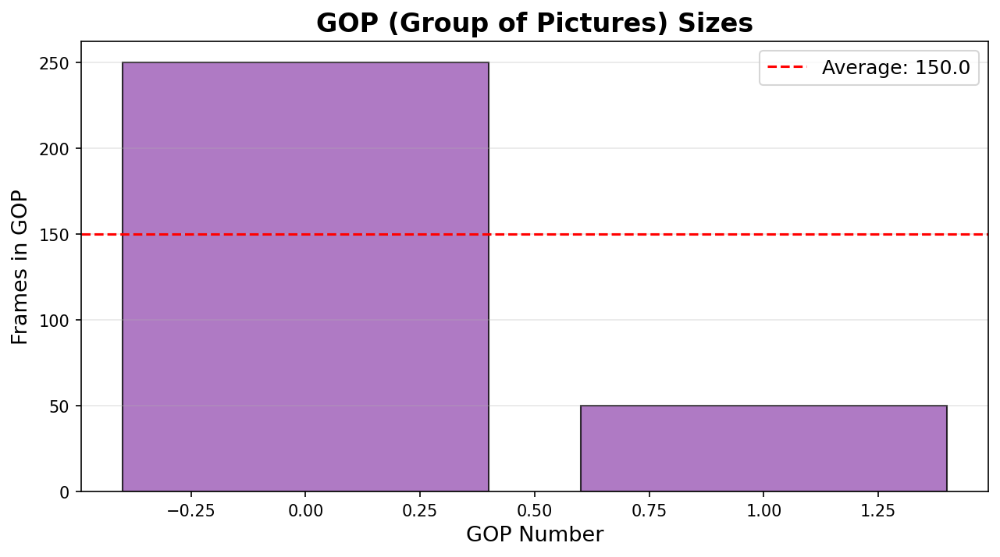
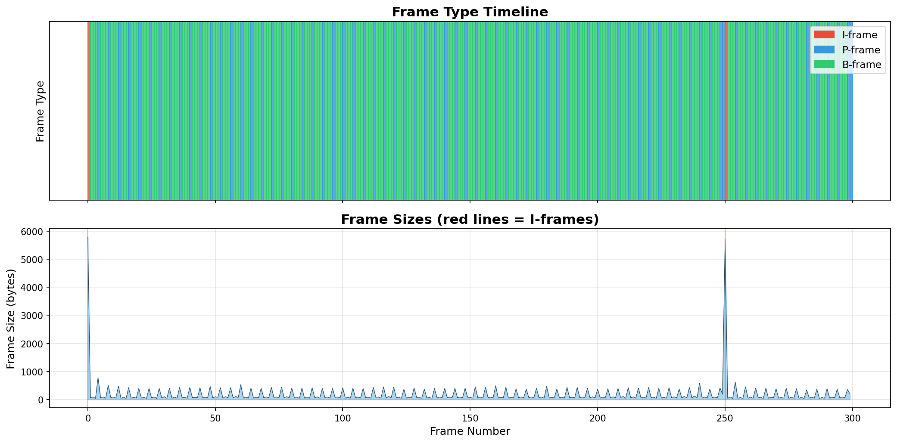
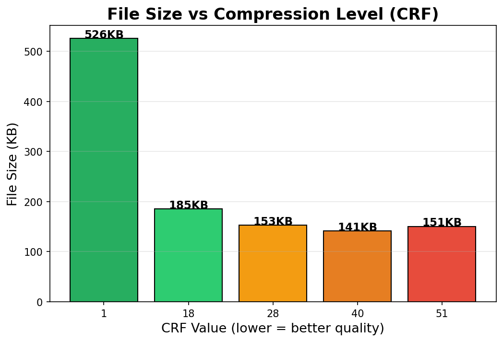
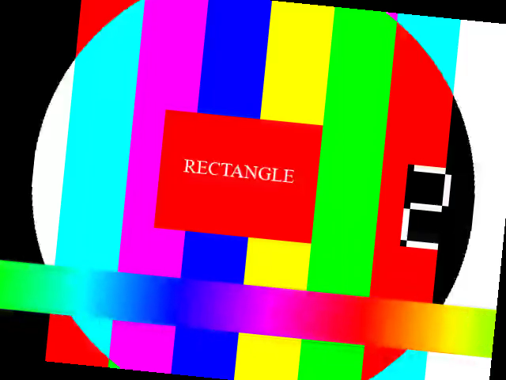
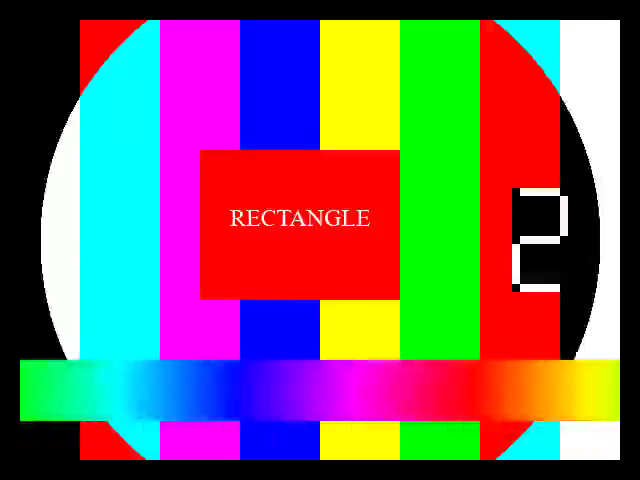
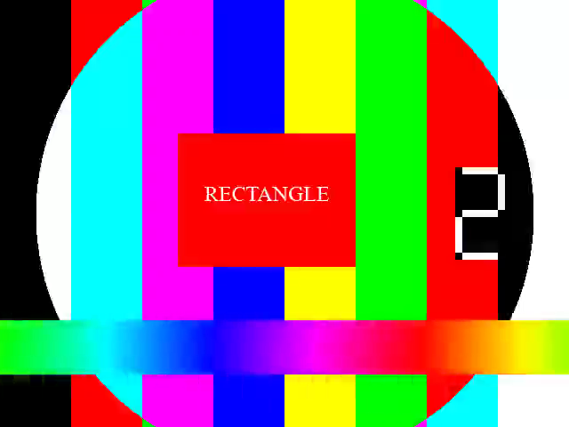

# L35 - Video Compression Analysis with FFmpeg

A set of Python tools that show how video compression (H.264) works.
We analyze a video, draw motion vectors, test different compression levels, and create charts.

## How to Run

```bash
# Run everything at once:
python run_all.py

# Or run each script separately (in this order):
python video_analyzer.py          # Step 1: Analyze the video
python macroblock_visualizer.py   # Step 2: Draw motion vectors
python compression_experiment.py  # Step 3: Compression tests
python visualization.py           # Step 4: Create charts
```

**Requirements:** Python 3, matplotlib (`pip install matplotlib`), FFmpeg at `C:\ffmpeg`

---

## Part 1: Video Analysis (Like VLC Info)

The analyzer extracts the same info you see in VLC > Tools > Codec Information:

```
Codec: H.264 (High 4:4:4 Predictive, Level 30)
Resolution: 640x480
FPS: 30
Duration: 10.00 seconds
Total Bitrate: 126 kbps
File Size: 154.2 KB
```

### Frame Type Distribution



**What we see:** Most frames are B-frames (74%). Only 2 frames are I-frames (0.7%).
This makes sense! I-frames are big (full pictures), so the codec uses as few as possible.
P and B frames just store the *differences* from other frames, so they are much smaller.

### Frame Sizes by Type



**What we learn:** I-frames are HUGE (5744 bytes average) compared to B-frames (70 bytes).
That's 82x bigger! This is why compression works so well - instead of storing 300 full
pictures, we store 2 full pictures and 298 tiny "difference" pictures.

### GOP Structure



**What is GOP?** GOP = Group of Pictures. It starts with an I-frame and includes all
P/B frames until the next I-frame. Our video has 2 GOPs with sizes 250 and 50 frames.

### Frame Timeline



**What we see:** The top bar shows frame types over time (red=I, blue=P, green=B).
The bottom chart shows frame sizes. Notice the big red spikes at I-frames!
Between I-frames, the sizes are tiny because P/B frames only store small changes.

---

## Part 2: Motion Vectors & Macroblocks

The codec splits each frame into 16x16 pixel blocks called **macroblocks**.
For P/B frames, it finds where each block "came from" in nearby frames.
The arrows showing this movement are called **motion vectors**.

### Output Videos

| File | What it shows |
|------|--------------|
| `output/motion_vectors.mp4` | Green/blue arrows on each frame showing motion vectors |
| `output/macroblock_types.mp4` | Same with block type overlay |
| `output/side_by_side_mv.mp4` | Original (left) vs Motion Vectors (right) |
| `output/mv_frames/` | Individual PNG frames with motion vectors |

### Sample Motion Vector Frame


**What we see:** The colored arrows show where the codec found matching blocks.
- Arrows point from the current block to where it found the match
- Longer arrows = more movement between frames
- Areas with no arrows = blocks that didn't move (background)

---

## Part 3: Compression Experiment

### Step 1: Add Rectangle + Compress at Different Levels

We add a red rectangle, then compress at different CRF values:

| CRF | Quality | File Size |
|-----|---------|-----------|
| 1   | Near lossless | 525.9 KB |
| 18  | High quality | 185.4 KB |
| 28  | Medium | 152.8 KB |
| 40  | Low quality | 141.2 KB |
| 51  | Worst possible | 150.6 KB |



**What we learn:**
- CRF 1 (best quality) is 3.7x larger than CRF 40 (low quality)
- CRF 51 is actually BIGGER than CRF 40! At extreme compression, the codec
  struggles so much that the output grows. Very low quality doesn't always mean smaller files.
- The sweet spot is CRF 18-28 (good quality, reasonable size)

### Step 2: Rotate & Shift Compressed Video


*Original frame*


*CRF 51 - heavy compression artifacts (blocky, blurry)*


*Rotated after compression - artifacts spread and get worse*


*Shifted after compression*

**What we learn about rotating/shifting compressed video:**
- When you rotate or shift a compressed video, the compression artifacts get WORSE
- The codec optimized blocks for the original position. Moving them breaks the optimization
- Each pixel now comes from a mix of different compressed blocks = double the mess
- This is why you should ALWAYS do transforms BEFORE final compression, not after

### Step 3: Generation Loss (Double Compression)



**What happens when you re-compress?** Each round of compression adds more artifacts.
The codec throws away different information each time. After 2 rounds, you can see
blocky artifacts clearly. This is why editors work with lossless or high-quality formats.

---

## Key Takeaways

1. **I-frames are big, B-frames are tiny** - Most of the file size comes from I-frames
2. **Motion vectors show how compression works** - The codec finds matching blocks between frames
3. **CRF 18-28 is the sweet spot** - Good quality without huge files
4. **Never transform after compression** - Rotate/shift BEFORE the final encode
5. **Avoid re-compression** - Each generation adds more artifacts (generation loss)
6. **GOP size matters** - Longer GOPs = smaller files, but slower seeking

## Project Structure

```
L35 - video compress FFMPEG/
├── sample_video.mp4           # Test video (generated)
├── video_analyzer.py          # Extract video info (GOP, frames, codec)
├── macroblock_visualizer.py   # Draw motion vectors and macroblocks
├── compression_experiment.py  # Rectangle + compress + rotate/shift
├── visualization.py           # Create charts and graphs
├── run_all.py                 # Run everything in order
├── PRD.md                     # Product requirements
├── TASKS.md                   # Task list
├── README.md                  # This file
└── output/                    # All generated outputs
    ├── video_analysis.txt     # Text report
    ├── frame_data.json        # Raw frame data
    ├── chart_*.png            # Charts and graphs
    ├── motion_vectors.mp4     # Video with MV overlay
    ├── macroblock_types.mp4   # Video with block types
    ├── side_by_side_mv.mp4    # Side-by-side comparison
    ├── compressed_crf*.mp4    # Different compression levels
    ├── rotated_compressed.mp4 # Rotated after compression
    ├── shifted_compressed.mp4 # Shifted after compression
    ├── double_compressed.mp4  # Re-compressed video
    ├── comparison_frames/     # PNG frames for comparison
    └── mv_frames/             # Motion vector frame PNGs
```
