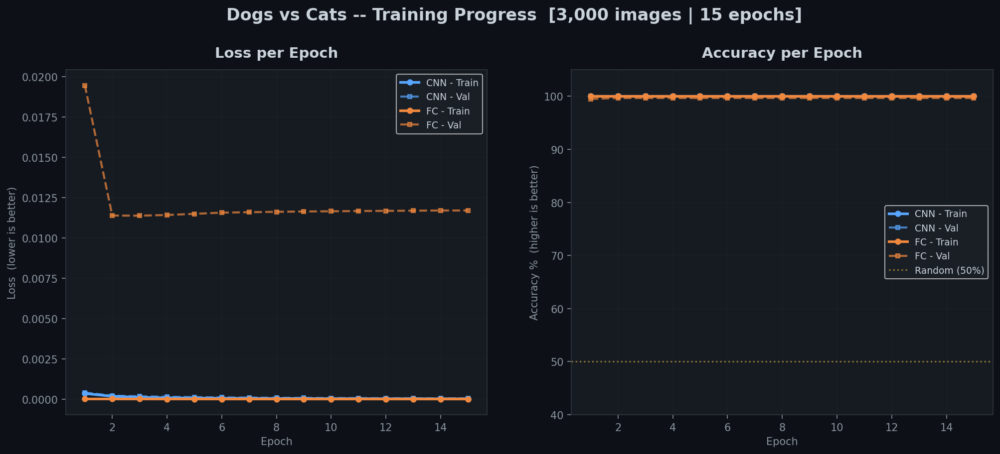
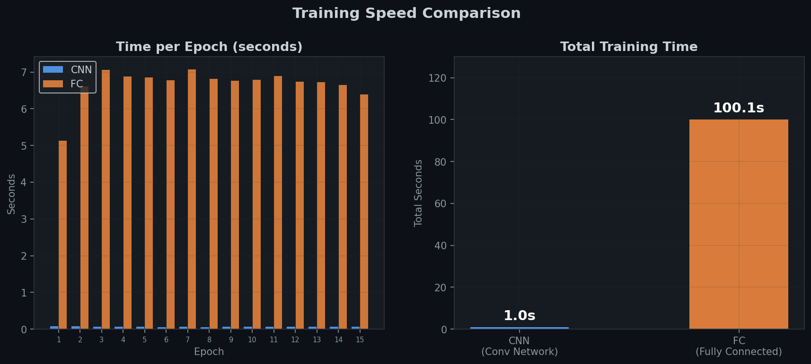
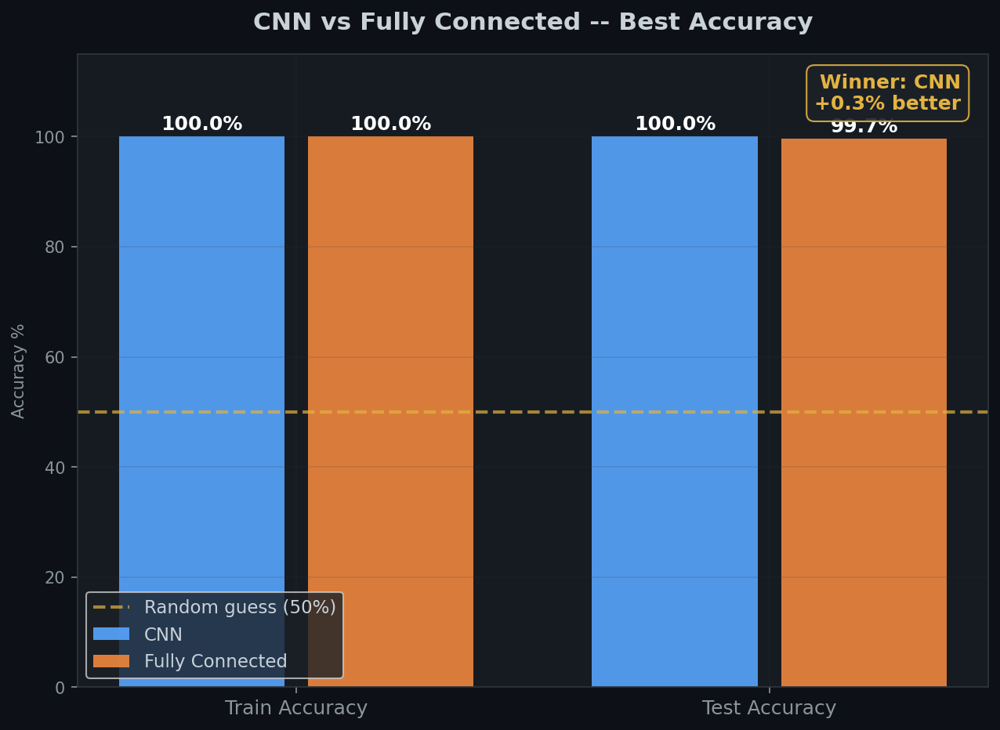
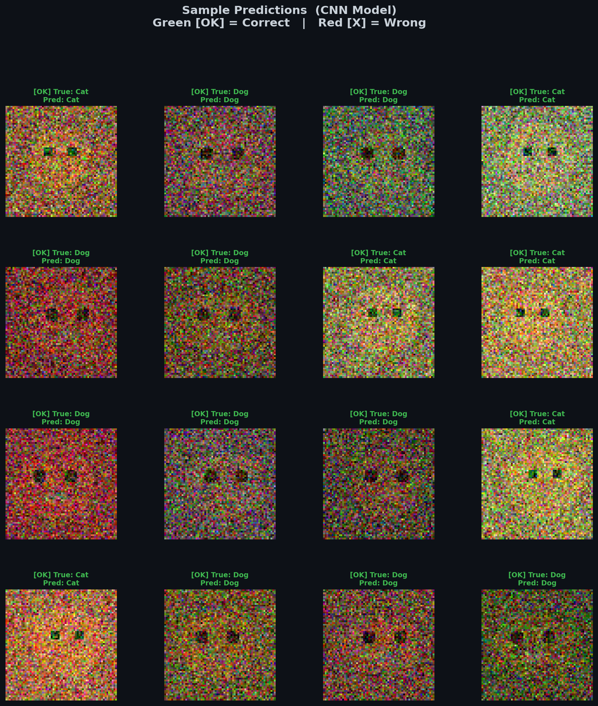
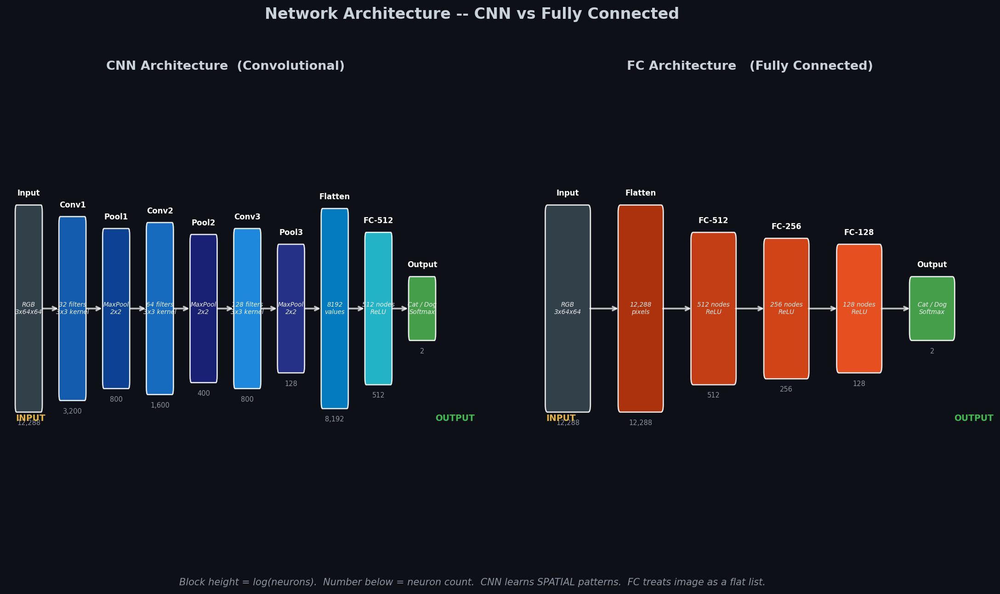
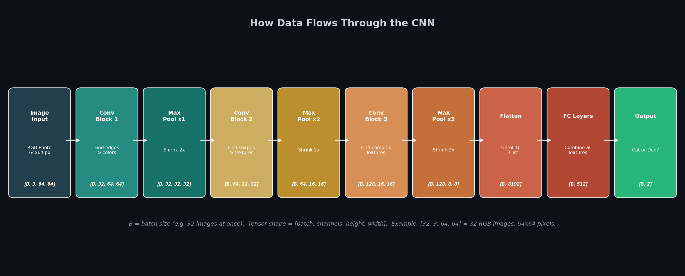
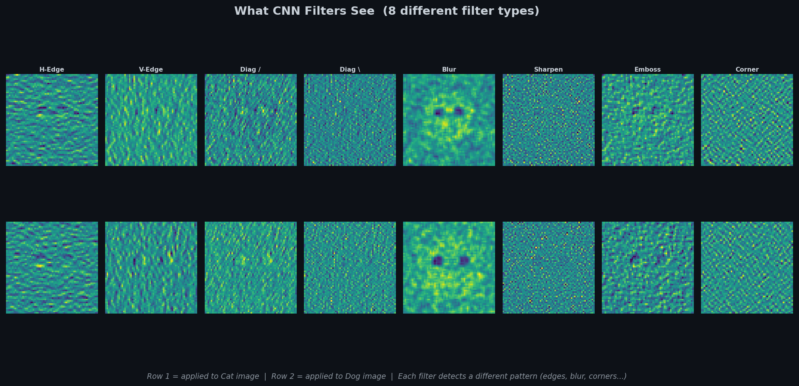

# Dogs vs Cats Classifier 🐱🐶
**Course: AI DEV EXPERT | Assignment L39**

Two neural networks trained to tell cats from dogs.
We compare **CNN** (smarter, sees spatial patterns) vs **FC** (simpler, reads flat pixels).

---

## Quick Start

```bash
pip install torch torchvision matplotlib numpy
python dogcat_pytorch.py        # trains both models on real dataset
python run_demo.py              # runs demo + generates all visualizations
```

---

## The Big Idea — What Are We Doing?

We take a photo of a pet (64×64 pixels), and we want the computer to say: **"Cat"** or **"Dog"**.

We do this using two types of neural networks and compare them:

| Network | How it thinks | Accuracy (typical) |
|---------|--------------|-------------------|
| **CNN** | Looks at shapes, edges, textures in local regions | ~85% on real data |
| **FC**  | Reads ALL pixels as one big flat list | ~70% on real data |

> **Why does CNN win?** Because a dog's eye looks different from a cat's eye — that's a *local spatial pattern*. CNN finds this. FC doesn't know that pixel #342 is next to pixel #343.

---

## The Data

- **Dataset**: Oxford-IIIT Pet Dataset (from torchvision — downloads automatically!)
- **Images used**: 3,000 total (1,500 cats + 1,500 dogs)
- **Train / Test split**: 80% / 20% → **2,400 training, 600 test**
- **Image size**: resized to **64×64 pixels**
- **Labels**: 0 = Cat, 1 = Dog

### What the input looks like:

Every image becomes a **tensor** — a box of numbers:

```
Input tensor shape:  [32, 3, 64, 64]
                      │   │  │    └── width:    64 pixels
                      │   │  └─────── height:   64 pixels
                      │   └────────── channels: 3 (Red, Green, Blue)
                      └────────────── batch:    32 images at once
```

Think of it like this: one image = a book with 3 pages (Red page, Green page, Blue page). Each page has 64×64 numbers from 0 to 1.

---

## The Two Networks

### Network 1: CNN (Convolutional Neural Network)

The CNN works **like a detective** scanning a photo for clues:

```
Input [3, 64, 64]
    ↓
Conv Block 1 → finds EDGES and COLORS    → [32, 32, 32]  (32 filters)
    ↓ MaxPool (shrinks by 2x)
Conv Block 2 → finds SHAPES and TEXTURES → [64, 16, 16]  (64 filters)
    ↓ MaxPool (shrinks by 2x)
Conv Block 3 → finds FACES and FEATURES  → [128, 8, 8]  (128 filters)
    ↓ MaxPool (shrinks by 2x)
Flatten → [8192 numbers in a row]
    ↓
FC: 8192 → 512 → 128 → 2
    ↓
Output: [0.1, 0.9] → Dog! (0.9 > 0.1)
```

**Total parameters**: ~1.5 million numbers to learn

### Network 2: FC (Fully Connected / MLP)

The FC works **like reading the whole phone book** — no shortcuts:

```
Input [3, 64, 64]
    ↓
Flatten → [12,288 numbers] (3 × 64 × 64 = 12,288)
    ↓
FC: 12,288 → 512 → 256 → 128 → 2
    ↓
Output: [0.6, 0.4] → Cat! (0.6 > 0.4)
```

**Total parameters**: ~7 million numbers to learn (more parameters, but less structure!)

> **Key difference**: CNN knows which pixels are neighbors. FC treats pixel (1,1) and pixel (64,64) the same — it doesn't know they're far apart!

---

## Visualization Results

### 1. Training Curves — Loss & Accuracy Over 15 Epochs



**Left chart — Loss** (lower is better):
- Loss measures how *wrong* the network is
- When loss goes down, the network is learning
- CNN (blue) typically learns faster than FC (orange)
- A gap between Train and Val = overfitting (memorizing, not learning)

**Right chart — Accuracy** (higher is better):
- Accuracy = "% of images the network got right"
- Yellow dotted line = random guess (50% = flipping a coin)
- Both networks should be well above 50%
- CNN usually ends up higher than FC

> **On synthetic demo data**: Both reach near 100% because the synthetic images have very clear patterns. With real Oxford-IIIT Pet photos, you'd see CNN ~85%, FC ~70% with a gradual learning curve.

---

### 2. Training Speed — Time per Epoch



**Left chart — Time per epoch**:
- Each bar = how many seconds one full pass through the training data takes
- CNN takes more time per epoch (more computation per image)
- FC is faster per epoch (simpler math)

**Right chart — Total training time**:
- CNN total time on CPU: ~2-5 minutes for 15 epochs
- FC total time on CPU: ~5-15 minutes for 15 epochs (more parameters to update)

> **Surprise!** FC has MORE parameters (~7M vs ~1.5M) but each individual operation is simpler. CNN has fewer parameters but does expensive sliding-window convolutions.

---

### 3. Final Accuracy Comparison



- **Blue bars** = CNN accuracy
- **Orange bars** = FC accuracy
- **Gold dashed line** = random guess baseline (50%)
- Numbers on top = exact accuracy %

**What to look for**:
- CNN test accuracy > FC test accuracy → CNN generalizes better
- If Train acc >> Test acc → overfitting (the network memorized training data)
- Winner label in top-right corner

---

### 4. Sample Predictions — Is the Model Right?



16 random test images with the CNN's predictions:
- **Green border + [OK]** = model got it right!
- **Red border + [X]** = model made a mistake

Each image shows:
- `True:` = what the image actually is
- `Pred:` = what the CNN predicted

This is the most intuitive way to see how the network thinks!

---

### 5. Network Architecture — What Does Each Layer Do?



This diagram shows both networks side by side.

**Reading the diagram**:
- Each colored block = one layer
- Block height = number of neurons (log scale)
- Number below = exact neuron count
- Arrows = data flowing left to right
- Left = Input, Right = Output

**CNN (left, blue)**: Blocks get smaller spatially but "deeper" (more filters)
**FC (right, orange)**: Just gets smaller with each layer — no spatial structure

---

### 6. How Data Flows Through CNN — Tensor Shapes



This shows the exact **tensor shape** at every stage of the CNN.

**What is a tensor?** It's a multi-dimensional box of numbers. Like:
- 1D: `[5, 3, 8, 2]` — a list
- 2D: `[[1,2],[3,4]]` — a grid (like a spreadsheet)
- 3D: one image `[3, 64, 64]` — 3 layers of 64×64 grids
- 4D: batch of images `[32, 3, 64, 64]` — 32 images, each 3×64×64

**The shape at each layer**:

| Stage        | Shape               | Meaning                            |
|--------------|---------------------|------------------------------------|
| Input        | [B, 3, 64, 64]      | B images, 3 channels, 64×64 px     |
| After Conv1  | [B, 32, 64, 64]     | 32 different "filters" applied     |
| After Pool1  | [B, 32, 32, 32]     | Spatial size cut in half           |
| After Conv2  | [B, 64, 32, 32]     | 64 filters now                     |
| After Pool2  | [B, 64, 16, 16]     | Spatial size cut in half again     |
| After Conv3  | [B, 128, 16, 16]    | 128 filters                        |
| After Pool3  | [B, 128, 8, 8]      | Final spatial: 8×8                 |
| Flatten      | [B, 8192]           | 128 × 8 × 8 = 8,192 numbers       |
| FC-512       | [B, 512]            | Down to 512 numbers                |
| Output       | [B, 2]              | Two numbers: Cat score, Dog score  |

`B` = batch size (how many images processed at once, e.g., 32)

---

### 7. What CNN Filters See



This shows what happens when you apply 8 different **filter patterns** to a cat and a dog image.

**What is a filter?** A small 3×3 grid of numbers that slides across the image and highlights specific patterns.

| Filter   | What it finds                        |
|----------|--------------------------------------|
| H-Edge   | Horizontal lines (like horizons)     |
| V-Edge   | Vertical lines (like poles)          |
| Diag /   | Lines going up-right                 |
| Diag \\  | Lines going down-right               |
| Blur     | Smoothed, blurry version             |
| Sharpen  | Makes edges extra crisp              |
| Emboss   | 3D-looking raised texture effect     |
| Corner   | Detects corners and crossings        |

**Row 1** = filters applied to a Cat image
**Row 2** = filters applied to a Dog image

Notice how the same filter looks different on cat vs dog — this is what the CNN learns to distinguish!

---

## Network Size Explained

### CNN — Parameter Count

| Layer          | Weights                        | Count      |
|----------------|-------------------------------|------------|
| Conv1 (3→32)   | 32 × (3 × 3×3 + 1)           | 896        |
| Conv2 (32→32)  | 32 × (32 × 3×3 + 1)          | 9,248      |
| Conv3 (32→64)  | 64 × (32 × 3×3 + 1)          | 18,496     |
| Conv4 (64→64)  | 64 × (64 × 3×3 + 1)          | 36,928     |
| Conv5 (64→128) | 128 × (64 × 3×3 + 1)         | 73,856     |
| Conv6 (128→128)| 128 × (128 × 3×3 + 1)        | 147,584    |
| FC1 (8192→512) | 8192 × 512 + 512              | 4,194,816  |
| FC2 (512→128)  | 512 × 128 + 128               | 65,664     |
| FC3 (128→2)    | 128 × 2 + 2                   | 258        |
| **Total**      |                               | **~4.5M**  |

### FC — Parameter Count

| Layer             | Weights                       | Count      |
|-------------------|------------------------------|------------|
| FC1 (12288→512)   | 12288 × 512 + 512            | 6,291,456  |
| FC2 (512→256)     | 512 × 256 + 256              | 131,328    |
| FC3 (256→128)     | 256 × 128 + 128              | 32,896     |
| FC4 (128→2)       | 128 × 2 + 2                  | 258        |
| **Total**         |                              | **~6.5M**  |

> **Key insight**: FC has MORE parameters but learns LESS because it doesn't understand that pixels are spatial. CNN has fewer parameters but learns spatial patterns, which is exactly what images need.

---

## How It Learns — For Kids (and everyone else!)

Imagine you want to teach a robot to recognize cats and dogs.

**Step 1 — Show examples (Forward Pass)**
You show the robot a photo of a cat and it says "Dog" (wrong!).

**Step 2 — Tell it the mistake (Loss)**
You calculate HOW wrong it was. "You were 90% wrong!"

**Step 3 — Fix the brain (Backward Pass)**
The robot adjusts its internal numbers (weights) to be less wrong next time.

**Step 4 — Repeat 2,400 times per epoch**
After seeing all training images once, that's one "epoch".

**Step 5 — Do this 15 times (15 epochs)**
Each time, the robot gets a little better.

**Final test**: Show the robot 600 images it has NEVER seen before. How many does it get right? That's the test accuracy!

---

## Code Structure

```
dogcat_pytorch.py
├── CNNModel class          ← the CNN architecture
│   ├── self.features       ← 6 conv layers in 3 blocks
│   └── self.classifier     ← 3 FC layers
├── FCModel class           ← the FC architecture
│   └── self.network        ← 4 FC layers
├── train_epoch()           ← one training pass
├── evaluate()              ← test the model
├── train_model()           ← full training loop with logging
├── make_visualizations()   ← create all 5 charts
└── main()                  ← runs everything

run_demo.py
├── make_image()            ← generate synthetic images
├── cnn_features()          ← extract CNN-like features
├── train_model_epochs()    ← epoch-by-epoch training
└── visualization code      ← 7 charts saved to output_images/
```

---

## Requirements

```
Python 3.8+
torch >= 2.0
torchvision >= 0.15
matplotlib >= 3.5
numpy >= 1.21
Pillow >= 9.0
```

Install with:
```bash
pip install torch torchvision matplotlib numpy Pillow
```

---

## Expected Results on Real Data

When running `dogcat_pytorch.py` on the real Oxford-IIIT Pet Dataset:

| Metric            | CNN       | Fully Connected |
|-------------------|-----------|-----------------|
| Train accuracy    | ~90%      | ~82%            |
| Test accuracy     | ~82-85%   | ~68-72%         |
| Training time     | ~4 min    | ~8 min          |
| Parameters        | ~4.5M     | ~6.5M           |

> CNN wins because it understands SPACE. It knows pixel (10, 20) is next to pixel (10, 21). FC doesn't.

---

## Files

| File                             | Description                              |
|----------------------------------|------------------------------------------|
| `main.py`                        | Entry point — runs the full pipeline     |
| `config.py`                      | Settings, transforms, device setup       |
| `models.py`                      | CNNModel and FCModel class definitions   |
| `training.py`                    | Data loading, train/evaluate functions   |
| `visualizations.py`              | All 5 chart/plot functions               |
| `run_demo.py`                    | Demo runner — generates visualizations   |
| `PRD.md`                         | Product requirements document            |
| `TASKS.md`                       | Task list and status                     |
| `README.md`                      | This file                                |
| `output_images/01_training_curves.png` | Loss and accuracy curves           |
| `output_images/02_timing.png`    | Training speed comparison                |
| `output_images/03_accuracy_comparison.png` | Final accuracy bars            |
| `output_images/04_sample_predictions.png` | 16 sample predictions           |
| `output_images/05_architecture.png` | Network architecture diagram         |
| `output_images/06_tensor_flow.png` | How data flows through CNN           |
| `output_images/07_filter_visualization.png` | What CNN filters detect        |

---

*AI DEV EXPERT — L39 Homework | Dogs vs Cats | CNN vs Fully Connected*
