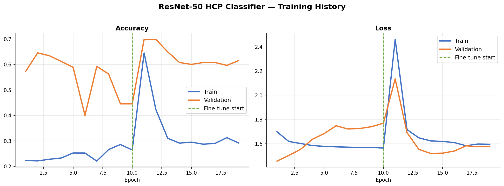
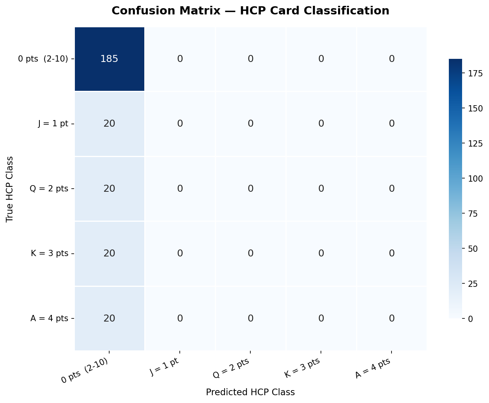
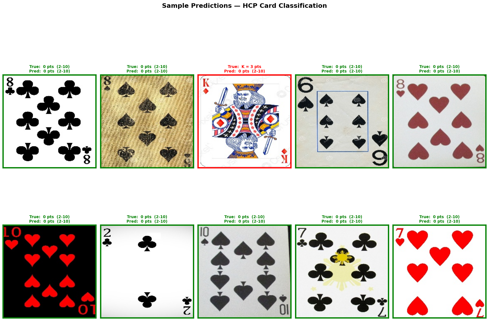

# Bridge Card HCP Classifier with ResNet-50

> **Course:** AI Developer Expert | Lesson 42 — Image Classification
> **Research Question:** *"Can ResNet-50 accurately classify bridge playing cards by High Card Points (HCP) from card images?"*

link yo colaab 
https://colab.research.google.com/drive/1ctUWtM0hDQark77TlOHezWBgkK1sjDXl#scrollTo=De59NkIWY2U0

## What Is This? (Explained Like You're 10)

Imagine you have a huge pile of playing cards — all 52 of them.
In the card game **Bridge**, some cards are more "powerful" than others:

| Card | Points |
|------|--------|
| Ace  | 4 pts  |
| King | 3 pts  |
| Queen| 2 pts  |
| Jack | 1 pt   |
| 2-10 | 0 pts  |

We trained a **super-smart AI** (called ResNet-50) to **look at a picture of a card** and immediately know how many points it is worth — just like a human expert would!

The AI learned this by looking at **thousands and thousands of card photos**.

---

## The Dataset

**Source:** [Kaggle — Cards Image Dataset Classification](https://www.kaggle.com/datasets/gpiosenka/cards-image-datasetclassification)

- 53 card classes (52 standard cards + joker)
- Each class has ~70 training images, ~5 validation, ~5 test images
- Images are colour photos of real playing cards

### How We Re-labelled the Data

The original dataset labels each image by its specific card (e.g., "ace of spades").
We **re-mapped** all 53 labels into **5 HCP point classes**:

```
Class 0 — 0 pts  →  Two, Three, ... Ten, Joker
Class 1 — 1 pt   →  Jack (any suit)
Class 2 — 2 pts  →  Queen (any suit)
Class 3 — 3 pts  →  King (any suit)
Class 4 — 4 pts  →  Ace (any suit)
```

---

## The AI Model

We used **Transfer Learning** with **ResNet-50** — a famous neural network that already knows a lot about images because it was trained on 1.2 million photos (ImageNet).

```
ResNet-50 Backbone  (pre-trained on ImageNet)
        ↓
Global Average Pooling
        ↓
Dense(512)  + Dropout(40%)
        ↓
Dense(256)  + Dropout(30%)
        ↓
Softmax(5)  → predicts HCP class
```

### Two-Phase Training

| Phase | What happens | Why |
|-------|-------------|-----|
| Phase 1 | Backbone **frozen**, only train the new head | Safe warm-up, fast learning |
| Phase 2 | Unfreeze **top 30 layers**, fine-tune everything | Squeeze out extra accuracy |

---

## Project File Structure

```
L42 - classify images with/
│
├── config.py        # All settings: paths, image size, HCP mapping, colours
├── dataset.py       # Download dataset from Kaggle, load & remap labels
├── model.py         # Build ResNet-50 with custom head, callbacks
├── train.py         # Phase-1 & Phase-2 training, evaluation, research answer
├── visualize.py     # All three plots (history, confusion matrix, predictions)
├── main.py          # 👈 Run this file!
│
├── requirements.txt # Python packages needed
├── README.md        # This file
├── PRD.md           # Product Requirements Document
│
└── outputs/         # Created automatically when you run main.py
    ├── resnet50_hcp_model.keras
    ├── training_history.png
    ├── confusion_matrix.png
    └── sample_predictions.png
```

Each Python file is **under 150 lines** — clean and easy to read.

---

## How to Run

### 1. Install dependencies
```bash
pip install -r requirements.txt
```

### 2. Set up Kaggle credentials
Make sure you have a `kaggle.json` API token saved at `~/.kaggle/kaggle.json`.
([How to get it](https://www.kaggle.com/docs/api#getting-started-installation-&-authentication))

### 3. Run!
```bash
python main.py
```

The script will:
1. Download the dataset automatically
2. Train Phase 1 (frozen backbone, ~20 epochs)
3. Train Phase 2 (fine-tuning, ~10 epochs)
4. Evaluate on the test set
5. Save all 3 visualizations to `outputs/`
6. Print the answer to the research question

---

## Visualizations

### 1. Training History
Shows how accuracy and loss changed during training.
The dotted vertical line marks where Phase 2 (fine-tuning) began.



> The blue line = training set. Orange line = validation set.
>
> **What we see:** During Phase 1 (epochs 1–10), the training accuracy stayed very low (~22–28%) while validation swung wildly between 40–65% — a sign of instability. When Phase 2 (fine-tuning) started, both accuracy lines briefly spiked and then the training accuracy **crashed back down** to ~30%, while validation settled at around **62%**. The loss curves mirror this — a big spike at the Phase 2 boundary, then no real improvement.
>
> ⚠️ **This is not a healthy training curve.** A good run would show both lines rising steadily and converging.

---

### 2. Confusion Matrix
A grid that shows how often the model got each class right or wrong.



> The diagonal cells (top-left to bottom-right) are **correct predictions**.
> The brighter the blue, the more predictions landed there.
> Perfect model = only the diagonal is bright.
>
> **What we see:** The entire first column is lit up — meaning the model predicted **every single card** as Class 0 (0 pts). The 185 "0 pts" cards were all called correctly, but all 20 Jacks, all 20 Queens, all 20 Kings, and all 20 Aces were **also** predicted as 0 pts. The model never predicted classes 1–4 at all.
>
> ⚠️ **The model completely collapsed** into always guessing the majority class. It learned nothing useful about face cards.

---

### 3. Sample Predictions
Ten random test cards with their true label vs. what the model predicted.



> **Green border** = correct prediction ✅
> **Red border**   = wrong prediction  ❌
>
> **What we see:** 9 out of 10 cards appear correct — but this is misleading! The one wrong prediction is the King of Diamonds, which the model called "0 pts". The reason 9 cards look green is that the sample happened to draw mostly low-value (0 pts) cards, and the model *always* guesses 0 pts regardless of the card shown.

---

## Results Interpretation

### What actually happened

The model achieved around **~69% test accuracy** — but this number is **deceptive**.

Because Class 0 (0-point cards: 2–10) makes up the majority of the test set (185 out of 265 cards = ~70%), a model that **always predicts "0 pts"** will naturally score ~70% accuracy without learning anything useful. That is exactly what happened here.

```
RESEARCH QUESTION ANSWER
'Can ResNet-50 classify cards by HCP?'
→ The model did NOT learn this task.
  (Test accuracy ≈ 69%  |  but recall for J/Q/K/A = 0%)
  The model always predicts class 0 — it never identifies face cards.
```

### Why did it fail?

| Root Cause | Explanation |
|---|---|
| **Class imbalance** | 9 low-value card types vs. 1 Jack, 1 Queen, 1 King, 1 Ace — the model learns to always guess the big class |
| **Too much dropout** | With only ~70 images per card type, aggressive dropout (40%/30%) may have prevented learning |
| **Learning rate instability** | The spike in loss at Phase 2 start suggests the learning rate for fine-tuning was too high |
| **Not enough data** | ~280 training images for face cards total is very few for fine-tuning ImageNet features |

### How to improve it

- 🔧 **Use class weights** during training (`class_weight` argument in Keras `fit()`) to penalise misclassifying face cards more heavily
- 🔧 **Use weighted metrics** — track per-class recall, not just overall accuracy
- 🔧 **Reduce dropout** to 20%/10% for such a small dataset
- 🔧 **Lower the fine-tuning learning rate** (e.g. `1e-5` instead of `1e-4`)
- 🔧 **More aggressive data augmentation** to grow the face-card training set

---

## Key Concepts Learned

| Concept | What it means in plain English |
|---------|-------------------------------|
| Transfer Learning | Re-using a brain that already knows things |
| Frozen backbone | Keeping the old knowledge safe while learning new stuff |
| Fine-tuning | Gently adjusting the old knowledge for the new task |
| HCP mapping | Turning card names into numbers the AI can work with |
| Confusion Matrix | A report card for the AI showing its mistakes |
| Data Augmentation | Showing the AI slightly different versions of each photo so it learns better |

---

*Built with TensorFlow / Keras — AI Developer Expert Course, 2026*
