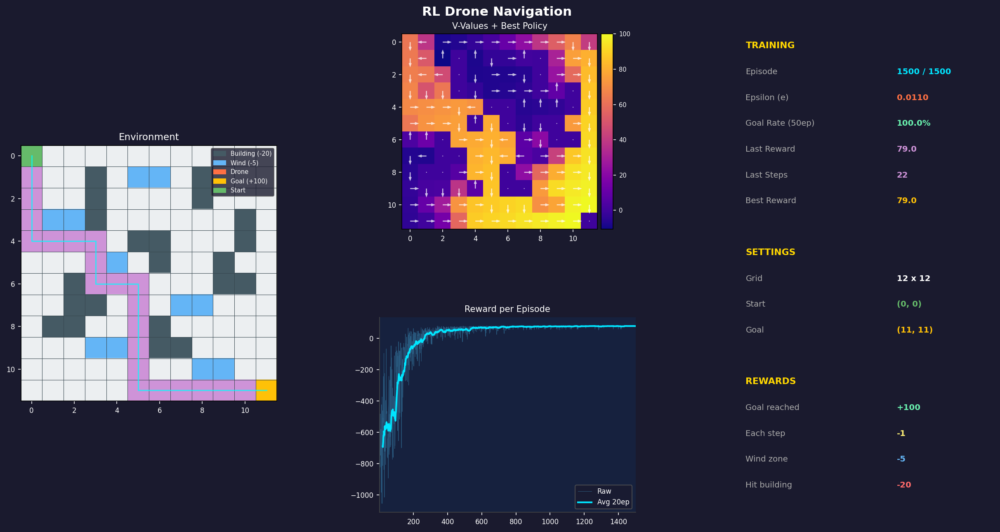

# L49 — RL Drone Navigation

A drone learns to fly through a 12x12 grid using **Q-learning** (Reinforcement Learning).
No map. No instructions. Just trial, error, and rewards.

---

## What is Reinforcement Learning?

Imagine a child learning to ride a bike:
- They try something (pedal, steer)
- They fall or succeed
- Over time, they remember what works

The drone does the same thing with a **Q-table** — a big table that stores
"how good is action X in situation Y?" After enough tries, the drone learns
the best path from start to goal.

---

## The Grid World

```
S . . B . . . . B . . .      S = Start  (0,0)
. . . B . W W . B . . .      G = Goal   (11,11)
. . . . . . W . . . B B      B = Building (wall, -20 to enter)
. W W . . . . . . . B .      W = Wind zone (-5, random push)
. . . . . B B . . . B .      . = Free space (-1 per step)
. . . . W . B . . B . .
. . B . . . . . . B B .
. . B B . . . W W . . .
. B B . . . B . . . . .
. . . . W W . B . . . .
. . . . . . . . W W . .
. . . . . . . . . . . G
```

---

## How It Works

### Episode = One Attempt

1. Drone starts at `(0,0)`
2. It picks an action (UP/DOWN/LEFT/RIGHT)
3. It gets a reward based on what happened
4. It updates its Q-table
5. Repeat until it reaches the goal or runs out of steps (200 max)

### Epsilon (Exploration vs Exploitation)

- At the **start**: epsilon = 1.0 → drone picks random actions (exploring)
- Over time: epsilon shrinks → drone picks the best known action (exploiting)
- At the **end**: epsilon = 0.01 → drone is mostly greedy

### Q-Learning Formula

```
Q[state, action] = Q[state, action] + alpha * (reward + gamma * max(Q[next_state]) - Q[state, action])
```

In simple words: "Update my belief about how good this action was, based on what actually happened."

---

## Visualization Dashboard

When you run the code, a live window appears with 4 panels.
After training completes, the final screenshot is saved to `outputs/`:



---

### Panel 1 — Environment Grid

```
+---------------------------+
|  . . B . . . . . . . . .  |
|  . . B . W . . . B . . .  |
|  . [D]→→→→→→→ . . . . .  |  <- Drone path in cyan
|  . . . . . . . . . . . .  |
|  . . . . . . . . . . . G  |
+---------------------------+
```

Shows the drone's current path (cyan line), buildings (dark), wind zones (blue),
start (green) and goal (gold).

### Panel 2 — V-Values + Best Policy

```
+---------------------------+
|  0   5  10  15  20 ...    |  <- Color = expected reward
|  ↓   →   ↓   →   ↓ ...   |  <- Arrow = best action
|  ↓   →   ↓   →   ↓ ...   |
+---------------------------+
```

- **Color (heatmap)**: brighter = higher expected future reward
- **Arrows**: the best action the drone has learned at each cell
- Cells near the goal are bright; far-away or blocked cells are dark

### Panel 3 — Reward History

```
   Reward
    100 |           ___/‾‾‾‾‾‾
      0 |  ____/‾‾‾
   -100 | /
        +-----------------> Episode
```

Shows how the drone improves over time. The smoothed line (bold) shows the trend.
Early episodes: drone wanders and gets low rewards.
Later episodes: drone knows the path and gets high rewards.

### Panel 4 — Stats Panel

| Stat | Meaning |
|------|---------|
| Episode | Current training episode (out of 1500) |
| Epsilon | How random the drone currently is |
| Goal Rate | % of last 50 episodes where drone reached the goal |
| Last Reward | Total reward in the most recent episode |
| Best Reward | Best total reward ever achieved |

---

## File Structure

```
L49 - RL Drone/
├── config.py        — all settings (grid, rewards, hyperparameters)
├── environment.py   — the 12x12 grid world
├── agent.py         — Q-learning agent
├── train.py         — training loop
├── visualize.py     — matplotlib dashboard
├── main.py          — run everything
├── requirements.txt
├── outputs/
│   └── drone_rl_final.png   <- saved after training
```

---

## Installation

```bash
pip install -r requirements.txt
```

## Run

```bash
# With live visualization (recommended)
python main.py

# Without visualization (faster, terminal only)
python main.py --no-viz
```

---

## Expected Output

After ~1500 episodes you should see:

```
Episode  100 | Reward:  -82.0 | Steps: 68 | Epsilon: 0.741 | Goal rate: 12%
Episode  500 | Reward:   45.2 | Steps: 32 | Epsilon: 0.222 | Goal rate: 61%
Episode 1000 | Reward:   78.5 | Steps: 18 | Epsilon: 0.049 | Goal rate: 88%
Episode 1500 | Reward:   83.1 | Steps: 15 | Epsilon: 0.010 | Goal rate: 94%
```

A PNG image is saved to `outputs/drone_rl_final.png` showing the learned policy
and the best path found.

---

## Customization

Edit `config.py` to change:
- `BUILDINGS` — add/remove building cells
- `WIND_ZONES` — add/remove wind zones
- `NUM_EPISODES` — train longer or shorter
- `ALPHA`, `GAMMA`, `EPSILON_DECAY` — change learning behavior

---

## Algorithm: Q-Learning Summary

| Property | Description |
|----------|-------------|
| Type | Model-free, off-policy |
| State space | 144 cells (12x12 grid) |
| Action space | 4 (UP, DOWN, LEFT, RIGHT) |
| Q-table size | 144 x 4 = 576 values |
| Convergence | Guaranteed for finite MDPs with sufficient exploration |
