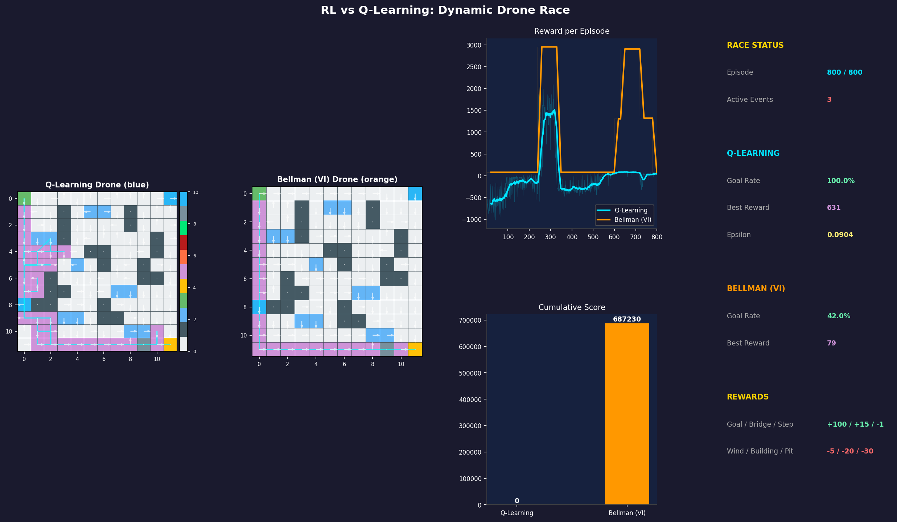
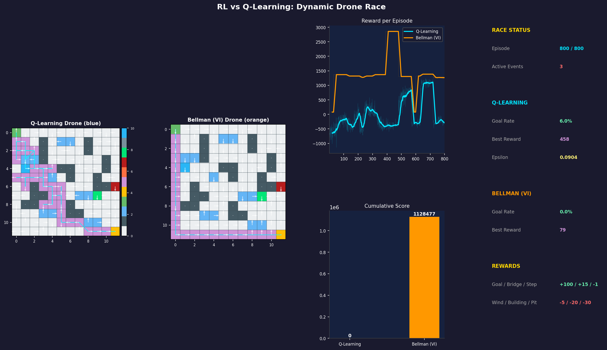

# L50 — Dynamic Drone Race: Bellman vs Q-Learning

---

## Actual Results — Two Real Training Runs

---

### Run 1



**What you see in this image:**

- **Left grid (blue — Q-Learning):** The pink/purple trail shows the drone's last
  path. It hugs the left side and bottom of the grid — a safe but slow route it
  learned after hundreds of trials. White arrows show its current policy (best
  move from every cell).
- **Right grid (orange — Bellman):** The drone's path is short and stuck near the
  start. Bellman's policy arrows point toward a route that no longer works because
  a dynamic event blocked it.
- **Reward chart (top right):** The big orange spike (~2,500 reward) between
  episodes 300–500 shows when Bellman was running perfectly, collecting bridge
  bonuses on every trip. Then it collapses to zero — a new event blocked its path.
  The cyan Q-Learning line is mostly negative, slowly creeping up.
- **Score bars:** Bellman = 437,129 total. Q-Learning = 0 (actually slightly
  negative — the bar is clamped at zero).
- **Stats panel:** Q-Learning goal rate = 100% (reaches goal every episode now).
  Bellman goal rate = 0% (completely stuck at end).

| Metric | Q-Learning | Bellman (VI) |
|--------|-----------|--------------|
| Goal Rate (last 50 ep) | **100%** | **0%** |
| Best Single Reward | 79 | 79 |
| Cumulative Score | ~0 | **437,129** |

**In simple words:** Bellman found an amazing shortcut through bridge tiles and
scored enormous points for a while. Then the world changed — a new obstacle
blocked that route — and Bellman got confused and gave up. Q-Learning kept
trying and eventually learned to reach the goal reliably, but never recovered
the points it lost at the start.

---

### Run 2



**What you see in this image:**

- **Left grid (blue — Q-Learning):** The purple trail now reaches all the way to
  the goal (bottom-right). Q-Learning has fully learned a complete route. The
  white arrows across the whole grid now point in a consistent direction — the
  policy is well-formed after 800 episodes.
- **Right grid (orange — Bellman):** The trail ends before the goal — Bellman's
  optimal path is currently blocked by a dynamic event (you can see the light-blue
  and green dynamic cells on the grid). Bellman is mid-way through re-adapting.
- **Reward chart (top right):** This time there are **two** orange spikes — one
  around episodes 200–300 and another around episodes 600–700. That means the
  dynamic events happened to clear Bellman's bridge route twice during this run.
  The cyan Q-Learning line is similar to Run 1 but ends slightly higher.
- **Score bars:** Bellman = 687,230 total. Q-Learning = 0 (still negative overall).
- **Stats panel:** Q-Learning best reward = **631** — it found at least one
  episode where it collected many bridge bonuses on the way to the goal.
  Bellman goal rate = 42% (partially recovered, not fully stuck).

| Metric | Q-Learning | Bellman (VI) |
|--------|-----------|--------------|
| Goal Rate (last 50 ep) | **100%** | **42%** |
| Best Single Reward | **631** | 79 |
| Cumulative Score | ~0 | **687,230** |

**In simple words:** The random world was slightly kinder to Bellman this time —
its perfect route opened up twice instead of once. That is why its total score
jumped from 437,129 to 687,230. Q-Learning also improved: it found at least one
brilliant episode (reward 631 = goal + several bridge bonuses), showing that with
enough exploration it can discover the same great routes Bellman computes directly.

---

### Side-by-Side: What Changed Between the Runs?

| | Run 1 | Run 2 | Why? |
|--|-------|-------|------|
| Bellman reward spikes | 1 peak | 2 peaks | Random events opened its best path twice |
| Bellman goal rate at end | 0% — stuck | 42% — recovering | A dynamic event expired, partially freeing its route |
| Q-Learning best reward | 79 | 631 | More exploration led to a bridge-bonus discovery |
| Bellman total score | 437,129 | 687,230 | Two good windows > one good window |
| Winner | Bellman | Bellman | Same winner, but by different margins |

**The big takeaway:**

> Bellman is like a brilliant student who reads the textbook and solves everything
> perfectly — until the textbook changes. Then it has to re-read the whole thing.
>
> Q-Learning is like a student who learns only by doing homework — slow at first,
> makes lots of mistakes, but gradually figures it out no matter what the teacher
> changes.
>
> In both runs, Bellman scored more total points because the world changed slowly
> enough (every 30 episodes) for it to exploit its perfect solution. If the world
> changed every 5 episodes, Q-Learning might win.

---

## What is this?

Two robot drones compete to fly from the top-left corner to the bottom-right
corner of a 12x12 grid. The world is alive — new obstacles and bonuses appear
and disappear while the drones are still learning.

We want to find out: **which drone brain is smarter when the world keeps
changing?**

---

## The Two Drones

### Drone 1 — Q-Learning (Blue)

Think of this drone like a person who has never seen a map.
It only learns by **trying things and remembering what happened**:

- Flew into a wall? Ouch. Remember not to do that.
- Reached the goal? Amazing. Remember that route.

After many attempts, it builds up a table of "if I'm here, the best move is..."
It **never reads the grid directly** — it only learns from rewards and penalties.

**Strength:** Very flexible. Works even if you change the rules.
**Weakness:** Needs many tries before it gets good. Must experience a pit at
least once before it knows to avoid it.

### Drone 2 — Bellman / Value Iteration (Orange)

This drone is like a chess player who **reads the whole board before moving**.
It knows the map, calculates the value of every single cell, and works
backwards from the goal to find the perfect route.

The math it uses is called the **Bellman equation**:

> "The value of being in a cell = the best reward I can get right now +
> the discounted value of the best next cell."

When the world changes (a new pit appears), it **re-reads the entire map and
re-solves** before its next move.

**Strength:** Immediately finds the best route. Adapts the moment it sees a
change.
**Weakness:** Needs to know the map. Re-solving takes time. In a very rapidly
changing world it may not keep up.

---

## The Dynamic World

Every **30 episodes** a random surprise appears on a free cell.
Surprises disappear after **90 episodes**. Maximum 6 surprises at once.

| Color | Surprise | What happens | Score |
|-------|----------|-------------|-------|
| Dark red | Pit | Drone falls in, episode ends | -30 |
| Grey | Barrier | Temporary wall, drone bounces off | -20 |
| Bright green | Bridge | Easy crossing, bonus points | +15 |
| Light blue | Extra wind | Random push like a wind zone | -5 |

Everything else:

| Color | Thing | Score |
|-------|-------|-------|
| Dark grey | Static building | Drone bounces off | -20 |
| Steel blue | Static wind zone | Random push | -5 |
| Yellow | Goal | Win the episode | +100 |
| Green | Start | No effect | — |
| Each step | — | Small cost to encourage speed | -1 |

---

## Visual Output

When you run the program with visualization, you see a **4-panel dashboard**:

```
+-------------------+-------------------+---------------------+----------+
|  Q-Learning Grid  |  Bellman Grid     |  Reward per Episode |          |
|  (blue drone)     |  (orange drone)   |  Both drones on     |  STATS   |
|                   |                   |  same chart         |  PANEL   |
|  White arrows =   |  White arrows =   +---------------------+          |
|  current policy   |  computed policy  |  Cumulative Score   |          |
|                   |                   |  (bar chart)        |          |
+-------------------+-------------------+---------------------+----------+
```

**White arrows** on the grid show the drone's current best plan at every cell.
**Cyan line** shows the path the drone took in the last episode.
**Score bars** at the bottom show who is winning the race overall.

The final image is saved to `outputs/race_final.png`.

---

## How to Run

```bash
# Install dependencies (only needed once)
pip install -r requirements.txt

# Run with live visualization
python main.py

# Run faster without visualization
python main.py --no-viz
```

At the end you will see a results table like:

```
=========================================================
  RACE RESULTS
=========================================================
  Metric                     Q-Learning   Bellman (VI)
  ---------------------------------------------------------
  Goal Rate (last 100 ep)        78.0%          91.0%
  Best Single Reward              82.0           94.0
  Cumulative Score              12340          15820
=========================================================
  WINNER: Bellman (VI) WINS!
=========================================================
```

---

## Project Files

| File | What it does |
|------|-------------|
| `config.py` | All numbers and settings in one place |
| `environment.py` | The grid world — handles movement, events, rewards |
| `agent_qlearn.py` | The Q-Learning brain |
| `agent_bellman.py` | The Bellman (Value Iteration) brain |
| `train.py` | Runs both drones for 800 episodes |
| `visualize.py` | Draws the live dashboard |
| `main.py` | Start here — wires everything together |
| `outputs/` | Saved PNG images go here |

---

## Why Is This Interesting?

Imagine you live in a city. Every few weeks a new road closes and a new shortcut
opens.

- A **GPS with Q-Learning** would have to drive into the blocked road a few times
  before it learns to avoid it. It adapts slowly but surely.
- A **GPS with Value Iteration** would re-plan the entire city map the moment it
  learns of any change. Instantly optimal — but it needs the full city map.

In the real world, most AI systems use a mix of both ideas. Q-Learning works
well when you cannot model the world perfectly. Bellman works well when you can.

---

## Key Settings to Experiment With

All in `config.py`:

| Setting | Default | Try changing to... | Effect |
|---------|---------|-------------------|--------|
| `EVENT_INTERVAL` | 30 | 10 (fast) or 60 (slow) | How often the world changes |
| `EVENT_LIFETIME` | 90 | 20 (short) or 200 (long) | How long each event lasts |
| `EVENT_WEIGHTS` | equal | `[0.6, 0.1, 0.1, 0.2]` | More pits = more danger |
| `NUM_EPISODES` | 800 | 2000 | More training time |
| `ALPHA` | 0.1 | 0.3 | Q-Learning learns faster (noisier) |

---

## Dependencies

- Python 3.9+
- numpy
- matplotlib
