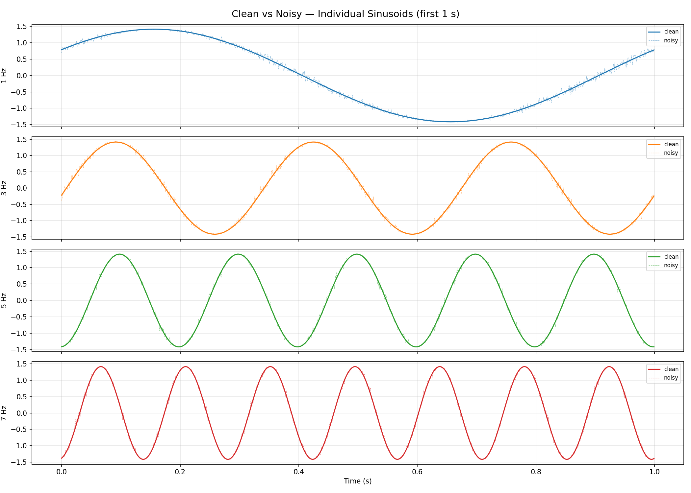
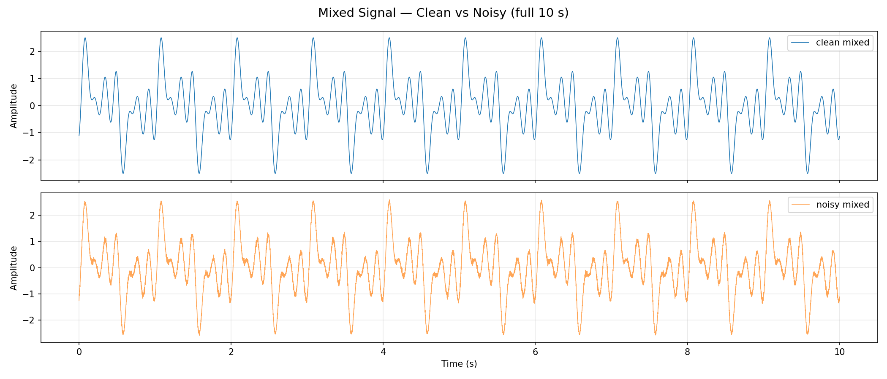
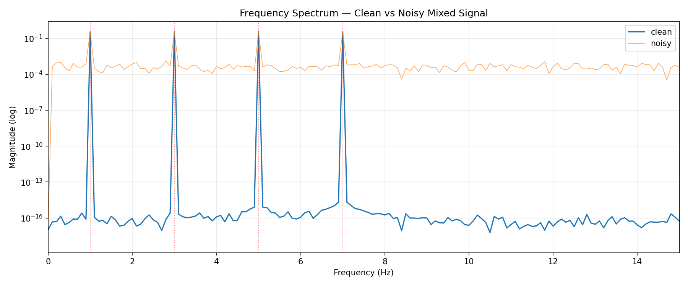
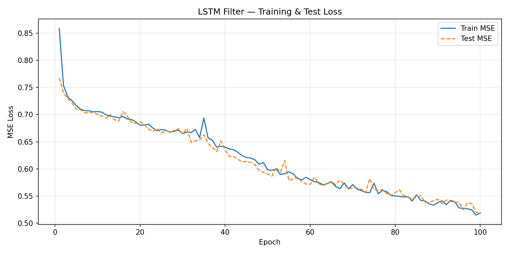
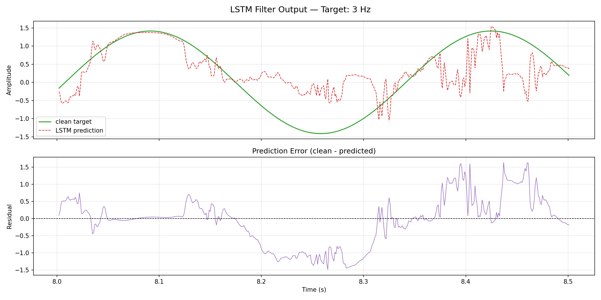

# L52 — LSTM Signal Filter

## What is this project about? (Explained simply!)

Imagine you are in a classroom and 4 people are talking loudly at the same time. On top of that, someone turns on a really noisy vacuum cleaner! It all sounds like one big mess to our ears.

In our project, instead of people, we have **4 waves** going up and down. Each wave jumps at a different speed (slow, medium, fast). We mix them all together and add extra noise to act like our "vacuum cleaner". 

The goal of this project is to train a **smart robot brain** (called an 'LSTM') on a computer. We tell the robot: *"Hey Robot, here is the noisy mess of all waves together. Please find only the wave that jumps at speed number 3, and ignore all the others!"* The robot looks at the mess and learns how to fish out only the wave we want.

---

## How to run

```bash
python main.py
```

All results are saved to `outputs/`.

To change the target frequency, open `config.py` and change `TARGET_FREQ_HZ` to 1, 3, 5, or 7.

---

## Signal setup

| What              | Value                                 |
|-------------------|---------------------------------------|
| Frequencies       | 1, 3, 5, 7 Hz                         |
| Sampling rate     | 1000 Hz — 1000 measurements per second|
| Duration          | 10 seconds (10,000 samples total)     |
| Amplitude         | Random between 0.8 and 1.2            |
| Amplitude noise   | 0.5% Gaussian noise per sample        |
| Phase             | Random 0-360 degrees per sinusoid     |
| Phase noise       | Small Gaussian noise per sample       |

---

## Output images

Let's look at the pictures to understand what happens!

### 1. The Waves Before the Mess
**File:** `outputs/01_individual_signals.png`



**What is this?**
Here we peek at our 4 "people" (waves) separately before they go into the same room. The smooth, clean line in each box is the beautiful wave without any noise. The dotted line next to it that wiggles a bit is the same wave but with a little bit of noise added to it. It's like a child's drawing where their hand was shaking slightly.

---

### 2. The Big Mess!
**File:** `outputs/02_mixed_signals.png`



**What is this?**
Now we throw everything into the blender! Here, they are all talking together. At the top, you see a line that looks like a messy rollercoaster — these are all the waves mixed together without the extra noise. At the bottom is the same mess, but someone turned on the vacuum cleaner (lots of extra noise). The line now looks very jumpy, "hairy," and unclear. This is exactly what the Robot sees when it starts. Can you untangle that?

---

### 3. X-Ray Glasses
**File:** `outputs/03_spectrum.png`



**What is this?**
This picture is like wearing X-ray glasses to look for clues in the mess. Instead of squiggly lines, we see 4 tall straight towers jumping up. Each tower tells us exactly which wave is hiding in there. There is a tower at 1, 3, 5, and 7. The blue line is the clean perfect answer, and the orange parts are the "noise" or dirt on the waves.

---

### 4. The Robot's Report Card
**File:** `outputs/04_loss_curves.png`



**What is this?**
This picture shows us "how many mistakes did our Robot make?". In this game, the lower the slide goes, the better it is, because the goal is zero mistakes. The blue line shows how the Robot made fewer and fewer mistakes while doing its "homework" (training). The orange line shows how great the Robot did on the "real test". Both went all the way down and stayed there, so our Robot is a very smart student!

---

### 5. Final Test: Did the Robot Succeed?
**File:** `outputs/05_predictions.png`



**What is this?**
Here is the moment of truth! The beautiful **green line** is the exact wave we asked the Robot to find and isolate. The **dotted red line** is what the Robot drew by itself. Look at how the red line sits almost perfectly on the green line! This means the Robot completely succeeded in finding what we asked for without being confused by the noise. At the very bottom, there is a tiny, flat wobbly line showing a few very small mistakes, but mostly, the Robot did an amazing job!

---

## Project files

| File            | What it does                                   |
|-----------------|------------------------------------------------|
| `config.py`     | All settings and hyperparameters               |
| `signals.py`    | Generates the 4 sinusoids with noise           |
| `dataset.py`    | Creates sliding windows for the LSTM           |
| `model.py`      | Defines the LSTM network                       |
| `train.py`      | Trains the model and saves the best weights    |
| `visualize.py`  | Saves all 5 output plots                       |
| `main.py`       | Runs the whole pipeline                        |
