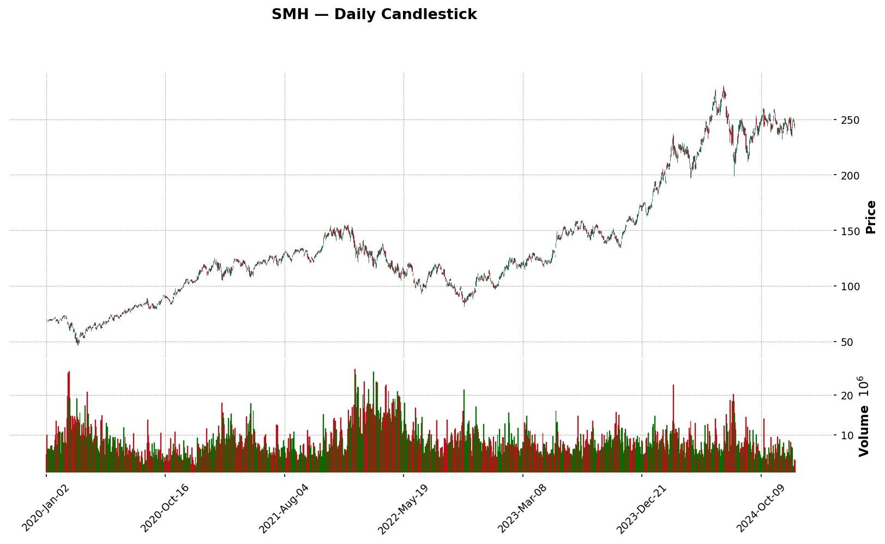
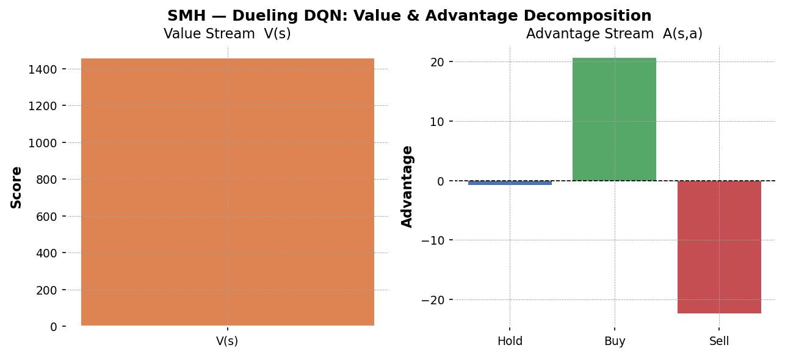
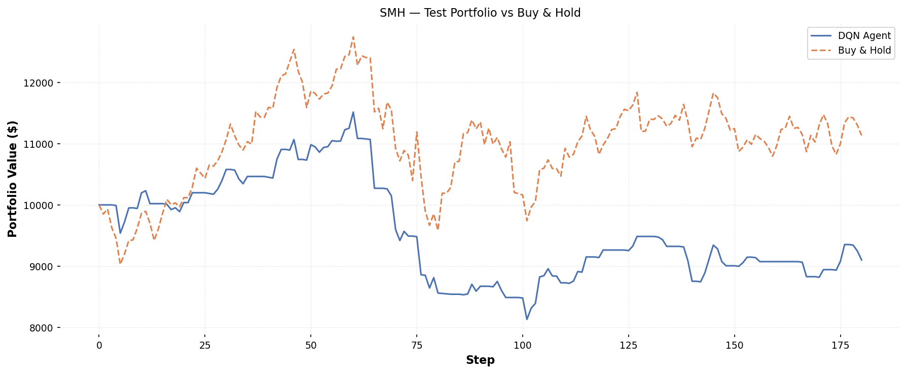

# L55 — Dueling DQN Stock Trader

An AI agent that learns to trade **SMH** (or any stock/ETF) by reading daily candlestick data.
It uses a **Dueling Deep Q-Network (DQN)** — the same kind of AI that learned to play Atari games — but trained to decide: **hold**, **buy**, or **sell**.

---

## What is a Dueling DQN?

A regular DQN just asks: *"How much reward do I get if I take action A right now?"*

A **Dueling DQN** splits that question into two separate answers:

| Stream | Question it answers |
|--------|---------------------|
| **Value V(s)** | *"How good is my current situation, no matter what I do?"* |
| **Advantage A(s,a)** | *"How much better is action A compared to the average action?"* |

Then it combines them: **Q(s,a) = V(s) + A(s,a) − mean(A)**

This is smarter because, on many trading days, *all* actions are equally bad (flat market).  
Separating V from A helps the AI learn faster and more stably.

---

## What does the agent see?

Every step the agent looks at the **last 30 trading days** through 10 numbers per day:

| Feature | Meaning |
|---------|---------|
| `log_return` | How much did the price change today? |
| `rsi_14` | Is the stock overbought or oversold? (0–100 scale) |
| `macd` + `macd_signal` + `macd_hist` | Momentum indicators |
| `bb_pct` | Where is today's price inside the Bollinger Band? |
| `vwap_dist` | Is price above or below its average weighted by volume? |
| `volume_norm` | How busy was trading today, compared to history? |
| `position` | Does the agent currently hold shares? |
| `unrealised_pnl` | If holding, how much profit/loss so far? |

---

## What does it learn to do?

The agent starts with **$10,000** and can make one decision per day:

- **Hold** — do nothing
- **Buy** — spend all cash to buy shares
- **Sell** — sell all shares for cash

A small **0.1% transaction cost** discourages excessive trading.  
The agent is rewarded only when it sells for a profit.

---

## Data source

Data comes from **Yahoo Finance** (free, no API key needed) via the `yfinance` library.
The project downloads daily Open/High/Low/Close/Volume bars and caches them locally
as fast Parquet files so you don't re-download on every run.

A **Gatekeeper** limits requests to 10/minute and 100/hour to be respectful of Yahoo's servers.

---

## Results — SMH (AI Infrastructure ETF)

### Chart 1 — Candlestick Chart


Each vertical bar in this chart is **one trading day** of SMH.
- **Green bar** = the price went UP that day (closed higher than it opened)
- **Red bar** = the price went DOWN that day (closed lower than it opened)
- The thin line above and below each bar shows the highest and lowest price of the day

This is the raw data the AI learns from. You can see how SMH grew strongly from 2020 to 2021, then dropped in 2022, and recovered in 2023–2024 — driven by the AI chip boom (NVIDIA etc.).

---

### Chart 2 — Value & Advantage Decomposition


This chart opens the "brain" of the Dueling DQN and shows its two separate parts:

- **Left bar — V(s) "Value"**: How good is the current market situation overall? A high positive number means the AI thinks conditions are favorable, regardless of what action it takes.
- **Right bars — A(s,a) "Advantage"**: For each possible action (Hold, Buy, Sell), how much better or worse is it compared to the average? The tallest bar is the action the AI prefers right now.

Together they give the final decision: **Q = V + A − mean(A)**

---

### Chart 3 — Portfolio vs Buy & Hold (Streamlit live view)


This is the **live interactive result** from the Streamlit dashboard.
- **Blue line (DQN Agent)** — the AI agent's portfolio value over the test period, starting from $10,000
- **Orange dashed line (Buy & Hold)** — what would have happened if you just bought SMH once and held it

When the blue line is **above** the orange line, the AI is outperforming a passive investment strategy. The AI learned to avoid some of the big drops by selling in time and buying back at lower prices.

---

### Chart 4 — Portfolio vs Buy & Hold (static PNG)


Same comparison as above but saved as a static PNG from `main.py`.
The test period covers the last 15% of the data — price bars the AI **never saw during training**.
This is the true test of whether the AI learned real patterns or just memorized the training data.

---

## Interactive Dashboard

Run the Streamlit web dashboard — opens in your browser:

```bash
streamlit run app.py
```

- Type any **ticker** (e.g. `NVDA`, `AAPL`, `QQQ`, `SMH`)
- Set a **start** and **end** date
- Follow the buttons in order: **Prepare Data → Train Model → Run Backtest → Predict Next**
- See candlesticks, portfolio chart, Value & Advantage bars, and a BUY / SELL / HOLD prediction

---

## File Structure

```
L55 - dueling DQN with stocks/
├── config.py          All settings (ticker, dates, network size, training params)
├── data_client.py     Download data from Yahoo Finance + local cache
├── preprocessor.py    Compute technical indicators, build 30-bar windows
├── environment.py     Trading simulation (buy/sell/hold + reward)
├── model.py           Dueling DQN neural network (PyTorch)
├── agent.py           Replay buffer, epsilon-greedy policy, learn step
├── train.py           Training loop — save best model
├── visualize.py       Save PNG charts to outputs/
├── app.py             Streamlit web dashboard (main entry point)
├── charts.py          Plotly chart builders for the dashboard
├── main.py            Command-line entry point (train + save PNGs)
├── requirements.txt   Python packages needed
└── outputs/           PNG results + saved models (SMH_best.pt)
```

---

## How to Run — Step by Step

### Step 1 — Install packages (once)

```bash
cd "L55 - dueling DQN with stocks"
pip install -r requirements.txt
```

### Step 2 — Full run (fetch data + train + dashboard)

```bash
python main.py
```

This will:
1. Download SMH daily data from Yahoo Finance (2020–2024)
2. Compute technical indicators and build windows
3. Train the Dueling DQN for 300 episodes (~5–15 minutes on CPU)
4. Save 4 PNG charts to `outputs/`
5. Open the interactive dashboard

### Step 3 — Try a different ticker

```bash
python main.py --ticker NVDA --start 2021-01-01 --end 2024-12-31
```

### Step 4 — Quick test (50 episodes, no window)

```bash
python main.py --episodes 50 --no-dashboard
```

### Step 5 — Skip training, just open the dashboard

```bash
python main.py --no-train
```
*(Requires a saved model in `outputs/models/SMH_best.pt`)*

### All options

| Flag | Default | Meaning |
|------|---------|---------|
| `--ticker` | `SMH` | Stock or ETF symbol |
| `--start` | `2020-01-01` | Start date |
| `--end` | `2024-12-31` | End date |
| `--episodes` | `300` | How many training episodes |
| `--no-train` | off | Skip training, load saved model |
| `--no-dashboard` | off | Train and save PNGs, then exit |

---

## What is SMH?

**SMH** is the VanEck Semiconductor ETF — a basket of the world's biggest chip companies
(NVIDIA, TSMC, Broadcom, ASML…). Because AI runs on chips, SMH is often called the
**AI infrastructure ETF**. It is highly volatile and technically interesting for RL experiments.
