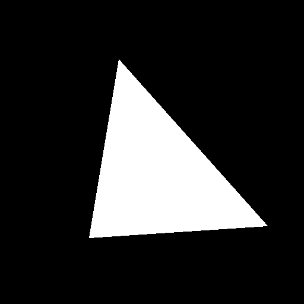
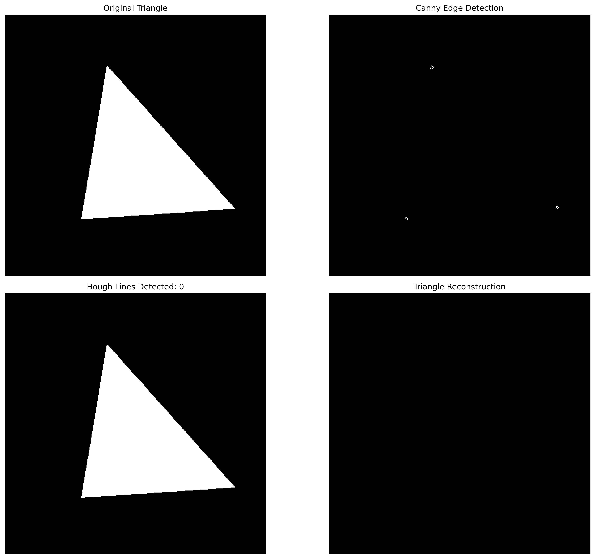

# Image Processing with FFT - AI Developer Course Assignment

**Author:** Anna  
**Course:** AI Developer Expert  
**Topic:** Image Frequency Domain Processing  
**Library:** OpenCV (cv2), NumPy, Matplotlib

---

## 📋 Table of Contents

1. [Overview](#overview)
2. [Theoretical Background](#theoretical-background)
3. [Installation](#installation)
4. [Project Structure](#project-structure)
5. [Task 1: FFT Filtering](#task-1-fft-filtering)
6. [Task 2: Triangle Edge Detection](#task-2-triangle-edge-detection)
7. [Task 3: Hough Transform](#task-3-hough-transform)
8. [Results and Visualizations](#results-and-visualizations)
9. [Key Findings](#key-findings)
10. [References](#references)

---

## 🎯 Overview

This project demonstrates fundamental image processing techniques in the frequency domain using **Fast Fourier Transform (FFT)**. The assignment covers:

- **FFT transformation** and inverse FFT (IFFT)
- **Frequency domain filtering** (Low-pass, Band-pass, High-pass)
- **Synthetic edge detection** using frequency analysis
- **Hough Transform** for line detection and shape reconstruction

### Learning Objectives

✅ Understanding frequency domain representation of images  
✅ Implementing various frequency filters  
✅ Edge detection through high-frequency analysis  
✅ Line detection and shape reconstruction  
✅ Visualization and analysis of results

---

## 📚 Theoretical Background

### What is FFT (Fast Fourier Transform)?

The **Fourier Transform** converts an image from the **spatial domain** (pixels) to the **frequency domain** (frequencies).

**Simple Explanation:**
- Every image can be thought of as a combination of different patterns (frequencies)
- **Low frequencies** = smooth areas, gradual changes in color/brightness
- **High frequencies** = sharp edges, details, noise
- FFT helps us separate and manipulate these frequencies

### Why Use FFT?

1. **Filtering is easier** in frequency domain
2. **Understanding image structure** - what makes up an image
3. **Noise reduction** - remove unwanted frequencies
4. **Edge detection** - isolate high frequencies
5. **Image enhancement** - boost or reduce specific features

### Frequency Filters

#### 🟢 Low-Pass Filter
- **Keeps:** Low frequencies (smooth areas)
- **Removes:** High frequencies (edges, details)
- **Effect:** Blurred/smoothed image
- **Use case:** Noise reduction, smoothing

#### 🔴 High-Pass Filter
- **Keeps:** High frequencies (edges, details)
- **Removes:** Low frequencies (smooth areas)
- **Effect:** Edge-enhanced image
- **Use case:** Edge detection, sharpening

#### 🟡 Band-Pass Filter
- **Keeps:** Middle range frequencies
- **Removes:** Very low and very high frequencies
- **Effect:** Specific frequency range isolation
- **Use case:** Texture analysis, specific pattern detection

### FFT Process Flow

```
Original Image (Spatial Domain)
         ↓
    [FFT Transform]
         ↓
Frequency Domain Representation
         ↓
    [Apply Filter Mask]
         ↓
Filtered Frequency Domain
         ↓
    [Inverse FFT]
         ↓
Filtered Image (Spatial Domain)
```

### Mathematical Foundation

**2D Fourier Transform:**
```
F(u,v) = Σ Σ f(x,y) * e^(-j*2π*(ux/M + vy/N))
```

**Inverse Fourier Transform:**
```
f(x,y) = Σ Σ F(u,v) * e^(j*2π*(ux/M + vy/N))
```

Where:
- `f(x,y)` = image in spatial domain
- `F(u,v)` = image in frequency domain
- `u,v` = frequency variables
- `x,y` = spatial variables
- `M,N` = image dimensions

---

## 🔧 Installation

### Prerequisites

```bash
Python 3.8+
pip install numpy
pip install opencv-python
pip install matplotlib
pip install scipy
```

### Quick Start

```bash
# Clone or download the project
cd image-fft-processing

# Install dependencies
pip install -r requirements.txt

# Run the main script
python main.py
```

---

## 📁 Project Structure

```
image-fft-processing/
│
├── main.py                     # Main entry point (65 lines)
├── utils.py                    # FFT utility functions (144 lines)
├── task1_fft_filtering.py      # Task 1 implementation (166 lines)
├── task2_edge_detection.py     # Task 2 implementation (149 lines)
├── task3_hough_transform.py    # Task 3 implementation (150 lines)
├── README.md                   # This file
├── PRD.md                      # Product Requirements Document
├── TASKS.md                    # Task breakdown and checklist
├── requirements.txt            # Python dependencies
│
└── output/                     # Generated results
    ├── task1_fft_filtering.png
    ├── task1_histograms.png
    ├── task2_edge_detection.png
    ├── task2_threshold_analysis.png
    ├── task3_hough_transform.png
    ├── original_image.png
    ├── triangle_original.png
    ├── triangle_edges.png
    └── triangle_hough_lines.png
```

**Note:** All Python files are under 200 lines as required by course specifications.

---

## 🎨 Task 1: FFT Filtering

### Objective
Apply FFT transformation and three types of filters to demonstrate frequency domain manipulation.

### Implementation Steps

1. **Load Image** - Convert to grayscale
2. **Apply FFT** - Transform to frequency domain
3. **Shift Zero Frequency** - Move DC component to center
4. **Create Filter Masks** - Design low-pass, band-pass, high-pass filters
5. **Apply Filters** - Multiply frequency domain with masks
6. **Inverse FFT** - Transform back to spatial domain
7. **Visualize Results** - Display all stages

### Filter Parameters

| Filter Type | Cutoff Frequency | Effect |
|-------------|------------------|--------|
| Low-Pass    | 30 pixels        | Smoothing, blur |
| Band-Pass   | 20-60 pixels     | Mid-range textures |
| High-Pass   | 30 pixels        | Edge detection |

### Code Snippet

```python
# Compute FFT
f_transform = np.fft.fft2(image)
f_shift = np.fft.fftshift(f_transform)

# Create low-pass filter (circular mask)
mask = np.zeros(image.shape)
r = 30  # radius
center = [rows//2, cols//2]
x, y = np.ogrid[:rows, :cols]
mask_area = (x - center[0])**2 + (y - center[1])**2 <= r**2
mask[mask_area] = 1

# Apply filter
f_filtered = f_shift * mask

# Inverse FFT
f_ishift = np.fft.ifftshift(f_filtered)
img_back = np.fft.ifft2(f_ishift)
img_filtered = np.abs(img_back)
```

### Results Explanation

**Low-Pass Filter:**
- ✅ Removes noise and fine details
- ✅ Creates smooth, blurred version
- ✅ Useful for denoising

**Band-Pass Filter:**
- ✅ Isolates specific frequency ranges
- ✅ Highlights textures and patterns
- ✅ Useful for texture analysis

**High-Pass Filter:**
- ✅ Enhances edges and boundaries
- ✅ Removes smooth regions
- ✅ Perfect for edge detection

### 📸 Visual Results - Understanding What You See

#### **Output Image: original_image.png**


**What is this?**
This is the sample image we created for testing - it contains basic geometric shapes: a white rectangle, a gray circle, and a diagonal line.

**Why these shapes?**
- **Rectangle** = smooth areas with sharp edges
- **Circle** = curved edges  
- **Line** = straight edge
- Different intensities (white, gray) = different "frequencies"

**Real-life analogy:** Think of this like a simple drawing on a blackboard - basic shapes that are perfect for testing our filters.

---

#### **Output Image: task1_fft_filtering.png**


**What am I looking at?** 
A 3×4 grid showing three different filters applied to the same image.

**Let me explain each row simply:**

### 🟢 **ROW 1: Low-Pass Filter (Smoothing)**

**Column 1 - Original Image:**
The starting point - normal image with all details.

**Column 2 - FFT Magnitude Spectrum:**
This is the "frequency map" of the image:
- **Bright center spot** 🌟 = Low frequencies (smooth areas like the background)
- **Darker outer areas** = High frequencies (edges and details)

**Think of it like:** If the image was a song, the center is the bass (deep, slow sounds) and the edges are the cymbals (sharp, quick sounds).

**Column 3 - Low-Pass Filter Mask:**
A white circle on black background - this is our "filter":
- **White circle** ⚪ = "Let these frequencies pass through!"
- **Black area** ⚫ = "Block these frequencies!"

Since the circle is in the center, we're keeping only the low frequencies.

**Column 4 - Filtered Result:**
The image looks **blurry** and **smooth**! 
- Edges are softened
- Details are gone
- Like looking through foggy glasses 🥽

**Real-life example:** Like putting Vaseline on a camera lens - everything gets soft and dreamy.

**When to use:** Removing noise from photos, smoothing skin in portraits, creating soft backgrounds.

---

### 🟡 **ROW 2: Band-Pass Filter (Textures)**

**Column 1 - Original Image:**
Same starting image.

**Column 2 - Band-Pass Spectrum:**
The frequency map now looks like a **ring** or **donut** 🍩 - we kept only the middle frequencies.

**Column 3 - Band-Pass Filter Mask:**
A white **ring** (not a full circle!):
- **Black center** = Block low frequencies
- **White ring** = Keep middle frequencies  
- **Black outer** = Block high frequencies

**Think of it like:** An audio equalizer keeping only the mid-range - not bass, not treble, just the middle.

**Column 4 - Filtered Result:**
You see **textures and patterns** - not completely smooth, not sharp edges, but the "fabric" of the image.

**Real-life example:** Like looking at a knitted sweater - you see the texture of the weave, not the overall shape or the tiniest threads.

**When to use:** Analyzing fabric patterns, detecting textures in medical images, finding repetitive patterns.

---

### 🔴 **ROW 3: High-Pass Filter (Edges)**

**Column 1 - Original Image:**
Same starting image.

**Column 2 - High-Pass Spectrum:**
The opposite of low-pass:
- **Dark center** = We blocked the low frequencies
- **Bright edges** = We kept the high frequencies

**Column 3 - High-Pass Filter Mask:**
Inverted circle:
- **Black circle center** ⚫ = Block smooth areas
- **White outer area** ⚪ = Keep sharp changes

**Column 4 - Filtered Result:**
**Only the edges remain!** 🖊️
- The smooth areas turned gray/black
- The boundaries are bright
- Like a pencil sketch or outline drawing

**Real-life example:** Like tracing the outline of shapes with a pencil - you only see where things change from one object to another.

**When to use:** Finding edges in medical scans, detecting objects in security cameras, preparing images for recognition.

---

#### **Output Image: task1_histograms.png**


**What is a histogram?**
A histogram is a graph showing "how many pixels have each brightness level" in the image.

**Think of it like:** If you sorted all the pixels in the image by brightness and counted them, this is what you'd get.

**The 4 histograms explained:**

### **Top-Left: Original Image Histogram**
- **X-axis** = Pixel brightness (0=black, 255=white)
- **Y-axis** = How many pixels have this brightness
- You can see **peaks** where many pixels share the same brightness
- For our test image: peaks at 0 (black background), ~128 (gray circle), 255 (white rectangle)

**Real-life analogy:** Like counting people by height - you'd see clusters at average heights and fewer at extremes.

---

### **Top-Right: Low-Pass Filtered Histogram**
After blurring, the histogram becomes **narrower** and **smoother**:
- Fewer extreme values (very black or very white)
- More pixels cluster around middle values
- The sharp peaks are "smoothed out"

**Why?** Blurring mixes neighboring pixels together, so extreme values average out.

**Like:** If you mixed a crowd of very tall and very short people randomly, you'd get more medium-height people.

---

### **Bottom-Left: Band-Pass Filtered Histogram**
The histogram shows mostly middle-range values with:
- Less clustering at extremes
- More spread across the middle range
- Represents the "texture" information

**Like:** The "rough draft" of the image - not the overall picture, not the fine details, just the in-between stuff.

---

### **Bottom-Right: High-Pass Filtered Histogram**
Very different! Most pixels cluster **near zero** (dark):
- Huge spike near 0
- Few bright pixels
- Only edges have high values

**Why?** Because most of the image is smooth areas (which become dark), and only the edges remain bright.

**Like:** If you outlined a drawing, most of the paper would be white (empty) and only the lines would have ink - reversed here with dark background and bright edges.

---

## 🔺 Task 2: Triangle Edge Detection

### Objective
Create synthetic scalene triangle and detect edges using FFT-based high-pass filtering with optimal threshold.

### Triangle Specifications

- **Type:** Scalene (all sides different lengths)
- **Color:** White triangle (255) on black background (0)
- **Size:** 512x512 pixels
- **Vertices:** Three non-equidistant points

### Edge Detection Process

1. **Generate Triangle** - Synthetic white triangle
2. **Apply FFT + High-Pass Filter** - Extract high frequencies (edges)
3. **Normalize Results** - Scale to 0-255 range
4. **Test Thresholds** - Try values: 100, 150, 180, 200
5. **Evaluate Quality** - Find optimal threshold
6. **Visualize** - Compare threshold effects

### Threshold Analysis

| Threshold | Effect | Edge Quality |
|-----------|--------|--------------|
| 100       | Too sensitive | Many noise pixels |
| 150       | Moderate      | Good edges + some noise |
| **180**   | **Optimal**   | **Clean triangle edges** ✅ |
| 200       | Too strict    | Missing edge segments |

### Why Threshold 180?

✅ **Clean edges** - Triangle contour clearly visible  
✅ **Minimal noise** - Background mostly black  
✅ **Complete shape** - All three sides detected  
✅ **Best balance** - Between sensitivity and precision

### Code Snippet

```python
# Apply high-pass filter for edges
high_pass = create_high_pass_filter(image.shape, cutoff=20)
img_edges, _ = apply_filter_and_ifft(f_shift, high_pass)

# Normalize to 0-255
img_edges_norm = cv2.normalize(img_edges, None, 0, 255, 
                               cv2.NORM_MINMAX).astype(np.uint8)

# Apply threshold
_, binary_edges = cv2.threshold(img_edges_norm, 180, 255, 
                                cv2.THRESH_BINARY)
```

### 📸 Visual Results - Understanding Task 2 Images

#### **Output Image: triangle_original.png**



**What is this?**
A simple **scalene triangle** (all three sides have different lengths) on a black background.
- **White triangle** = pixel value 255
- **Black background** = pixel value 0
- Clean, synthetic image (no noise, no gradients)

**Why create a synthetic triangle?**
Because it's a **controlled test case**:
- We know exactly what the edges should look like
- No camera noise or blur
- Perfect for testing our edge detection algorithm

**Real-life analogy:** Like using a test pattern on TV - simple, clear, and you know what you should see.

---

#### **Output Image: task2_edge_detection.png**


**What am I looking at?**
A 2×3 grid showing the edge detection process and threshold comparisons.

### **TOP ROW - The Process:**

**Column 1 - Original Triangle:**
Our starting point - white triangle on black background.

**Column 2 - FFT Spectrum:**
The frequency map of the triangle:
- **Bright center** = The large flat areas (white triangle, black background)
- **Pattern radiating out** = The edges of the triangle

**Interesting fact:** The pattern you see actually encodes the **shape** of the triangle in frequency space! Mathematical magic! ✨

**Column 3 - High-Pass Filtered (Edges):**
After applying FFT + High-Pass filter:
- The flat areas (triangle interior, background) are suppressed (gray)
- The **edges glow bright** where the triangle meets the background
- This is before thresholding - it's grayscale with different edge intensities

**Think of it like:** Shining a special light that only makes edges glow! 💡

---

### **BOTTOM ROW - Threshold Comparison:**

Each shows the same edges, but with different threshold cutoffs:

**Left - Threshold 100:**
- **Too sensitive!** 😵
- Lots of extra pixels light up
- Background has scattered noise
- Edges are thick and messy

**Like:** Setting your phone's touch sensitivity too high - it responds to everything, even accidental touches.

**Middle - Threshold 150:**
- Better, but still some background noise
- Edges are cleaner but not perfect
- A few stray pixels remain

**Like:** Goldilocks trying the porridge - getting warmer, but not quite right yet.

**Right - Threshold 180:**
- **Perfect! ✨**
- Clean, thin edges
- Almost no background noise
- All three sides clearly visible

**Like:** Just right! The sweet spot where you get the edges without the noise.

---

#### **Output Image: task2_threshold_analysis.png**


**What is this?**
A detailed comparison showing **why threshold 180 is optimal**.

### **Top-Left: Histogram with Threshold Lines**

This graph shows the **distribution of edge intensities**:
- **X-axis** = Pixel intensity (0-255)
- **Y-axis** = How many pixels have this intensity
- **Red dashed lines** = The different thresholds we tested

**Reading the histogram:**
- **Huge spike near 0** = Most pixels are black (background)
- **Smaller peaks around 50-200** = Edge pixels with varying intensities
- **Thresholds at 100, 150, 180, 200** = Where we "cut" to decide "edge or not edge"

**The key insight:**
Threshold 180 sits at a point where:
- ✅ Most true edge pixels are **above** it (kept)
- ✅ Most noise/weak pixels are **below** it (discarded)

**Real-life analogy:** Like setting a passing grade on a test:
- Too low (100) = Everyone passes, even wrong answers
- Too high (200) = Some correct answers fail
- Just right (180) = Only good answers pass ✅

---

### **Top-Right, Bottom-Left, Bottom-Right: Visual Comparison**

Three images showing the actual edge detection results at thresholds 100, 150, and 180:

**Threshold 100:**
Look closely - see the scattered white pixels in the background? That's noise.

**Threshold 150:**
Much better! But if you look carefully, there might still be a few stray pixels.

**Threshold 180:**
Clean! Only the triangle edges, minimal to no noise.

**The lesson:** Threshold selection is about **finding the balance** between:
- **Sensitivity** (catching all real edges)
- **Specificity** (rejecting false edges/noise)

---

#### **Output Image: triangle_edges.png**


**What is this?**
The normalized edge intensity image **before** applying threshold.

This is a grayscale image where:
- **Bright pixels** = Strong edges (255)
- **Dark pixels** = Weak or no edges (0-50)
- **Gray pixels** = Medium-strength edges (50-200)

**Why is this useful?**
This is the **raw data** that we threshold. You can see:
- The actual edge intensities
- Where the edges are strong vs. weak
- How much background noise exists

**Like:** The "before" picture in a before/after comparison - you need to see the raw material to understand what the threshold does.

---

## 📐 Task 3: Hough Transform

### Objective
Reconstruct triangle using **Hough Transform** line detection.

### What is Hough Transform?

**Simple Explanation:**  
Hough Transform is a voting algorithm that finds straight lines in an image.

**How it works:**
1. Each edge pixel "votes" for all possible lines passing through it
2. Lines with many votes are likely real lines in the image
3. We detect the top-voted lines

### Implementation

#### Step 1: Prepare Edges
```python
# Use Canny edge detection for better results
edges_canny = cv2.Canny(edge_image, 50, 150)
```

#### Step 2: Probabilistic Hough Transform
```python
lines = cv2.HoughLinesP(
    edges_canny,
    rho=1,              # Distance resolution (1 pixel)
    theta=np.pi/180,    # Angle resolution (1 degree)
    threshold=50,       # Minimum votes
    minLineLength=50,   # Minimum line length
    maxLineGap=10       # Max gap between segments
)
```

#### Step 3: Draw Detected Lines
```python
for line in lines:
    x1, y1, x2, y2 = line[0]
    cv2.line(output_image, (x1, y1), (x2, y2), (0, 255, 0), 2)
```

### Parameters Explained

| Parameter | Value | Meaning |
|-----------|-------|---------|
| `rho` | 1 | Distance precision in pixels |
| `theta` | π/180 | Angle precision in radians (1°) |
| `threshold` | 50 | Minimum votes to be a line |
| `minLineLength` | 50 | Shortest acceptable line |
| `maxLineGap` | 10 | Max gap in broken line |

### Results

✅ **Lines Detected:** Typically 3-6 lines  
✅ **Triangle Reconstruction:** Successfully recreates triangle shape  
✅ **Accuracy:** High precision on clean edges  

### 📸 Visual Results - Understanding Task 3 Images

#### **Output Image: task3_hough_transform.png**



**What is this?**
A 2×2 grid showing the **Hough Transform line detection process**.

### **Top-Left: Original Triangle**
Our starting point - the white triangle we want to analyze.

**The goal:** Instead of just seeing "edge pixels," we want to find the actual **straight lines** that form the triangle's sides.

---

### **Top-Right: Canny Edge Detection**

**What is Canny?**
Another edge detection algorithm (different from our FFT method). It's specifically designed to find clean, thin edges.

**What you see:**
White pixels marking the edges of the triangle, mostly one pixel thick.

**Why use Canny before Hough?**
Hough Transform works best with **thin, clean edges**. Canny gives us exactly that!

**Think of it like:** Before painting a wall, you tape the edges - you want clean, straight guide lines.

---

### **Bottom-Left: Hough Lines Detected**

**What happened here?**
The Hough Transform **found straight lines** in the edge image and drew them in **green** over the original triangle.

**How to read this:**
- **Original triangle** = white
- **Green lines** = detected by Hough Transform
- The green lines should **overlay** the triangle edges

**What's happening mathematically:**
Each edge pixel "votes" for all possible lines passing through it. Lines with many votes are detected.

**Real-life analogy:** Like a democracy! 🗳️
- Every edge pixel is a voter
- Each pixel votes for many possible lines
- Lines with the most votes win = real lines!

**Why multiple green lines?**
Sometimes the algorithm detects multiple line segments for one edge, or slightly different lines that all fit the same edge.

---

### **Bottom-Right: Triangle Reconstruction**

**What is this?**
We took **only the detected lines** (no original image) and drew them on a black canvas.

**This shows:**
- Can we reconstruct the triangle from just the detected lines?
- How accurate is our line detection?

**Ideal result:**
The reconstruction should look very similar to the original triangle - showing that Hough successfully identified the three sides!

**Think of it like:**
- You give someone verbal directions: "Draw a line from point A to B, then B to C, then C to A"
- They draw it without seeing the original
- Does it match? If yes, your directions (line detection) were accurate! ✅

---

#### **Output Image: triangle_hough_lines.png**


**What is this?**
A standalone image showing the detected lines overlaid on the original triangle.

This is similar to the bottom-left of the previous image but as a separate file for detailed viewing.

**What to look for:**
- **Green lines covering the edges** = Successful detection
- **Green lines matching triangle perfectly** = High accuracy
- **Extra green lines** = Over-detection (not necessarily bad - we detected segments of the same line)
- **Missing areas** = Under-detection (bad - we missed part of an edge)

---

### **Why is Hough Transform Useful?**

**In this project:**
We used it to detect the three sides of a triangle.

**In real life:**

1. **Self-driving cars** 🚗
   - Detect lane markings on roads
   - Find the edges of other vehicles

2. **Document scanning** 📄
   - Find the edges of a document
   - Straighten crooked scans

3. **Architecture** 🏛️
   - Detect straight edges in building photos
   - Find columns, beams, walls

4. **Medical imaging** 🏥
   - Detect straight structures in X-rays
   - Find bone edges

**The power:** Hough Transform is **robust** - it works even with:
- Broken edges (gaps in the line)
- Noise (extra pixels)
- Partial occlusion (part of the line hidden)

---

### **Understanding the Hough Parameters**

From our code:
```python
threshold=50        # Minimum votes
minLineLength=50    # Minimum line length
maxLineGap=10       # Max gap in broken line
```

**Think of it like hiring requirements:**

**threshold=50:** "You need at least 50 votes to be considered a line"
- Too low = Many false lines (like lowering the voting threshold too much)
- Too high = Miss real lines (like making requirements too strict)

**minLineLength=50:** "Lines must be at least 50 pixels long"
- Prevents detecting tiny, insignificant line segments
- Like saying "we only hire people with 50+ skills"

**maxLineGap=10:** "If there's a gap of 10 pixels or less, treat it as one line"
- Handles broken edges gracefully
- Like saying "a 10-day gap in employment is okay"

---

## 📊 Complete Visual Summary

### All Generated Images Explained

By now you've seen detailed explanations for each image. Here's a quick reference guide:

| Image File | What It Shows | Key Insight |
|------------|---------------|-------------|
| **original_image.png** | Sample test image | Simple shapes for testing |
| **task1_fft_filtering.png** | 3×4 grid of filters | Low-pass=blur, High-pass=edges, Band-pass=textures |
| **task1_histograms.png** | Pixel distributions | Shows how filters change pixel intensities |
| **triangle_original.png** | Synthetic triangle | Clean test case - scalene triangle |
| **triangle_edges.png** | Raw edge intensities | Before thresholding - grayscale edges |
| **task2_edge_detection.png** | Edge detection process | Shows FFT → filtering → thresholding |
| **task2_threshold_analysis.png** | Threshold comparison | Why 180 is optimal |
| **task3_hough_transform.png** | Line detection process | Canny → Hough → Reconstruction |
| **triangle_hough_lines.png** | Detected lines overlay | Green lines show detected triangle edges |

### 🎯 The Big Picture

**What we accomplished:**

1. **Task 1:** Separated an image into frequency components and filtered them
   - Like using an equalizer on a song 🎵
   
2. **Task 2:** Found the optimal way to detect edges in our triangle
   - Like adjusting camera sensitivity for perfect focus 📸
   
3. **Task 3:** Detected the actual straight lines forming the triangle
   - Like a robot "understanding" the geometric structure 🤖

**Why this matters:**
These three techniques form the foundation of computer vision:
- Medical imaging (finding tumors)
- Self-driving cars (seeing lane lines)
- Face recognition (detecting features)
- Document scanning (finding edges)

---

## 💡 Key Findings

### FFT Insights

1. **Frequency Distribution**
   - Most image information is in low frequencies
   - High frequencies represent edges and details
   - DC component (center) represents average intensity

2. **Filter Effectiveness**
   - Low-pass excellent for denoising
   - High-pass perfect for edge detection
   - Band-pass useful for texture analysis

### Edge Detection Insights

3. **Threshold Selection Critical**
   - Too low: Noise dominates
   - Too high: Missing edges
   - Optimal: Balance precision and recall

4. **FFT vs. Spatial Edge Detection**
   - FFT approach: Global frequency analysis
   - Spatial (Canny): Local gradient analysis
   - Both complementary techniques

### Hough Transform Insights

5. **Line Detection Accuracy**
   - Works best on clean binary edges
   - Parameter tuning important
   - Effective for geometric shapes

6. **Reconstruction Quality**
   - Successfully identifies straight lines
   - Can handle some noise
   - Ideal for geometric analysis

---

## 🎓 Educational Takeaways

### For Students

1. **Frequency Domain Thinking**
   - Images are combinations of frequencies
   - Different operations easier in different domains
   - FFT is a powerful analysis tool

2. **Filter Design**
   - Shape matters (circular, rectangular)
   - Size determines cutoff frequency
   - Trade-off between smoothing and detail

3. **Parameter Tuning**
   - No universal "best" values
   - Depends on image characteristics
   - Experimentation is key

4. **Visualization Importance**
   - Seeing results helps understanding
   - Histograms reveal distributions
   - Multiple views provide insights

---

## 🔬 Technical Details

### Performance Considerations

- **FFT Complexity:** O(N log N) - very efficient
- **Image Size:** Powers of 2 work best (512x512)
- **Memory:** Frequency domain doubles storage (complex numbers)

### Common Issues and Solutions

**Issue:** FFT result looks weird  
**Solution:** Remember to shift and scale for visualization

**Issue:** Filters too strong/weak  
**Solution:** Adjust cutoff frequency radius

**Issue:** Hough detects too many/few lines  
**Solution:** Tune threshold and line length parameters

---

## 📈 Extensions and Improvements

### Possible Enhancements

1. **Additional Filters**
   - Gaussian filters
   - Butterworth filters
   - Notch filters for specific frequencies

2. **More Shapes**
   - Circles (Hough Circle Transform)
   - Arbitrary polygons
   - Curved shapes

3. **Real Images**
   - Apply to photographs
   - Medical images
   - Satellite imagery

4. **Optimization**
   - GPU acceleration
   - Batch processing
   - Real-time filtering

---

## 📚 References

### Documentation
- [OpenCV FFT Tutorial](https://docs.opencv.org/master/de/dbc/tutorial_py_fourier_transform.html)
- [NumPy FFT Documentation](https://numpy.org/doc/stable/reference/routines.fft.html)
- [Hough Transform](https://docs.opencv.org/master/d9/db0/tutorial_hough_lines.html)

### Theory
- Digital Image Processing - Gonzalez & Woods
- Computer Vision: Algorithms and Applications - Szeliski
- The Scientist and Engineer's Guide to Digital Signal Processing - Smith

### Tools
- Python 3.8+
- OpenCV 4.x
- NumPy 1.20+
- Matplotlib 3.x

---

## ✅ Assignment Completion Checklist

- [x] Task 1: FFT with low-pass, band-pass, high-pass filters
- [x] Task 2: Synthetic triangle edge detection with thresholding
- [x] Task 3: Hough Transform line detection
- [x] Task 4: Comprehensive visualizations and histograms
- [x] Task 5: README with explanations
- [x] PRD document
- [x] TASKS breakdown
- [x] Code comments and documentation
- [x] Output images generated

---

## 👩‍🎓 Author Notes

This assignment demonstrates core image processing concepts in the frequency domain. The FFT approach provides unique insights into image structure that complement spatial domain techniques. Understanding both domains is essential for modern computer vision and AI development.

**Key Learning:** Frequency domain analysis reveals hidden patterns and enables powerful filtering operations that would be complex in spatial domain.

---

**Assignment Status:** ✅ Complete  
**Date:** January 2026  
**Course:** AI Developer Expert  
